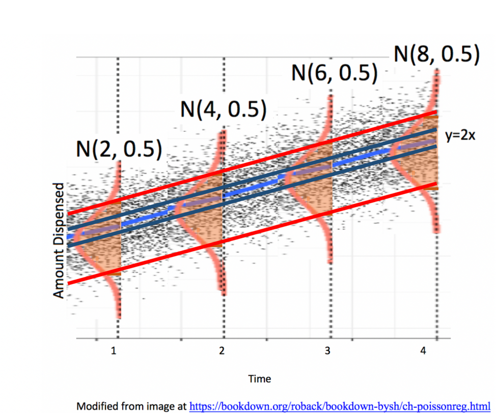

--- 
title: "Statistics for Data Science Notes"
author: "Andrew Sage - Stat 255: Lawrence University"
date: "`r Sys.Date()`"
site: bookdown::bookdown_site
documentclass: book
bibliography: [book.bib, packages.bib]
## url: your book url like https://bookdown.org/yihui/bookdown
## cover-image: path to the social sharing image like images/cover.jpg
description: |
  This is a minimal example of using the bookdown package to write a book.
  The HTML output format for this example is bookdown::gitbook,
  set in the _output.yml file.
link-citations: yes
github-repo: rstudio/bookdown-demo
---


```{r, include=FALSE}
knitr::opts_chunk$set(echo = TRUE, message=FALSE, warning=FALSE, fig.height = 3, fig.width = 7, cache=TRUE)
library(ggformula)
library(moderndive)
library(gridExtra)
library(skimr)
library(Bolstad)
library(GGally)
library(Lock5Data)
library(knitr)
library(caret)
library(MASS)
library(tidyverse)
options(scipen=999)
set.seed(07302020)
```


# Exploratory Data Analysis

## Exploring Diamond Prices

We consider a dataset with prices (in $ US) and other information on 53,940 round cut diamonds. The first 6 rows are shown below. 

```{r}
library(tidyverse)
data(diamonds)
head(diamonds)
```

```{r, echo=FALSE}
diamonds$cut <- factor(x = diamonds$cut, levels = c("Fair",
                                        "Good",
                                        "Very Good",
                                        "Premium",
                                        "Ideal"), ordered = TRUE)
```


The dataset incudes both:

* **categorical** (or factor) variables cut, color, clarity, and   
* **quantitative** (or numeric) variables, depth, table, price, x, y, z

### Boxplot of Diamond Prices

```{r}
ggplot(data=diamonds, aes(x=price, y=cut, fill=cut)) + 
  geom_boxplot(outlier.size=0.01, outlier.alpha = 0.1) + 
    stat_summary(fun=mean, geom="point", shape=4, color="red", size=3)
```

What do we notice about the relationship between price and cut? Is this surprising?   


### Histogram of carat size and quality of cut

Next, we examine a histogram, displaying price, cut, and carat size.  

```{r}
ggplot(data=diamonds, aes(x=carat, fill=cut)) + geom_histogram()
```

How does the information in this plot help explain the surprising result we saw in the boxplot?


### Table 1: Average carat size and price by quality of cut

```{r}
diamonds %>% group_by(cut) %>% summarize(N=n(), 
                                         Avg_carat=mean(carat), 
                                         Avg_price=mean(price) )

```

### Scatterplot of carat size and quality of cut

Next, we use a scatterplot to visualize cut, price, and carat size. 

```{r}
ggplot(data=diamonds, aes(x=carat, y=price, color=cut)) + geom_point()
```

What should we conclude about the relationship between price and quality of cut? Are better cuts generally more expensive? less expensive? about the same? Does the relationship between price and cut seem to depend on carat size?

### Terminology

The diamonds dataset is an example of two statistical concepts:

**Simpson's Paradox** refers to a situation when an apparent relationship between two variables changes or reverses when additional variable(s) are considered.     
       Example: diamonds with higher quality of cut appear less expensive than lower quality cuts, until we account for carat size
    
An **interaction** between two variables X and Y occurs when the relationship between X and a third variable Z depends on Y.     
      Example: the relationship between cut and price depends on carat size, so there is an interaction between cut and carat size.  


## Tidy Data

### Representations of Data

Data can be displayed in many different tabular forms. We'll discuss one useful form, called **tidy** data. 

Learning Outcomes:   

1. Define tidy data.   

2. Recognize when data are tidy form. 

Consider the following representations of the same dataset, which dispays the number of tuberculosis cases in different countries, relative to population. This example comes from [R for Data Science by Wickham and Grolemund](https://r4ds.had.co.nz/tidy-data.html)
   

### Representation 1

```{r, echo=FALSE}
kable(table1)
```


### Representation 2

```{r, echo=FALSE}
kable(table2)
```


### Representation 3

```{r, echo=FALSE}
kable(table3)
```


### Representation 4

Table A:

```{r, echo=FALSE}
kable(table4a)
```

Table B: 

```{r}
kable(table4b)
```


### Variables and Observations

In this example, we have observed data on various countries at different points in time. The record for a single country, in a given year is called an **observation**.   

For each observation, we record the country, year, number of cases, and population. These are called **variables.**


### Tidy Data

A dataset is said to be **tidy** when it satisfies the following conditions:

1. Each variable has its own column.    
2. Each observation has its own row.     
3. Each value must has own cell.     

In fact, any two of these imply the third.   

```{r, echo=FALSE, out.width = '90%'}
knitr::include_graphics("Tidy_Data.png")
```

Image from [R for Data Science by Wickham and Grolemund](https://r4ds.had.co.nz/tidy-data.html)

### Representation 1 Tidy

Representation 1 is in tidy form. 

```{r, echo=FALSE}
kable(table1)
```


### Representation 2 not Tidy

Representation 2 is not in tidy form. 

* Observations are spread over multiple rows.   
* The variables `cases` and `population` do not have thir own column.   
* The column `type` contains variable names, not values.   

```{r, echo=FALSE}
kable(table2)
```


### Representation 3 not Tidy

Representation 3 is not in tidy form. 

The variables `cases` and `population` do not have their own columns, but are combined in a single column called `rate`.

```{r, echo=FALSE}
kable(table3)
```


### Representation 4 is not Tidy

Representation 4 is not in tidy form. 

* The variable `year` is spread across multiple columns.   
* The variables `cases` and `population` are spread over multiple tables.  

```{r, echo=FALSE}
kable(table4a)
```
```{r, echo=FALSE}
kable(table4b)
```


### Why Use Tidy Data

* Data are often easiest to work with when they are in tidy form    

* The `tidyverse()` R package is useful for creating graphs, and calculating summary statistics when data are in tidy form.     

* Sometimes there is good reason for data to not be in tidy form. This is ok, but it makes it harder to work with.    

* In this class, we will focus on data that are already in tidy form. However, if you come across data on your own, you should check that it is tidy before attempting to use the techniques we'll see in this class.   

* In **CMSC/STAT 205: Data-Scientific Programming,** we study how to convert data into tidy form if it is not already. More information can be found in [R For Data Science by Wickham and Grolemund](https://r4ds.had.co.nz/tidy-data.html).  


# Introduction to Linear Models


## Models with a Categorical Explanatory Variable


### Models with a Categorical Explanatory Variable

Learning outcomes:

1. Fit model with categorical variables using R.   
2. Interpret model coefficients.    
3. Make predictions.   
4. Calculate proportion of variation explained by model.  

We'll work with a set of 10 houses sold in Ames, IA between 2006 and 2010. 

### Variation in Ames IA, House Prices 

```{r, echo=FALSE}
library(AmesHousing)
data(ames_raw)
Houses <- ames_raw %>% select(`Gr Liv Area`, Neighborhood, SalePrice)
Houses$Neighborhood <- as.factor(Houses$Neighborhood)
Houses <- Houses %>% filter(Neighborhood %in% c("NAmes", "CollgCr", "Edwards"))
Houses <- Houses %>% select(Neighborhood, `Gr Liv Area`, SalePrice)
Houses <- Houses %>% rename(SquareFeet = `Gr Liv Area`)
Houses <- Houses %>% mutate(SalePrice = SalePrice/1000)
NewHouses <- Houses[c(840, 804, 543, 746, 280, 885, 629, 665, 526, 591), ]
Houses <- Houses[c(309,832,303,212,875,681,68,150,835, 735),]
```

Shown below are the prices of 10 houses sold in Ames, IA between 2006 and 2010. 

```{r, echo=FALSE}
Houses$SalePrice
```


```{r, fig.height=4.5, fig.width=3, echo=FALSE}
ggplot(data=Houses, aes(x=1, y=SalePrice)) + geom_point() + ylab("Price in thousands") + 
  xlab("")+ theme(axis.text.x = element_blank()) + 
  stat_summary(fun.y = mean, geom = "errorbar", aes(ymax = ..y.., ymin = ..y..), color="red") + 
  annotate("text", y=145, x=1.25, label="sample mean", color="red")
```


### Predicting Price of New House 

```{r, echo=FALSE}
library(AmesHousing)
data(ames_raw)
Houses <- ames_raw %>% select(`Gr Liv Area`, Neighborhood, SalePrice)
Houses$Neighborhood <- as.factor(Houses$Neighborhood)
Houses <- Houses %>% filter(Neighborhood %in% c("NAmes", "CollgCr", "Edwards"))
Houses <- Houses %>% select(Neighborhood, `Gr Liv Area`, SalePrice)
Houses <- Houses %>% rename(SquareFeet = `Gr Liv Area`)
Houses <- Houses %>% mutate(SalePrice = SalePrice/1000)
NewHouses <- Houses[c(840, 804, 543, 746, 280, 885, 629, 665, 526, 591), ]
Houses <- Houses[c(309,832,303,212,875,681,68,150,835, 735),]
```

Shown below are the prices of 10 houses sold in Ames, IA between 2006 and 2010. 

```{r, echo=FALSE}
Houses$SalePrice
```


```{r, fig.height=4.5, fig.width=3, echo=FALSE}
ggplot(data=Houses, aes(x=1, y=SalePrice)) + geom_point() + ylab("Price in thousands") + 
  xlab("")+ theme(axis.text.x = element_blank()) + 
  stat_summary(fun.y = mean, geom = "errorbar", aes(ymax = ..y.., ymin = ..y..), color="red") + 
  annotate("text", y=145, x=1.25, label="sample mean", color="red") 
```

* Suppose we want to predict the price of a new house, that was sold in this time period. (note that new means a house not among the original 10, rather than a newly-built house.)    

* Using the information available the best we can do is to use the sample mean for our prediction.   

```{r}
mean(Houses$SalePrice)
```

### A Very Simple Model

* If we have the prices of $n$ houses, $y_i, y_2, \ldots, y_n$, and want to predict the price of a new house, we use the model:

\[
\widehat{\text{Price}} = \bar{y},  \text{where } \bar{y}=\frac{\displaystyle\sum_{i=1}^ny_i}{n}\]. 

* The symbol $\widehat{\text{Price}}$, represents the predicted, or expected, price.  

### Simple Model in R

```{r}
M0 <- lm(data=Houses, SalePrice~1)
summary(M0)
```

### Quantifying Total Variability in Prices

* Although the mean price represents our best prediction, we certainly shouldn't expect the price of the new house to exactly match the mean of the original 10. There is considerable variability between house prices.    

* We can get a sense of how much variability we should expect in our prediction by looking at how much the values in our dataset differ from the predicted (mean) price.   

* $\displaystyle\sum_{i=1}^n (y_i - \bar{y})=0$, so this is not a helpful measure.   


```{r, echo=FALSE, fig.height=3, fig.width=8}
M0Resid <-ggplot(data=Houses, aes(x = 1:10, y = SalePrice)) +geom_point() + 
  geom_segment(aes(xend = 1:10, yend = M0$fitted.values), color="red") + 
  geom_abline(slope=0, intercept=mean(M0$fitted.values)) + xlab("")  + theme_bw() + theme(axis.text.x = element_blank())
M0Resid
```


### Total Sum of Squares

We'll measure total variability in price, using :

\[
\displaystyle\sum_{i=1}^n (y_i - \bar{y})^2
\]

We'll call this the total sum of squares, and abbreviate it SST.  

```{r, echo=FALSE, out.height = '65%' }
knitr::include_graphics("SST.png")
```


### Total Variation Calculations in Simple Model

```{r, include=FALSE}
SalePrice <- Houses$SalePrice
Predicted <- M0$fitted.values
Difference <- M0$residuals   
DifferenceSq <- M0$residuals^2
Residdf <- data.frame(SalePrice, Predicted, Difference, DifferenceSq)
kable(Residdf)
```

* Calculate $\displaystyle\sum_{i=1}^n (y_i - \bar{y})$ in R. 

```{r}
sum(Houses$SalePrice - mean(Houses$SalePrice))
```

* Calculate $SST = \displaystyle\sum_{i=1}^n (y_i - \bar{y})^2$ in R. 

```{r}
sum((Houses$SalePrice - mean(Houses$SalePrice))^2)
```


### Adding Information about Neighborhood

* Now, suppose we know the neighborhood of each house. We can use this information to improve our predictions.       


* The prediction for a new house is given by the average price in that neighborhood.     


```{r, echo=FALSE, fig.width=4}
ggplot(data=Houses, aes(x=Neighborhood, y=SalePrice)) +geom_point() + 
  stat_summary(fun.y = mean, geom = "errorbar", aes(ymax = ..y.., ymin = ..y..),
                 width = 0.75, linetype = "solid", color="red") + theme_bw()
```


```{r, echo=FALSE}
NbhdTbl <- Houses %>% group_by(Neighborhood) %>% 
  summarize(AveragePrice=mean(SalePrice))
kable(NbhdTbl)
```

### Explanatory and Response Variables

* The variable we are trying to predict (price) is called the **response variable** (denoted $Y$).    


* The variable(s) we use to help us make the prediction (neighborhood) is(are) called **explanatory variables** (denoted $X$). These are also referred to as **predictor variables** or **covariates**.    


### Model by Neighborhood

```{r}
M_Nbhd <- lm(data=Houses, SalePrice ~ Neighborhood)
summary(M_Nbhd)
```

### R Output for Model with Categorical Variables

```{r, echo=FALSE}
summary(M_Nbhd)$coefficients
```


* For categorical explanatory variables, R treats the category that comes first alphabetically (in this case CCreek), as a baseline. The intercept gives the prediction for this category.   
    - We would expect a house in College Creek to cost 195.33 thousand dollars.

* Each of the other rows in the coefficients table represent the difference between the expected response (price) for that category (neighborhood), compared to the baseline.     
     - We would expect a house in Edwards to cost 92.70 thousand less than a house in College Creek. (hence costing 102.63 thousand)     
     - We would expect a house in North Ames to cost 48.71 thousand less than a house in College Creek. (hence costing 146.62 thousand)   

### Model Notation for Houses by Neighborhood     
    
In the model can be expressed in the form:

```{r, include=FALSE}
b0 <- round(coef(M_Nbhd)[1],2)
b1 <- round(coef(M_Nbhd)[2],2)
b2 <- round(coef(M_Nbhd)[3],2)
```
$\widehat{\text{Price}}= b_0+  b_1 \times\text{I}_{\text{Edwards}} +b_2 \times\text{I}_{\text{NAmes}}$

$\widehat{\text{Price}}= `r b0`+  `r b1` \times\text{I}_{\text{Edwards}} +`r b2` \times\text{I}_{\text{NAmes}}$, where 

\text{I} represents an indicator variables, taking on values 0 or 1.     
    - Example: \[ \text{I}_{\text{Edwards}} =\begin{cases} 
      1 & \text{if house is in Edwards Neighborhood} \\
      0 & \text{otherwise}
       \end{cases}
      \]


**Predicted Prices:**

College Creek:  $\widehat{\text{Price}}= `r b0`+  `r b1` \times0 +`r b2` \times0 = 195.33$ thousand. 


Edwards:  $\widehat{\text{Price}}= `r b0`+  `r b1` \times1 +`r b2` \times0 = 102.63$ thousand.    

North Ames: $\widehat{\text{Price}}= `r b0`+  `r b1` \times0 +`r b2` \times1 = 146.62$ thousand.


### Residuals for Neighborhood Model

* The difference between the true and predicted values ($y_i - \hat{y}_i$) is called the $ith$ **residual**.   


```{r, include=FALSE}
## code used to create Cat_Resid.png
ggplot(data=Houses, aes(x=Neighborhood, y=SalePrice)) + geom_jitter() + 
  stat_summary(fun.y = mean, geom = "errorbar", aes(ymax = ..y.., ymin = ..y..),
                 width = 0.75, linetype = "solid", color="lightblue") + theme_bw()
``` 

```{r, out.width = '75%', echo=FALSE}
knitr::include_graphics("Cat_Resid.png")
```


### Residuals for Neighborhood Model (cont.)

```{r, echo=FALSE}
SalePrice <- Houses$SalePrice
Predicted <- M_Nbhd$fitted.values
Residual <- M_Nbhd$residuals   
ResidualSq <- M_Nbhd$residuals^2
Residdf <- data.frame(SalePrice, Predicted, Residual, ResidualSq)
Residdf
```

```{r}
sum(M_Nbhd$residuals^2)
```


### Variability Explained by Model with Neighborhood


Intercept-Only Model:   


```{r, echo=FALSE}
M0Resid
```

```{r}
sum(M0$residuals^2)
```


Model Using Neighborhood

```{r, echo=FALSE}
knitr::include_graphics("Cat_Resid.png")
```

```{r}
sum(M_Nbhd$residuals^2)
```

### Quantifying Variability Explained

* the total variability in house prices is the sum of the squared differences between price and average price.   

\[\text{Total Variability in Price}= \text{SST} =\displaystyle\sum_{i=1}^n(y_i-\bar{y})^2\]

* the variability remaining unexplained even after accounting for neighborhood is given by the sum of squared residuals. We abbreviate this SSR, for sum of squared residuals.    

\[
\text{SSR} = \text{Variability Remaining}=\displaystyle\sum_{i=1}^n(y_i-\hat{y}_i)^2
\]

* the variability explained by the model, abbreviated SSM, is given by 

\[ \text{SSM} = \text{SST} - \text{SSR} \]

It can be shown that $\text{SSM}=\displaystyle\sum_{i=1}^n(\hat{y}_i-\bar{y})^2$. These abbreviations here vary across texts. Be careful!

### Coefficient of Determination

* The **coefficient of determination (abbreviated $R^2$)** is defined as    

\[R^2=\frac{\text{Variability Explained by Model}}{\text{Total Variability}}=\frac{\text{SSM}}{\text{SST}} =\frac{\displaystyle\sum_{i=1}^n(\hat{y}_i-\bar{y})^2}{\displaystyle\sum_{i=1}^n(y_i-\bar{y})^2}\]

* $R^2$ can be interpreted as the proportion of total variability in the response variable that is explained by the model using the given explanatory variable(s).  


### $R^2$ Visually

```{r, echo=FALSE, out.width = '100%'}

```

* Blue Area = Total Variability (SST)    

* Red Area = Variability Remaining Unexplained by Model (SSR)   

* Blue Area - Red Area = Variability Explained by Model (SSM)     

* $R^2 = \frac{\text{Area of Blue Squares} - \text{Area of Red Squares}}{\text{Area of Blue Squares}} = \frac{\text{SST}-\text{SSR}}{\text{SST}}= \frac{\text{SSM}}{\text{SST}}$


### Variation Explained by Neighborhood Model    


* Total variability in house prices SST = 17,558.52    
* Variability remaining unexplained after model accounting for neighborhood: SSR =4,656.188     
* Variability explained by model: SSM=SST-SSR=17,558.52 - 4,656.188 = 12,901.81

\[ R^2= \frac{12,901.81}{17,558.52}\approx0.7348 \]

* 73.5% of the variation in house price is explained by the model using neighborhood as an explanatory variable.  

* This matches the value of "Multiple R-squared" in the 2nd last line of the R model summary. 


```{r, echo=FALSE}
slices <- c(12901.81, 4656.188)
lbls <- c("SSM", "SSR")
lbls <- paste(lbls, slices) ## add percents to labels
pie(slices,labels = lbls, col=rainbow(length(lbls)),
   main="Total Variability in House Prices (SST)", radius=1)
```

## Models with a Quantitative Explanatory Variable

### Model using SquareFeet in House

Now, suppose we do not know the neighborhood, but do know the size of the house in square feet.   

```{r, fig.height=3, fig.width=6}
ggplot(data=Houses, aes(x=SquareFeet, y=SalePrice)) + geom_point() 
```

Suppose we want to predict the price of houses with the following number of square feet:   

* 990 square feet    
* 1235 square feet     
* 1476 square feet         

### Model on SquareFeet in House

Since square feet is a quantitative variable, we can make predictions by fitting a line to the data.  

```{r, fig.height=3, fig.width=6}
ggplot(data=Houses, aes(x=SquareFeet, y=SalePrice)) + geom_point() + 
  stat_smooth(method="lm", se=FALSE)
```

* For a house with 990 square feet, predicted price is about $125 thousand.    
* For a house with 1235 square feet, predicted price is about $155 thousand.   
* For a house with 1476 square feet, predicted price is about $185 thousand.     

### Model using Square Feet

```{r}
M_SqFt <- lm(data=Houses, SalePrice~SquareFeet) 
summary(M_SqFt)
```

### Model for SquareFeet and Interpretations

In the model using both square feet and neighborhood, the regression equation is

```{r, include=FALSE}
b0 <- round(coef(M_SqFt)[1],3)
b1 <- round(coef(M_SqFt)[2],3)
```
$\widehat{\text{Price}}= b_0+ b_1 \times\text{SquareFeet}$

$\widehat{\text{Price}}= `r b0`+ `r b1` \times\text{SquareFeet}$

* $\widehat{\text{Price}}$ represents the expected, or predicted, price.  

* The slope, $b_1$ represents the expected change in price (in thousands) per one-unit increase in square feet.   
     - The price of a house is expected to increase by `r b1*1000` dollars for each additional square foot.     
     
* The intercept, $b_0$ represents the expected price of a house with 0 square feet.      
      - In this situation, this is not a meaningful interpretation.       

### Calculating Predicted Prices {.smaller}

$\widehat{\text{Price}}= `r b0`+ `r b1` \times\text{SquareFeet}$

* Predicted price for a house with 990 square feet:     

$\widehat{\text{Price}}= `r b0`+ `r b1` \times990 = 126.4$ thousand dollars. 

* Predicted price for a house with 1235 square feet:      

$\widehat{\text{Price}}= `r b0`+ `r b1` \times1235 = 156.0$ thousand dollars. 

* Predicted price for a house with with 1476 square feet:     

$\widehat{\text{Price}}= `r b0`+ `r b1` \times1476 = 185.1$ thousand dollars. 

### Residuals for SquareFeet Model

The difference between the actual and predicted price is called the **residual.**

```{r}
M_SqFt$residuals
```

```{r, echo=FALSE, fig.height=3.5, fig.width=8}
ggplot(data=Houses, aes(x = SquareFeet, y = SalePrice)) +
  geom_segment(aes(xend = SquareFeet, yend = M_SqFt$fitted.values), color="red") +
  geom_point() +
  geom_point(aes(y = M_SqFt$fitted.values), shape = 1) +
  stat_smooth(method="lm", se=FALSE)+
  theme_bw()
```


### Residuals for SquareFeet Model (cont.)

```{r, echo=FALSE}
SalePrice <- Houses$SalePrice
Predicted <- M_SqFt$fitted.values
Residual <- M_SqFt$residuals   
ResidualSq <- M_SqFt$residuals^2
Residdf <- data.frame(SalePrice, Predicted, Residual, ResidualSq)
Residdf
```

```{r}
sum(M_SqFt$residuals^2)
```


### Variation Explained by SquareFeet Model

```{r, echo=FALSE, out.width = '65%'}

```

Created at http://www.rossmanchance.com/applets/RegShuffle.htm.  


* Blue Area = Total Variability (SST)    

* Red Area = Variability Remaining Unexplained by Model (SSR)   

* Blue Area - Red Area = Variability Explained by Model (SSM)     

* $R^2 = \frac{\text{Area of Blue Squares} - \text{Area of Red Squares}}{\text{Area of Blue Squares}} = \frac{\text{SST}-\text{SSR}}{\text{SST}}= \frac{\text{SSM}}{\text{SST}}$


### Variation Explained by SquareFeet Model 


* Total variability in house prices SST = 17,558.52    
* Variability remaining unexplained after accounting for square feet is SSR = 5,859.07     
* Variation explained by model accounting for square feet is \[ \text{SSM} = 17,558.52 - 5,859.07 = 11,699.45 \]
* Proportion of variation explained by model accounting for square feet is \[ R^2=\frac{11,699.45}{17,558.52}\approx0.6663\]

* 66.6% of the variation in house price is explained by the model using square feet as an explanatory variable.  


```{r, echo=FALSE}
slices <- c(11699.45, 5859.07)
lbls <- c("SSM", "SSR")
lbls <- paste(lbls, slices) ## add percents to labels
pie(slices,labels = lbls, col=rainbow(length(lbls)),
   main="Total Variability in house Prices (SST)", radius=1)
```

### Linear Correlation Coefficient

```{r, fig.height=1.5, fig.width=6, echo=FALSE}
ggplot(data=Houses, aes(x=SquareFeet, y=SalePrice)) + geom_point() + 
  stat_smooth(method="lm", se=FALSE)
```

* For linear models with a single quantitative variable, the **linear correlation coefficient** $r=\sqrt{R^2}$, or $r=-\sqrt{R^2}$ (with sign matching the sign on the slope of the line), provides information about the strength and direction of the linear relationship between the variables. 

* $-1 \leq r \leq 1$, and $r$ close to $\pm1$ provides evidence of strong linear relationship, while $r$ close to 0 suggests linear relationship is weak.    

* $r$ is only relevant for models with a single quantitative explanatory variable and a quantitative response variable, while $R^2$ is relevant for any linear model with a quantitative response variable.  

```{r}
cor(Houses$SalePrice,Houses$SquareFeet)
```

## Multiple Regression Model

### Multiple Regression Model

Suppose we have information on both the neighborhood and square feet in the houses. We can account for both of these together using a **multiple regression model**, i.e. a model with more than one explanatory variable. 

```{r}
Houses
```

### 2-Variable Model with Constant Slope  {.smaller}


We'll assume the rate of increase wrt. square feet (i.e. slope) is the same in each neighborhood, but that some neighborhoods are more expensive than others. 

```{r, echo=FALSE}
M_Nbhd_SqFt <- lm(data=Houses, SalePrice~SquareFeet + Neighborhood)
equation1 <- function(x){coef(M_Nbhd_SqFt)[2]*x+coef(M_Nbhd_SqFt)[1]}
equation2  <- function(x){coef(M_Nbhd_SqFt)[2]*x+coef(M_Nbhd_SqFt)[1]+coef(M_Nbhd_SqFt)[3]}
equation3  <- function(x){coef(M_Nbhd_SqFt)[2]*x+coef(M_Nbhd_SqFt)[1]+coef(M_Nbhd_SqFt)[4]}
```

```{r, echo=FALSE, fig.height=4, fig.width=8}
PM3 <- ggplot(data=Houses, aes(x=SquareFeet, y=SalePrice, color=Neighborhood)) + geom_point()+
        stat_function(fun=equation1,geom="line",color=scales::hue_pal()(3)[1]) +
        stat_function(fun=equation2,geom="line",color=scales::hue_pal()(3)[2]) +  
        stat_function(fun=equation3,geom="line",color=scales::hue_pal()(3)[3])   
PM3
```


### House Price 2-Variable Model Summary {.smaller}

```{r}
M_Nbhd_SqFt <- lm(data=Houses, SalePrice~SquareFeet+Neighborhood)
summary(M_Nbhd_SqFt)
```

### MR Model for SquareFeet and Neighborhood

In the model using both square feet and neighborhood, the regression equation is

```{r, include=FALSE}
b0 <- round(coef(M_Nbhd_SqFt)[1],2)
b1 <- round(coef(M_Nbhd_SqFt)[2],2)
b2 <- round(coef(M_Nbhd_SqFt)[3],2)
b3 <- round(coef(M_Nbhd_SqFt)[4],2)
```

$\widehat{\text{Price}}= b_0+ b_1 \times\text{SquareFeet}+ b_2\times\text{I}_{Edwards} + b_3 \times\text{I}_{NAmes}$

$\widehat{\text{Price}}= `r b0`+ `r b1` \times\text{SquareFeet}+ `r b2` \times\text{I}_{Edwards} +`r b3` \times\text{I}_{NAmes}$

* The intercept $b_0$ represents the expected price of a house in College Creek with 0 square feet.    
     - the intercept has no meaningful interpretation in this context
* $b_1$ represents the expected change in price (in thousands) per one-unit increase in square feet, assuming neighborhood is the same.    
     - on average, we expect the price of a house to increase by $0.05933 thousand (i.e. $59.33) for each additional square foot, assuming the houses are in the same neighborhood.    
* $b_2$ and $b_3$ represent the expected difference in price between a house in the Edwards (or North Ames) neighborhood, compared to the College Creek neighborhood, assuming square footage is the same.       
    - We expect a house in the Edwards neighborhood to cost $59.094 less than a house in the College Creek Neighborhood, assuming the houses are the same size.    
    - We expect a house in the North Ames Neighborhood to cost $25.812 less than a house in the College Creek Neighborhood, assuming the houses are the same size.   
    
    
### Predicting Price in MR Model {.smaller}

$\widehat{\text{Price}}= `r b0`+ `r b1` \times\text{SquareFeet}+ `r b2` \times\text{I}_{Edwards} +`r b3` \times\text{I}_{NAmes}$

* 848 square foot house in College Creek

$\widehat{\text{Price}}= `r b0`+ `r b1` \times848+ `r b2` \times0 +`r b3` \times 0 =157.0378$ thousand

* 1200 square foot house in North Ames   

$\widehat{\text{Price}}= `r b0`+ `r b1` \times1200+ `r b2` \times0 +`r b3` \times1 = 152.1096$ thousand


* 2314 square foot house in Edwards

$\widehat{\text{Price}}= `r b0`+ `r b1` \times\text{SquareFeet}+ `r b2` \times1 +`r b3` \times 0 =184.9212$ thousand


### Risk of Extrapolation

Note that 2314 square feet is well outside the range of our observed data. We should treat this prediction with caution, since we don't know whether the trend we see in our data will continue.  


```{r, echo=FALSE, fig.width=8, fig.height=5}
PM3
```


### Residuals for 2-Variable Model

```{r, echo=FALSE, fig.height=5, fig.width=8}
ggplot(data=Houses, aes(x=SquareFeet, y=SalePrice, color=Neighborhood)) + geom_point()+
        stat_function(fun=equation1,geom="line",color=scales::hue_pal()(3)[1]) +
        stat_function(fun=equation2,geom="line",color=scales::hue_pal()(3)[2]) +  
        stat_function(fun=equation3,geom="line",color=scales::hue_pal()(3)[3]) +   
geom_segment(aes(xend = SquareFeet, yend = M_Nbhd_SqFt$fitted.values), color="red") 

```

### Residuals for 2-Variable Model  (cont.)

```{r, echo=FALSE}
SalePrice <- Houses$SalePrice
Predicted <- M_Nbhd_SqFt$fitted.values
Residual <- M_Nbhd_SqFt$residuals   
ResidualSq <- M_Nbhd_SqFt$residuals^2
Residdf <- data.frame(SalePrice, Predicted, Residual, ResidualSq)
Residdf
```

```{r}
sum(M_Nbhd_SqFt$residuals^2)
```


### Variation Explained by 2-Variable Model   


* Total Variation in house prices: SST=17,558.52    
* Variation remaining unexplained after accounting for square feet is SSR=3,616.139     
* Variation explained by model accounting for square feet is 
\[SSM=SST-SSR=17,558.52 - 3,616.139 = 13,942.38\]

* Proportion of variation in house prices explained by model is:

\[ R^2 = \frac{13,942.38}{17,558.52}\approx0.794 \]

* 79.4% of the variation in house price is explained by the model using square feet and neighborhood as an explanatory variables.  

```{r, echo=FALSE}
slices <- c(13942.38, 3616.139)
lbls <- c("SSM", "SSR")
lbls <- paste(lbls, slices) ## add percents to labels
pie(slices,labels = lbls, col=rainbow(length(lbls)),
   main="Total Variability in House Prices (SST)", radius=1)
```


### Model Comparison Summary

```{r, include=FALSE}
options(scipen=999)
R0 <- sum(M0$residuals^2)
R1 <- sum(M_Nbhd$residuals^2)
R2 <- sum(M_SqFt$residuals^2)
R3 <- sum(M_Nbhd_SqFt$residuals^2)
```

| Model | Variables | Unexplained Variability | Variability Explained |  $R^2$ |    
|------ | ---------- | -----------| -----------|-----------|
| 0 | None |`r R0` | 0 | 0 | 
| 1 | Nbhd |`r R1` | `r R0-R1` | `r (R0-R1)/R0` |
| 2 | Sq. Ft. |`r R2` | `r R0-R2` | `r (R0-R2)/R0` | 
| 3 | Nbhd, Sq. Ft. |`r R3` | `r R0-R3` | `r (R0-R3)/R0` |


**Comments on $R^2$:**   

* $R^2$ will never decrease when a new variable is added to a model.      
* This does not mean that adding more variables to a model always improves its ability to make predictions on new data.     
* $R^2$ measures how well a model fits the data on which it was built.   
* It is possible for a model with high $R^2$ to "overfit" the data it was built from, and thus perform poorly on new data. We will discuss this idea extensively later in the course.   

## Least-Squares Estimation


### Estimation of Model Coefficients

Learning Outcome:

1. Explain how obtain model coefficients $b_0, b_1, b_p$.  


### Least-Squares Estimation

```{r, fig.height=2, fig.width=6}
ggplot(data=Houses, aes(x=SquareFeet, y=SalePrice)) + geom_point() + 
  stat_smooth(method="lm", se=FALSE)
```

* The line $\text{Price} = 6.82 + 0.12 \times \text{Square Feet}$ is considered the "line of best fit" in the sense that it minimizes the sum of the squared residuals. 


* This [Rossman-Chance applet](http://www.rossmanchance.com/applets/RegShuffle.htm) provides an illustration of the line of best fit.   
   

### Least Squares in General Form

Consider a dataset of $n$ observations and p explanatory variables, 

\[
\begin{bmatrix}
x_{11}    & x_{12}    & \cdots & x_{1p}  & y_1\\
x_{21}    & x_{22}    & \cdots & x_{2p} & y_2\\
\vdots    & \vdots    &  & \vdots  & \vdots\\
x_{n1}    & x_{n2}    & \cdots & x_{np} & y_n\\
\end{bmatrix}
\]

where $y_i$ represents the response variable for case $i$ and $x_{ip}$ represent the value or category indicatory of explanatory variable $p$ for case $i$. 

The line of best fit: $\hat{y}_i = b_0 + b_1x_{i1} + b_2{x_i2} + \ldots + b_px_{ip}$ is, where $b_0, b_1, \ldots, b_p$ are chosen to minimize:    

\[ \displaystyle\sum_{i=1}^n (y_i -\hat{y}_i)^2  = \displaystyle\sum_{i=1}^n (y_i - (b_0 + b_1x_{i1} + b_2{x_i2} + \ldots + b_px_{ip}))^2 \]

### Least-Squares Estimation in Simple Linear Regression

* Consider a **simple linear regression(SLR)** model, which is one with a singe quantitative explanatory variable.

* $\hat{y}_i = b_0+b_1x_i$ 

* we need to minimize:

\[
\displaystyle\sum_{i=1}^n(y_i-\hat{y}_i)^2 =\displaystyle\sum_{i=1}^n(y_i-(b_0+b_1x_i))^2
\]


### Least-Squares Estimation in Simple Linear Regression (cont.) 

Using calculus, it can be shown that this quantity is minimized when 

* $b_1=\frac{\displaystyle\sum_{i=1}^{n}(x_i-\bar{x})(y_i-\bar{y})}{\displaystyle\sum_{i=1}^{n}(x_i-\bar{x})^2}=\frac{\displaystyle\sum_{i=1}^{n} x_i y_i-\frac{\displaystyle\sum_{i=1}^{n} x_i \displaystyle\sum_{i=1}^{n} y_i }{n}}{\left(\displaystyle\sum_{i=1}^{n} x_i^2 -\frac{\left(\displaystyle\sum_{i=1}^{n} x_i\right)^2}{n}\right)}$ 

* $b_0=\bar{y}-b_1\bar{x}$ (where $\bar{y}=\frac{\displaystyle\sum_{i=1}^{n}{y_i}}{n}$, and $\bar{x}=\frac{\displaystyle\sum_{i=1}^{n}{x_i}}{n}$).   


### LS Estimation for One Categorical Variable

* Consider a model with a single categorical variable (such as neighborhood), with G+1 categories, numbered $g=0,2, \ldots, G$

* Then $\hat{y}_i = b_0 + b_1x_{i1} + \ldots +b_{G}x_{iG}$.    

* we need to minimize 

\[
\displaystyle\sum_{i=1}^n(y_i-\hat{y}_i)^2 =\displaystyle\sum_{i=1}^n(y_i-(b_0 + b_1x_{i1} + \ldots +b_{G}x_{iG}))^2.   
\]

* It can be shown that this is achieved when    
  - $b_0 = \bar{y_0}$ (i.e. the average response in the "baseline group"), and   
  - $b_j = \bar{y_j} - \bar{y}_0$   
  
  
### LS Estimation More Generally

* For multiple regression models, the logic is the same. We need to choose $b_0, b_1, \ldots, b_p$ in order to minimize

\[ \displaystyle\sum_{i=1}^n (y_i -\hat{y}_i)^2  = \displaystyle\sum_{i=1}^n (y_i -(b_0 + b_1x_{i1} + b_2{x_i2} + \ldots + b_px_{ip}))^2 \]

* The mathematics, however are more complicated and require inverting a matrix. This goes beyond the scope of this class, so we will let R do the estimation and use the results.   

* More on least squares estimation in multiple regression can be found [here](http://www.math.chalmers.se/Stat/Grundutb/GU/MSG500/A10/lecture5.pdf). 


## ANalysis Of VAriance


### ANalysis Of VAriance

Learning Outcomes

1. Use ANOVA F-statistics to compare models and sub-models.   
2. Use F-statistics to measure variability between groups, compared to variability within groups.   


### Comparing Submodels

| Model | Variables | Unexplained Variability | Variability Explained |  $R^2$ |    
|------ | ---------- | -----------| -----------|-----------|
| 0 | None |`r R0` | 0 | 0 | 
| 1 | Nbhd. |`r R1` | `r R0-R1` | `r (R0-R1)/R0` | 
| 2 | Sq. Ft  |`r R2` | `r R0-R2` | `r (R0-R2)/R0` |
| 3 | Nbhd, Sq. Ft. |`r R3` | `r R0-R3` | `r (R0-R3)/R0` |


* Notice that Model 1 is a submodel of Model 3, since all variables used in Model 1 are also used in Model 3.   

* Model 2 is also a submodel of Model 3.    

* Model 0 is a submodel of Models 1, 2, and 3.   

* Models 1 and 2 are not submodels of each other, since Model 1 contains a variable used in Model 2 and Model 2 contains a variable not used in Model 1.   


### Comparison of Sub-Models

When one model is a submodel of another, we can compare the amount of variability explained by the models, using a technique known as **ANalysis Of VAriance (ANOVA)**.   

Reduced Model: $\hat{y}_i = b_0 + b_1x_{i1} + b_2{x_i2} + \ldots + b_qx_{iq}$

Full Model:  $\hat{y}_i = b_0 + b_1x_{i1} + b_2{x_i2} + \ldots + b_qx_{iq} + b_{q+1}x_{i{q+1}} \ldots + b_px_{ip}$

p = ## variables in Full Model   
q = ## variables in Reduced Model  
n = number of observations

We calculate a statistic called F: 

$$
\begin{aligned}
F  &=\frac{\frac{\text{Unexplained Variability in Reduced Model}-\text{Unexplained Variability in Full Model}}{p-q}}{\frac{\text{Unexplained Variability in Full Model}}{n-(p+1)}} \\
&= \frac{\frac{\text{SSR}_{\text{Reduced}}-\text{SSR}_{\text{Full}}}{p-q}}{\frac{\text{SSR}_{\text{Full}}}{n-(p+1)}}
\end{aligned}
$$


### Comments on F-Statistic

* The F-statistic measures the amount of variability explained by adding additional variable(s) to the model, relative to the total amount of unexplained variability.   

* Large values of F indicate that adding the additional explanatory variables is helpful in explaining variability in the response variable    
* Small values of F indicate that adding new explanatory variables variables does not make much of a difference in explaining variability in the response variable    
* What counts as "large" is depends on $n, p,$ and $q$. We will revisit this later in the course.   

### ANOVA F-Statistic 

Let's Calculate an ANOVA F-Statistic to compare Models 2 and 3.   

Reduced Model: $\widehat{\text{Price}}= b_0+ b_1 \times\text{SquareFeet}$      

Full Model: $\widehat{\text{Price}}= b_0+ b_1 \times\text{SquareFeet}+ b_2\times\text{I}_{Edwards} + b_3 \times\text{I}_{NAmes}$     


$$
\begin{aligned}
F &= \frac{\frac{\text{SSR}_{\text{Reduced}}-\text{SSR}_{\text{Full}}}{p-q}}{\frac{\text{SSR}_{\text{Full}}}{n-(p+1)}} \\
&=\frac{\frac{5,859.07-3,616.14}{3-1}}{\frac{3,616.13}{10-(3+1)}} \\
\end{aligned}
$$


```{r}
SSR2 <- sum(M_SqFt$residuals^2); SSR3 <- sum(M_Nbhd_SqFt$residuals^2);
((SSR2-SSR3)/(3-1))/((SSR3)/(10-(3+1)))
```

### ANOVA F-Statistic for M2 vs M3 in R

```{r}
anova(M_SqFt, M_Nbhd_SqFt)
```

Notice the F-statistic has the same value. 

Later, we will examine what this tells us about adding Neighborhood to a model already containing square feet as an explanatory variable.   


### ANOVA F-Statistic for M1 vs M0

Now, let's compare Models 0 and 1.  

Reduced Model: $\widehat{\text{Price}}_i = b_0$

Full Model:  $\widehat{\text{Price}}_i = b_0 + b_1\text{I}_{\text{Edwards}} + b_2\text{I}_{\text{NAmes}}$

$$
\begin{aligned}
F &= \frac{\frac{\text{SSR}_{\text{Reduced}}-\text{SSR}_{\text{Full}}}{p-q}}{\frac{\text{SSR}_{\text{Full}}}{n-(p+1)}} \\
&=\frac{\frac{17558.52-4656.19}{2-0}}{\frac{4656.19}{10-(2+1)}}
\end{aligned}
$$

```{r}
SSR0 <- sum(M0$residuals^2); SSR1 <- sum(M_Nbhd$residuals^2);
((SSR0-SSR1)/(2-0))/((SSR1)/(10-(2+1)))
```

### ANOVA F-Statistic for M0 vs M1 in R

```{r}
anova(M0, M_Nbhd)
```

### ANOVA F-Statistic for Categorical Variables

* The difference between M1 and M0 is that M1 considers the house's neighborhood, while M0 does not.   
* If neighborhood is helpful in modeling house price, then we would expect to see a high F-statistic.   
* Another way to think about this is that if the amount of variability in house prices between different neighborhoods is large, relative to the amount of variability within neighborhoods, then the F-statistic should be large.   
* In fact, an alternative (an mathematically equivalent) way to calculate the F-statistic is to calculate the ratio of variability between different neighborhoods, relative to the amount of variability within neighborhoods. 

### F-Statistic for Categorical Variables Illustration

An F-statistic compares the amount of variability between groups to the amount of variability within groups. 

```{r, echo=FALSE}
y <- c( 4,5,6,7,8, 13, 14, 15, 16, 17, 8,9,8,10,11)     
Group <- c(rep("A", 5), rep("B", 5), rep("C", 5))
df1 <- data.frame(y, Group)
y <- c( 3, 5, 9, 12, 16, 6, 8, 9, 12, 18, 13, 15, 2, 9, 6)
Group <- c(rep("A", 5), rep("B", 5), rep("C", 5))
df2 <- data.frame(y, Group)

p1 <- ggplot(data=df1, aes(y=y, x=Group))+ geom_point() + labs(ggtitle="Scenario 1")
p2 <- ggplot(data=df2, aes(y=y, x=Group))+ geom_point() + labs(ggtitle="Scenario 2")
```

```{r, fig.height=2.5, fig.width=9, echo=FALSE}
grid.arrange(p1, p2, ncol=2)
```


|             |  Scenario 1 | Scenario 2 |
|-----------|----------|-----------|
| variation between groups    |  High  |  Low |
| variation within groups   | Low  |  High |
| F Statistic |  Large       |   Small     |    
| Result |    Evidence of Group Differences      |   No evidence of differences |


### Alternative F-Statistic Formula

For a categorical variable with $g$ groups, 

* let $\bar{y}_{1\cdot}, \ldots, \bar{y}_{g\cdot}$ represent the mean response for each group.   

* let $n_1, \ldots, n_g$ represent the sample size for each group   

* Then $\frac{\displaystyle\sum_{i=1}^g\sum_{j=1}^{n_i}n_i(y_{i\cdot}-\bar{y}_{\cdot\cdot})^2}{g-1}$ gives a measure of how much the group means differ, and 

* $\frac{\displaystyle\sum_{i=1}^g\sum_{j=1}^{n_i}(y_{ij}-\bar{y}_{i\cdot})^2}{n-g}$ gives a measure of how much individual observations differ within groups     


### Alternative F-Statistic Formula (cont.)

* An alternative formula for this F-statistic is:

\[
F= \frac{\text{Variability between Neighborhoods}}{\text{Variability within Neighborhoods}}= \frac{\frac{\displaystyle\sum_{i=1}^g\sum_{j=1}^{n_i}n_i(y_{i\cdot}-\bar{y}_{\cdot\cdot})^2}{g-1}}{\frac{\displaystyle\sum_{i=1}^g\sum_{j=1}^{n_i}(y_{ij}-\bar{y}_{i\cdot})^2}{n-g}}
\]    

* It can be shown that this statistic is equivalent to the one we saw previously.   

### Calculating F-Statistic for Categorical Variables

We have seen previously that:   

* $\bar{y}_{\cdot\cdot}=148.039$   (overall average price), and $n=10$
* $\bar{y}_{1\cdot}=195.330$  (average price in College Creek), and $n_1=3$     
* $\bar{y}_{2\cdot}=102.633$  (average price in Edwards), and $n_2=4$   
* $\bar{y}_{3\cdot}=146.625$  (average price in North Ames), and $n_3=3$     

Then, 

* $\frac{\displaystyle\sum_{i=1}^g\sum_{j=1}^{n_i}(y_{i\cdot}-\bar{y}_{\cdot\cdot})^2}{g-1} = \frac{3(195.330-148.039)^2+3(102.633-148.039)^2+4(146.625-148.039)^2}{3-1} = \frac{12902}{2}$, and 

* $\frac{\displaystyle\sum_{i=1}^g\sum_{j=1}^{n_i}(y_{ij}-\bar{y}_{i\cdot})^2}{n-g} = \frac{(123.00-146.625)^2+ (187.00 - 195.33)^2 + \ldots + (137.00-146.625)^2}{10-3} = \frac{4656}{7}$

### Calculating F-Statistic for Categorical Variables {.cont}

\[
F= \frac{\frac{\displaystyle\sum_{i=1}^g\sum_{j=1}^{n_i}n_i(y_{i\cdot}-\bar{y}_{\cdot\cdot})^2}{g-1}}{\frac{\displaystyle\sum_{i=1}^g\sum_{j=1}^{n_i}(y_{ij}-\bar{y}_{i\cdot})^2}{n-g}} = \frac{\frac{(195.330-148.039)^2+(102.633-148.039)^2+(146.625-148.039)^2}{3-1}}{\frac{(123.00-146.625)^2+ (187.00 - 195.33)^2 + \ldots + (137.00-146.625)^2}{10-3}} = \frac{\frac{12902}{2}}{\frac{4656}{7}}
\] 

* Note that the quantity in the the quantity in the third line is equivalent to the sum of the squared residuals using M2. Thus, we can calculate F using:

```{r}
((3*(195.330-148.039)^2+3*(102.633-148.039)^2+4*(146.625-148.039)^2)/(3-1))/(sum(M_Nbhd$residuals^2)/(10-3))
```

### Alternative Calculation in R

This interpretation of the F-statistic can be seen using the AOV command in R.

```{r}
AOV_Nbhd <- aov(data=Houses, SalePrice~Neighborhood)
summary(AOV_Nbhd)
```

* The *Neighborhood* line represents the variability between neighborhoods    
* The *Residuals* line represents the variability within neighborhoods   

* The first two columns give the quantities we use in our formula. The third column, representing the ratio of the first two columns is called a **mean square.**

### F-Statistic in R Output

The last line in the summary output includes the F-statistic for the specified model, compared to a reduced model that includes only the intercept. 

Reduced Model: $\widehat{Y}= b_0$      

Full Model: $\widehat{Y}= b_0+ b_1 X_{i1}+ \ldots+ b_p X_{ip}$      

This statistic addresses the question *"Do any of the explanatory variables help explain variability in Y?"*.   

When there is only one explanatory variable in the model, this statistic can be used to test whether there is evidence that this statistic is associated with $Y$.    

### F-Statistic in R Output M1

The F-statistic compares a full model that includes neighborhood to a reduced model that predicts each price using the overall average.  
```{r}
summary(M_Nbhd)
```

### F-Statistic in R Output M2

The F-statistic compares a full model that includes square feet to a reduced model that predicts each price using the overall average.  
```{r}
summary(M_SqFt)
```


### F-Statistic in R Output M3

The F-statistic compares a full model that includes square feet and neighborhood to a reduced model that predicts each price using only the overall average. 

```{r}
summary(M_Nbhd_SqFt)
```


### When to Use F-Statistics for Model Comparison    

* We have used F-statistics to compare models 1 and 3, and models 0 and 2. 
* We could also calculate F-statistics comparing models 2 and 3, models 0 and 1, and models 0 and 3.    
* We cannot use an F-statistic to compare models 1 and 2, since neither is a submodel of the other.   
* When comparing a model to the "intercept-only" model, we can use the model summary output. When comparing other to other submodels, use the `aov()` or `anova()` commands. 


### Interaction Models with Categorical Variables

Learning Outcomes    

1. Fit models involving interactions. 
2. Make interpret regression coefficients for models with interactions.    
3. Compare and contrast the assumptions behind models with and without interaction terms.   


* We will build a model to predict the weight of a bear, using other characteristics including season, sex, and age.   


## Interaction Models with Categorical Variables

### Bear Data

Data are available in the `Bolstad` R package. We examine the structure of the dataset. 

```{r}
library(Bolstad)
data(bears)
glimpse(bears)
```


### Bears Data Cleaning

Notice that we have multiple observations on the same bears. The procedures we have learned so far require observations to be independent of each other. Thus, we'll keep only the first observation on each bear.  

```{r}
Bears_Subset <- bears %>% filter(Obs.No == 1)
```

The variables Month and Sex are coded as integers, but it really makes more sense to think of these as categorical variables. Thus, we will convert them to factors. 

```{r}
Bears_Subset$Month <- as.factor(Bears_Subset$Month)
Bears_Subset$Sex <- as.factor(Bears_Subset$Sex)
```

### Examining the Subset

```{r}
glimpse(Bears_Subset)
```

### Examining the Month Variable

```{r}
ggplot(data=Bears_Subset, aes(x=Month)) + geom_bar(color="white", fill="lightblue")
```

Notice that there are no measurements between December and March, the bears' hibernation season.  

### Season Variable

When a variable has many categories, it becomes harder to compare the categories. Sometimes, it is helpful to create a new variable with fewer variables by combining categories. 

Let's combine the months of April and May into a category called "Spring", June, July, and August into "Summer", and "September", "October", and "November", into "Fall". 

```{r}
Bears_Subset <- Bears_Subset %>% mutate(Season = ifelse(Month %in% 4:5, "Spring",
ifelse(Month %in% 6:8, "Summer", "Fall")))
Bears_Subset$Season <- as.factor(Bears_Subset$Season)
```

### Visualizing Season Variable

```{r}
ggplot(data=Bears_Subset, aes(x=Season)) + geom_bar(color="white", fill="lightblue")
```

### Bears Data Summary

```{r}
summary(Bears_Subset)
```

### Histogram of Bear Weights

```{r}
ggplot(data=Bears_Subset, aes(x=Weight)) + 
  geom_histogram(color="white", fill="lightblue") + 
  xlab("Weight") + ylab("Frequency") + ggtitle("Weights of Bears")
```

We see that bears most commonly weigh between 100 and 200 lbs, and the distribution of weights is right-skewed.  

### Weight by Season

```{r}
ggplot(data=Bears_Subset, aes(x=Season, y=Weight)) + geom_boxplot() + geom_jitter() 
```

### Boxplot of Weight and Sex

```{r}
ggplot(data=Bears_Subset, aes(y=Weight, x=Sex)) + 
  geom_boxplot() + 
  xlab("Sex(1=M, 2=F)") + ylab("Weight") + ggtitle("Weight by Sex") + coord_flip()
```

We see that male bears (Category 1) weigh more than female bears on average, and that there is more variability in the weights of male bears than female bears. 


### Bears: Season and Sex Model without Interaction

$\widehat{\text{Weight}} = b_0+b_1\times\text{I}_{\text{Spring}}+b_2\times\text{I}_{\text{Summer}} + b_3\times\text{I}_{\text{Female}}$
    
|Season  | Male     | Female
|--------|----------|--------|
| Fall   |  $b_0$    | $b_0 + b_3$ |
| Spring | $b_0 + b_1$ | $b_0 + b_1+ b_3$ |
| Summer | $b_0 + b_2$ | $b_0 + b_2+ b_3$ |


**Model Assumptions**:   

* Allows weights to differ by sex and season.     
* Assumes difference between sexes is the same in each season and difference between seasons is the same for each sex. 

### Bears Season and Sex Model Output

Let's model weights of male and female bears individually by season.   

```{r}
Bears_M_Season_Sex <- lm(data=Bears_Subset, Weight~Season + Sex)
summary(Bears_M_Season_Sex)
```

### Predictions using Season and Sex

$\widehat{\text{Weight}} = 226.73-25.54 \times\text{I}_{\text{Spring}}-28.17\times\text{I}_{\text{Summer}} -67.24\times\text{I}_{\text{Female}}$

|  | Male | Female |   
|------ | ---------- | ---------- |
| Fall | 226.73 - 25.54(0) - 28.17(0) -67.24(0)=226.73  | 226.73 - 25.54(0) - 28.17(0) -67.24(1)=159.59 |
| Spring | 226.73 - 25.54(1) - 28.17(0) -67.24(0)=201.19 | 226.73 - 25.54(1) - 28.17(0) -67.24(1)=133.95 |
| Summer | 226.73 - 25.54(0) - 28.17(1) -67.24(0)=198.55 | 226.73 - 25.54(0) - 28.17(1) -67.24(1)=131.32 |

### Weight using Season and Sex Model Interpretations


$\widehat{\text{Weight}} = 226.73-25.54 \times\text{I}_{\text{Spring}}-28.17\times\text{I}_{\text{Summer}} -67.24\times\text{I}_{\text{Female}}$

Note that fall and male are treated as the "baseline" levels in this model.  

* On average, male bears are expected to weigh 226.73 lbs in the fall. 

* On average, bears of the same sex are expected to weigh 25.54 lbs less in the spring than in the fall.   

* On average, bears of the same sex are expected to weigh 28.17 lbs less in the summer than in the fall. 

* On average, female bears are expected to weigh 67.24 lbs than male bears, in the same season. 

The model with season and sex explains about 10% of the variation in bear weights. 


### Season and Sex with Interaction

$$\widehat{\text{Weight}} = b_0 + b_1 \times\text{I}_{\text{Spring}} + b_2\times\text{I}_{\text{Summer}} +b_3\times\text{I}_{\text{Female}}\\ +b_4\times\text{I}_{\text{Spring}}\text{I}_{\text{Female}} +b_5\times\text{I}_{\text{Summer}}\text{I}_{\text{Female}}$$

|  | Male | Female |   
|------ | ---------- | ---------- |
| Fall | $b_0$  | $b_0+b_3$|
| Spring |  $b_0+b_1$| $b_0+b_1 +b_3+b_4$ |
| Summer | $b_0+b_2$ | $b_0+b_2+b_3+b_5$ |


**Model Assumptions**:   

* Allows for differences between seasons and sexes.   
* Allows for differences between sexes to vary between seasons and difference between seasons to vary between sexes. 

$b_4$ and $b_5$ are called **interaction effects**. 


### Bears Season and Sex Interaction Model

To fit an interaction model in R, use `*` instead of `+`

```{r}
Bears_M_Season_Sex_Int <- lm(data=Bears_Subset, Weight~Season * Sex)
summary(Bears_M_Season_Sex_Int)
```

### Predictions for Season and Sex Interaction Model

$$\widehat{\text{Weight}} = b_0 + b_1 \times\text{I}_{\text{Spring}} + b_2\times\text{I}_{\text{Summer}} +b_3\times\text{I}_{\text{Female}}\\ +b_4\times\text{I}_{\text{Spring}}\text{I}_{\text{Female}} +b_5\times\text{I}_{\text{Summer}}\text{I}_{\text{Female}}$$

$$
\begin{aligned}
\widehat{\text{Weight}} &= 221.14 -14.00 \times\text{I}_{\text{Spring}} -17.95\times\text{I}_{\text{Summer}} -50.07\times\text{I}_{\text{Female}} \\
&-29.08\times\text{I}_{\text{Spring}}\text{I}_{\text{Female}} -30.41\times\text{I}_{\text{Summer}}\text{I}_{\text{Female}}
\end{aligned}
$$


|  | Male | Female |   
|------ | ---------- | ---------- |
| Fall | 221.14 -14.00(0) -17.95(0) -50.07(0) -29.08(0)(0) -30.41(0)(0)=221.14  | 221.14 -14.00(0) -17.95(0) -50.07(1) -29.08(0)(1) -30.41(0)(1) =171.07|
| Spring | 221.14 -14.00(1) -17.95(0) -50.07(0) -29.08(1)(0) -30.41(0)(0) =207.14| 211.375 + 8.01221.14 -14.00(1) -17.95(0) -50.07(1) -29.08(1)(1) -30.41(0)(1)=128.00 |
| Summer | 221.14 -14.00(0) -17.95(1) -50.07(0) -29.08(0)(0) -30.41(1)(0) =203.19 | 221.14 -14.00(0) -17.95(1) -50.07(1) -29.08(0)(1) -30.41(1)(1) =122.71|


### Season and Sex Interaction Model Interpretations

$$\widehat{\text{Weight}} = b_0 + b_1 \times\text{I}_{\text{Spring}} + b_2\times\text{I}_{\text{Summer}} +b_3\times\text{I}_{\text{Female}}\\ +b_4\times\text{I}_{\text{Spring}}\text{I}_{\text{Female}} +b_5\times\text{I}_{\text{Summer}}\text{I}_{\text{Female}}$$


|  | Male | Female |   
|------ | ---------- | ---------- |
| Fall | $b_0$  | $b_0+b_3$|
| Spring |  $b_0+b_1$| $b_0+b_1 +b_3+b_4$ |
| Summer | $b_0+b_2$ | $b_0+b_2+b_3+b_5$|

* $b_0$ represents expected weight of male bear in fall    
* $b_1$ represents difference between expected male bear weight in spring, compared to fall    
* $b_2$ represents difference between expected male bear weight in summer, compared to fall    
* $b_3$ represents difference between expected female bear weight, compared to male bear weight in fall    
* $b_4$ represents difference in expected weights between the sexes in the spring, compared to the difference in the fall   
* $b_5$ represents difference in expected weights between the sexes in the summer, compared to the difference in the fall  


### Interpretations for Season and Sex Interaction Model

$$
\begin{aligned}
\widehat{\text{Weight}} &= 221.14 -14.00 \times\text{I}_{\text{Spring}} -17.95\times\text{I}_{\text{Summer}} -50.07\times\text{I}_{\text{Female}} \\
&-29.08\times\text{I}_{\text{Spring}}\text{I}_{\text{Female}} -30.41\times\text{I}_{\text{Summer}}\text{I}_{\text{Female}}
\end{aligned}
$$

* On average, male bears are expected to weigh 221.14 lbs in the fall.   
* On average male bears are expected to weigh 14 lbs less in the spring than in the fall.  
* On average, male bears are expected to weigh 17.95 lbs less in the summer than in the fall.    
* On average, female bears are expected to weigh 50.07 lbs less than male bears in the fall.    
* On average, the female bears are expected to weigh 29.08 lbs. less relative to male bears in the spring, compared to the expected difference the fall. Thus, female bears are expected to weigh 50.07 + 29.08 = 79.17 lbs less than male bears in the spring.   
* On average, female bears are expected to weigh 30.41 lbs less, relative to male bears in the summer, compared to the expected difference in the fall. Thus, female bears are expected to weigh $50.07 + 30.41 = 80.48$ lbs less than male bears in the summer. 

The interaction model explains about 10.6% of the variation in bear weights. 

### Predicting New Observations in R

We can calculate predictions directly in R by putting the new data in a data.frame and calling the `predict()` function.

```{r}
Season <- c("Fall", "Fall", "Spring", "Spring", "Summer", "Summer")
Sex <- factor(c(1,2,1,2,1,2))
NewBears <- data.frame(Season, Sex)
```


```{r}
predict(Bears_M_Season_Sex, newdata=NewBears)
```

```{r}
predict(Bears_M_Season_Sex_Int, newdata=NewBears)
```

## Interaction Models with Categorical and Quantitative Variables


### Summary of Bears Dataset

```{r}
summary(Bears_Subset)
```

### Histogram of Bear Ages

```{r}
ggplot(data=Bears_Subset, aes(x=Age)) + 
  geom_histogram(color="white", fill="lightblue") + 
  xlab("Age (in months)") + ylab("Frequency") + ggtitle("Ages of Bears (in months)")
```


### Bears with Missing Ages

Recall that 41 bears had missing ages. They will be ignored if we use age in our model. To see how this might impact predicted weights, let's look at how weights compare for bears with and without missing ages.  

```{r}
ggplot(data=Bears_Subset, aes(x=is.na(Age), y=Weight)) + geom_boxplot() + coord_flip()
```

Bears with missing ages do not seem to be systematically different than those whose ages are recorded, with respect to weight, so the missing ages should not cause too much concern with out model results. 

### Boxplot of Weight and Sex

```{r}
ggplot(data=Bears_Subset, aes(y=Weight, x=Sex)) + 
  geom_boxplot() + 
  xlab("Sex(1=M, 2=F)") + ylab("Weight in lbs") + ggtitle("Weight by Sex") + coord_flip()
```


### Boxplot of Age and Sex

```{r}
ggplot(data=Bears_Subset, aes(y=Age, x=Sex)) + 
  geom_boxplot() + 
  xlab("Sex(1=M, 2=F)") + ylab("Age in Months") + ggtitle("Age by Sex") + coord_flip()
```

The median age for female bears is older than for male bears. There are 2 male bears that are much older than any others. 


### Scatterplot of Age and Weight

```{r, echo=FALSE, fig.height=4, fig.width=8}
ggplot(data=Bears_Subset, aes(x=Age, y=Weight, color=Sex)) + geom_point() + xlab("Age in Months")
```

We see that there is a positive, roughly linear, relationship between age and weight. 

We should note that this linear trend is not likely to continue outside the range of our observed ages.   


### Bears: Age and Sex Model

$\widehat{\text{Weight}}= b_0+ b_1 \times\text{Age}+ b_2\times\text{I}_{Female}$    

|Sex| Pred. Weight| 
|---|-------------|
| M | $b_0 + b_1 \times\text{Age}$ | 
| F | $(b_0 + b_2) + b_1 \times\text{Age}$ |

**Model Assumptions:**   


* Assumes weight increases linearly with age     
* Allows for differences in expected weight for male and female bears of same age    
* Assumes male and female bears gain weight at the same rate as they age     

### Constant Slope Model for Bears

```{r, echo=FALSE}
BearModel2 <- lm(data=Bears_Subset, Weight~Age+Sex)
equation1 <- function(x){coef(BearModel2)[2]*x+coef(BearModel2)[1]}
equation2  <- function(x){coef(BearModel2)[2]*x+coef(BearModel2)[1]+coef(BearModel2)[3]}
```

```{r, echo=FALSE, fig.height=4, fig.width=8}
ggplot(data=Bears_Subset, aes(x=Age, y=Weight, color=Sex)) + geom_point()+
        stat_function(fun=equation1,geom="line",color=scales::hue_pal()(3)[1]) +
        stat_function(fun=equation2,geom="line",color=scales::hue_pal()(3)[2])   
```

### Bears Age and Sex Model Output

```{r}
Bears_M_Age_Sex <- lm(data=Bears_Subset, Weight ~ Age + Sex)
summary(Bears_M_Age_Sex)
```

### Predicted Bear Weights from Age and Sex Model

$\widehat{\text{Weight}}= 82.60 + 2.92 \times\text{Age} - 79.90\times\text{I}_{Female}$     

Suppose Sally and Yogi are 25 month old bears, Sally is a female, Yogi a male. 

Sally's Predicted Weight:

$\widehat{\text{Weight}}= 82.60 + 2.920 \times 25 -78.90\times 1 \approx 75.8 \text{ lbs.}$  

Yogi's Predicted Weight:

$\widehat{\text{Weight}}= 82.60 + 2.920 \times 25 -78.90\times 0 \approx 155.7 \text{ lbs.}$  

### Age and Sex Model for Male and Female Bears

The interaction model allows for different intercepts, but assumes that the average monthly weight increase is the same for male and female bears. 

$\widehat{\text{Weight}}= 82.60 + 2.92 \times\text{Age} - 79.90\times\text{I}_{Female}$     

Male Bears:
\[
\widehat{\text{Weight}}= 82.60 + 2.92 \times\text{Age}
\]

Female Bears:
\[
\widehat{\text{Weight}}= (82.60 -79.90) + (2.92)\times\text{Age} \\
= 2.7+2.92\times Age
\]


### Bears Predictions with `predict`

```{r}
Sex <- factor(c(1, 2))
Age <- c(25, 25)
NewBears <- data.frame(Age, Sex)
```

```{r}
predict(Bears_M_Age_Sex, newdata=NewBears)
```


### Age and Sex Model Interpretations

* For bears of the same sex, weight is expected to increase by 2.92 lbs. each month.    

* On average, a female bear is expected to weigh 79.90 lbs less than a male bear of the same age.   

* The intercept $b_0=82.60$ represents the expected weight of a male bear at birth. We should treat this interpretation with caution, since all bears in the dataset were at least 8 months old. 

Approximately 67% of the variation in bear weights is explained by the model using age and sex as explanatory variables. 


### Bears Age and Sex Model with Interaction

$\widehat{\text{Weight}}= b_0+ b_1 \times\text{Age}+ b_2\times\text{I}_{Female} + b_3\times\text{Age}\times\text{I}_{Female}$    


|Sex| Pred. Weight| 
|---|-------------|
| M | $b_0 + b_1 \times\text{Age}$ | 
| F | $(b_0 + b_2) + (b_1 + b_3) \times\text{Age}$ |


**Model Assumptions:**   


* Assumes weight increases linearly with age     
* Allows for differences in expected weight for male and female bears of same age    
* Allows male and female bears to gain weight at different rates as they age

### Bears Age and Sex Interaction Model

```{r}
ggplot(data=Bears_Subset, aes(x=Age, y=Weight, color=Sex)) + 
  geom_point() + stat_smooth(method="lm", se=FALSE)
```


### Summary for Age-Sex Interaction Model

```{r}
Bears_M_Age_Sex_Int <- lm(data=Bears_Subset, Weight~ Age*Sex)
summary(Bears_M_Age_Sex_Int)
```


### Predictions from Interaction Model for Bears

$\widehat{\text{Weight}}= 70.43 + 3.24 \times\text{Age}- 31.96\times\text{I}_{Female} -1.04\times\text{Age}\times\text{I}_{Female}$ 

Suppose Sally and Yogi are 25 month old bears, Sally is a female, Yogi a male. 


Sally's Predicted Weight:

$\widehat{\text{Weight}}= 70.43+ 3.24 \times 25- 31.96\times1 -1.04\times25\times1 \approx 93.55 \text{ lbs.}$ 
 

Yogi's Predicted Weight:

$\widehat{\text{Weight}}= 70.43+ 3.24 \times 25- 31.96\times0 -1.04\times25\times0 \approx 151.38 \text{ lbs.}$ 

### Interaction Model for Male and Female Bears

The interaction model allow for different intercepts and slopes between male and female bears. 

$\widehat{\text{Weight}}= 70.43 + 3.24 \times\text{Age}- 31.96\times\text{I}_{Female} -1.04\times\text{Age}\times\text{I}_{Female}$ 

Male Bears:
\[
\widehat{\text{Weight}}= 70.43 + 3.24 \times\text{Age}
\]

Female Bears:
\[
\widehat{\text{Weight}}= (70.43 -31.96) + (3.24 -1.04)\times\text{Age} \\
= 38.46 + 2.20\times Age
\]


### Bears Interaction Model Predictions with `predict`

```{r}
Sex <- factor(c(1, 2))
Age <- c(25, 25)
NewBears <- data.frame(Age, Sex)
```

```{r}
predict(Bears_M_Age_Sex_Int, newdata=NewBears)
```


### Interpretations for Age and Sex Model with Interaction

$\widehat{\text{Weight}}= b_0+ b_1 \times\text{Age}+ b_2\times\text{I}_{Female} + b_3\times\text{Age}\times\text{I}_{Female}$    


|Sex| Pred. Weight| 
|---|-------------|
| M | $b_0 + b_1 \times\text{Age}$ | 
| F | $(b_0 + b_2) + (b_1 + b_3) \times\text{Age}$ |


Interpretations:   
$b_0$: expected weight of a male bear at birth (caution:extrapolation)     
$b_1$: expected weight gain per month for male bears   
$b_2$: expected difference in weight between female and male bears at birth (caution:extrapolation)   
$b_3$: expected difference in monthly weight gain for female bears, compared to male bears  


### Bears Weight Model Considerations 

* $R^2$ increased from 0.67 to 0.68 when the interaction term is added. This is a relatively small increase, so we might question whether the interaction term is needed.  

* The constant slope model allows us to combine information across sexes to estimate the expected slope. The interaction model treats the two sexes completely separately, thus has less information to use for each estimate.   

* Which model is preferable is not clear. In addition to the data, we should consider other relevent information. Do experts who study bears believe it is reasonable to assume that male and female bears grow at the same rate per month?

* While the models yield drastically different predictions for very young bears, the differences are not as big for bear 8 months or older. Regardless of model we use, we should be careful about making predictions for bears that are younger or older than those that we have data on.  


### Bears Weight Model Considerations (continued)

Both of these models contain assumptions that are probably unrealistic   

* Both models assume that bears of the same sex gain weight linearly with age.   

* A more realistic model might assume that bears gain weight more quickly when they are younger, and that the rate of growth slows once they reach adulthood.    

* Are there variables not included in the model that might be predictive of a bear's weight?

Of course there is no statistical model that perfectly describes expected weight gain of bears. The question is whether we can find a model that provides an approximation that is reasonable enough to draw conclusions from.   

As statistician George Box famously said,    

*"All models are wrong, but some are useful."*


## Interaction Models with Quantitative Variables


### 2015 Cars Dataset

We consider data from the Kelly Blue Book, pertaining to new cars, released in 2015. We'll investigate the relationship between price, length, and time it takes to accelerate from 0 to 60 mph.    

```{r}
data(Cars2015)
glimpse(Cars2015)
```


### Car Price and Acceleration Time

`LowPrice` represents the price of a standard (non-luxury) model of a car. `Acc060` represents time it takes to accelerate from 0 to 60 mph.

```{r}
data(Cars2015)
```

```{r}
CarsA060 <- ggplot(data=Cars2015, aes(x=Acc060, y=LowPrice)) + geom_point() 
CarsA060
```

### Length and Sale Price

```{r}
ggplot(data=Cars2015, aes(x=Length, y=LowPrice)) + geom_point() + xlab("length in inches")
```

### Relationship between Acc060 and Length

```{r}
ggplot(data=Cars2015, aes(x=Length, y=Acc060)) + geom_point() 
```

Lack of correlation among explanatory variables is a good thing. If explanatory variables are highly correlated, then using them together is unlikely to perform much better than using one or the other. In fact, it can cause problems, as we'll see later. 

### Modeling Price using Acc060

$\widehat{Price} = b_0 + b_1\times\text{Acc. Time}$

* Model assumes expected price is a linear function of acceleration time.   

Parameter Interpretations:

$b_0$ represents intercept of regression line, i.e. expected price of a car that can accelerate from 0 to 60 mph in no time. This is not a meaningful interpretation in context. 

$b_1$ represents slope of regression line, i.e. expected change in price for each additional second it takes to accelerate from 0 to 60 mph. 

### Modeling for Car Price and Acceleration

```{r}
Cars_M_A060 <- lm(data=Cars2015, LowPrice~Acc060)
summary(Cars_M_A060)
```

### Price and A060 Regression Line

```{r}
CarsA060 + stat_smooth(method="lm", se=FALSE)
```

### Acc060 Model Interpretations

$\widehat{Price} = b_0 + b_1\times\text{Acc. Time}$

$\widehat{Price} = 89.90 - 7.193\times\text{Acc. Time}$


* Intercept $b_0$ might be interpreted as the price of a car that can accelerate from 0 to 60 in no time, but this is not a meaningful interpretation since there are no such cars.   

* $b_1=-7.1933$ tells us that on average, the price of a car is expected to decrease by 7.19 thousand dollars for each additional second it takes to accelerate from 0 to 60 mph.  

* $R^2 = 0.5521$ tells us that 55% of the variation in price is explained by the linear model using acceleration time as the explanatory variable.   


### Modeling Price using Acc060 and Length

$\widehat{Price} = b_0 + b_1\times\text{Acc. Time} + b_2\times\text{Length}$

**Model Assumptions:**

* Assumes expected price is a linear function of acceleration time and length.   

* Assumes that expected price increases at same rate with respect to acc. time, for cars of all lengths.   

* Assumes that expected price increases at same rate with respect to length, for cars of all acceleration times. 

### Model Using Length and Acceleration Time

```{r}
Cars_M_A060_L <- lm(data=Cars2015, LowPrice ~ Acc060 + Length)
summary(Cars_M_A060_L)
```

### Regression Plane

$\widehat{Price} = b_0 + b_1\times\text{Acc. Time} + b_2\times\text{Length}$

$\widehat{Price} = 51.83936 + -6.48340\times\text{Acc. Time} + 0.17316\times\text{Length}$

```{r, echo=FALSE, out.width = '40%'}
knitr::include_graphics("Plane.png")
```

We can further explore the regression plane a [academo.org](https://academo.org/demos/3d-surface-plotter/?expression=51.89-6.48*x%2B0.17*y&xRange=0%2C%2B14&yRange=150%2C+200&resolution=21). 


### Acc060 and Length Model Interpretations

$\widehat{Price} = b_0 + b_1\times\text{Acc. Time} + b_2\times\text{Length}$

$\widehat{Price} = 51.83936 + -6.48340\times\text{Acc. Time} + 0.17316\times\text{Length}$
 

* Intercept $b_0$ might be interpreted as the price of a car that can accelerate from 0 to 60 in no time and has length 0, but this is not a meaningful interpretation since there are no such cars.   

* $b_1=-6.4834$ tells us that on average, the price of a car is expected to decrease by 6.48 thousand dollars for each additional second it takes to accelerate from 0 to 60 mph., assuming length is held constant.  

* $b_2=0.17316$ tells us that on average, the price of a car is expected to increase by 0.173 thousand dollars (or $173$) for each additional inch in length, assuming the time it takes to accelerate from 0 to 60 mph. is held constant.  

* $R^2 = 0.5715$ tells us that 57% of the variation in price is explained by the linear model using acceleration time and length as the explanatory variables.   

### Modeling Price using Acc060 and Length with Interaction

$\widehat{Price} = b_0 + b_1\times\text{Acc. Time} + b_2\times\text{Length}+ b_3\times\text{Acc. Time}\times\text{Length}$

**Model Assumptions:**

* Assumes expected price is a linear function of acceleration time and length.   

* Assumes that rate of increase in expected price increases with respect to acc. time differs depending on length of the car.   

* Assumes that rate of increase in expected price increases with respect to length differs depending on acceleration time of the car.   


### Predictions using Price, Acc060, Length Model with Interaction

$\widehat{Price} = b_0 + b_1\times\text{Acc. Time} + b_2\times\text{Length} + b_3\times\text{Acc. Time}\times\text{Length}$

Predicted Price for 150 inch car:

$$
\begin{aligned}
\widehat{Price} & = b_0 + b_1\times\text{Acc. Time} + b_2\times150 + b_3\times\text{Acc. Time}\times150 \\
 &= (b_0 + 150b_2) + (b_1+150b_3)\times\text{Acc. Time}
\end{aligned}
$$

Predicted Price for 200 inch car: 

$$
\begin{aligned}
\widehat{Price} & = b_0 + b_1\times\text{Acc. Time} + b_2\times 200 + b_3\times\text{Acc. Time}\times 200 \\
 &= (b_0 + 200b_2) + (b_1+200b_3)\times\text{Acc. Time}
\end{aligned}
$$


### Interaction Model for Quantitative Variables

We specify an interaction model in R using the `*` between the explanatory variables. 

```{r}
Cars_M_A060_L_Int <- lm(data=Cars2015, LowPrice ~ Acc060 * Length)
summary(Cars_M_A060_L_Int)
```

### Cars Interaction Model Interpretations


$\widehat{Price} = -160.25438 + 19.00490\times\text{Acc. Time} + 1.34893\times\text{Length} - 0.14260\times\text{Acc. Time}\times\text{Length}$

For a car that is 150 inches long:  

$$
\begin{aligned}
\widehat{Price} & = -160.25438 + 19.00490\times\text{Acc. Time} + 1.34893\times150 - 0.14260\times\text{Acc. Time}\times150 \\
 &= 42.085 -2.385\times\text{Acc. Time} 
\end{aligned}
$$

For a 150 inch car, price is expected to decrease by 2.385 thousand dollars for each additional second it takes to accelerate from 0 to 60 mph.   

$$
\begin{aligned}
\widehat{Price} & = -160.25438 + 19.00490\times\text{Acc. Time} + 1.34893\times200 - 0.14260\times\text{Acc. Time}\times200 \\
 &= 109.532 -9.515\times\text{Acc. Time} 
\end{aligned}
$$

For a 200 inch car, price is expected to decrease by 9.515 thousand dollars for each additional second it takes to accelerate from 0 to 60 mph.    

When using an interaction model, we can only interpret coefficients with respect to one variable for a given value of the other variable. 

$R^2=0.6307$ tells us that 63% of variation in car price is explained by the model using length and acceleration time with interaction. 

### Predicting  Car Price Using `predict`

Predict the price of a 200 inch car that can acclerate from 0 to 60 mph in 8 seconds. 

```{r}
predict(Cars_M_A060_L_Int, newdata=data.frame(Acc060=8, Length=200))
```

Predict the price of a 150 inch car that can acclerate from 0 to 60 mph in 10 seconds. 

```{r}
predict(Cars_M_A060_L_Int, newdata=data.frame(Acc060=10, Length=150))
```


# Interval Estimation via Simulation

## Sampling Variability and Margin of Error

### Estimation From a Sample

We are interested in estimating the proportion of blues among all M&M's produced.  


If this seems trivial, imagine estimating:

1. The proportion of patients who experience pain relief after taking a certain medication.   

2. The proportion of defective car batteries among all car batteries produced by a manufacturer.   

3. The proportion of all voters who support a particular candidate.   

In each situation, it is not realistic to believe we could observe all individuals of interest (i.e. our population).   

Instead, we observe only a sample and try to make inferences about the population based on the sample.   

### A Sample of M&M

In a fun-sized pack of M&M's we observe the following colors:

```{r, echo=FALSE, out.width = '50%'}
knitr::include_graphics("Candies.jpg")
```

Using our sample, we estimate that the proportion of blues is $\hat{p}=\frac{6}{14}\approx 0.429$.   

### Estimating Sampling Variability

Of course, each sample would be different, so we shouldn't expect the proportion of blue's among all M&M's to exactly match the proportion in our sample. Instead, we can use our sample estimate ($\hat{p}$) to get a reasonable range for where the population parameter $p$ could lie.   

We need to know how much the proportion of blues could vary from one sample to the next. (The more variability, the wider our interval will need to be).   

### Estimating Sampling Variability 

In order to estimate how much sample-to-sample variability is associated with $\hat{p}$, we'll follow these steps:

1. Start with the sample of 14 "M&M's".   
2. Randomly draw a single "M&M" and record the color. Put the "M&M" back in the bag.    
3. Draw another "M&M". Again record the color and put it back.   
4. Repeat steps 2-3 12 more times to create a sample of size 14   
5. Record the proportion of blue M&M's in your sample of 14 in the spreadsheet, next to your name, and sample 1.    
6. Repeat steps 1-5 2 more times, and record the proportion of blue's next to your name, and samples 2 and 3.   


### Reading In Our Results

```{r, echo=FALSE}
Class_Bootstrap_Results <- data.frame(rbinom(75, 14, 3/7))
names(Class_Bootstrap_Results) <- "Proportion_Blue"
```


```{r}
head(Class_Bootstrap_Results)
```

### Distribution of Proportion Blue in Simulations 

```{r}
ggplot(data=Class_Bootstrap_Results, aes(x=Proportion_Blue)) + 
  geom_histogram(fill="blue", color="white")
```


### Percentile Confidence Interval  {.smaller}

```{r, echo=FALSE}
q.025 <- quantile(Class_Bootstrap_Results$Proportion_Blue, 0.025)
q.975 <- quantile(Class_Bootstrap_Results$Proportion_Blue, 0.975)
```

```{r, fig.height=3, fig.width=10, echo=FALSE}
ggplot(data=Class_Bootstrap_Results, aes(x=Proportion_Blue)) + 
  geom_histogram(fill="blue", color="white") + 
  geom_vline(xintercept=c(q.025, q.975), color="red") + 
  annotate("text", label="2.5% of Simulations", x= 0, y=30) + 
  annotate("text", label="95% of Simulations", x= 0.4, y=30) +
  annotate("text", label="2.5% of Simulations", x= 0.8, y=30)+ theme(legend.position = "none")
```

```{r}
c(q.025, q.975)
```

Based on our simulation, we are 95% confident that the proportion of blues among all M&M's is between `r q.025` and `r q.975`. 

### Simulation Using R

Although our results give us some sense of how much the proportion of blues could vary from one sample to the next, it would be better if we had LOTS of samples. We'll use R to simulate doing this 10,000 times. 

```{r}
Color <- c(rep("Blue", 6), rep("Orange", 3), rep("Green", 2), rep("Yellow", 2), 
           rep("Red", 1))
Sample <- data.frame(Color)

BootstrapSample <- sample_n(Sample, 14, replace=TRUE) 
t(BootstrapSample)
```

### Simulating Many Samples in R

```{r}
Proportion_Blue <- rep(NA, 10000)
for (i in 1:10000){
BootstrapSample <- sample_n(Sample, 14, replace=TRUE) 
Proportion_Blue[i] <- sum(BootstrapSample$Color=="Blue")/14
}
Candy_Bootstrap_Results <- data.frame(Proportion_Blue)
```

### Bootstrap Results

Proportion of blues in first 6 samples

```{r}
head(Candy_Bootstrap_Results)
```

## Bootstrap Confidence Intervals


### Bootstrap Distribution from R Simulation {.smaller}

```{r, echo=FALSE}
q.025 <- quantile(Candy_Bootstrap_Results$Proportion_Blue, 0.025)
q.975 <- quantile(Candy_Bootstrap_Results$Proportion_Blue, 0.975)
```

```{r, fig.height=2.5, fig.width=10, echo=FALSE}
Boot_Dist_Plot <- ggplot(data=Candy_Bootstrap_Results, aes(x=Proportion_Blue)) + geom_histogram(fill="blue", color="white") + 
  annotate("text", label="2.5% of Simulations", x= 0.1, y=1000) + 
  annotate("text", label="95% of Simulations", x= 0.4, y=1000) +
  annotate("text", label="2.5% of Simulations", x= 0.8, y=1000)+ theme(legend.position = "none")

Boot_Dist_Plot + geom_vline(xintercept=c(q.025, q.975), color="red")
```


```{r}
c(q.025, q.975)
```

Based on our simulation, we are 95% confident that the proportion of blues among all M&M's is between `r q.025` and `r q.975`. 

We call this a **percentile bootstrap confidence interval**.   

### Standard Error 

The **bootstrap standard error** is the standard deviation of the bootstrap distribution. It measures the amount of variability in a statistic (in this cases difference in proportions) between samples of the given size.

```{r}
SE <- sd(Candy_Bootstrap_Results$Proportion_Blue)
SE
```

Based on our simulation, we estimate that the standard error in proportion of blues in a sample of 14 is  `r sd(Candy_Bootstrap_Results$Proportion_Blue)`

### Bootstrap Standard Error Confidence Intervals


* When the sampling distribution of a statistic is symmetric and bell-shaped, approximately 95% of all samples will lead to a statistic that is within 2 standard errors of the desired population quantity. 

95% bootstrap standard error confidence interval:

\[
\text{Statistic} \pm 2\times\text{Standard Error}
\]

* it is only appropriate to use the bootstrap standard error confidence interval method when a sampling distribution is symmetric and bell-shaped

### Calculating Standard Error Confidence Interval {.smaller}

```{r}
Estimate <- 6/14
c(Estimate - 2*SE, Estimate + 2*SE)
```

We add the cutoff points for the standard error confidence interval

```{r, fig.height=2.5, fig.width=10, echo=FALSE}
Boot_Dist_Plot + geom_vline(xintercept = c(Estimate - 2*SE, Estimate + 2*SE), color="red")
```

Based on our simulation, we are 95% confident that the proportion of blues among all M&M's is between `r Estimate - 2*SE` and `r Estimate + 2*SE`. 

### Comparison of Bootstrap Confidence Intervals

* A 95% bootstrap percentile confidence interval is determined by finding the 0.025 and 0.975 quantiles of the bootstrap distribution (i.e. by taking the middle 95% of the distribution).   

* A 95% standard error confidence interval is determined using 

\[ \text{Statistic} \pm 2\times\text{Standard Error}
\]

When the bootstrap distribution is symmetric and bell-shaped, these intervals will be approximately the same.   

* The $\pm$ $2\times\text{SE}$ is called a **margin of error**, and the resulting range of plausible values for the population parameter $p$ is called a **confidence interval**.    

* A confidence interval gives a reasonable range for a value pertaining to the entire population, using information from a sample. 

### 90% Bootstrap Percentile Confidence Interval {.smaller}

```{r, echo=TRUE}
q.05 <- quantile(Candy_Bootstrap_Results$Proportion_Blue, 0.05)
q.95 <- quantile(Candy_Bootstrap_Results$Proportion_Blue, 0.95)
```


```{r, fig.height=2.5, fig.width=10, echo=FALSE}
Boot_Dist_Plot <- ggplot(data=Candy_Bootstrap_Results, aes(x=Proportion_Blue)) + geom_histogram(fill="blue", color="white") 

Boot_Dist_Plot + geom_vline(xintercept=c(q.05, q.95), color="red") + 
  annotate("text", label="5% of Simulations", x= 0.1, y=1000) + 
  annotate("text", label="90% of Simulations", x= 0.4, y=1000) +
  annotate("text", label="5% of Simulations", x= 0.8, y=1000)+ theme(legend.position = "none")
```


```{r}
c(q.05, q.95)
```

Based on our simulation, we are 90% confident that the proportion of blues among all M&M's is between `r q.05` and `r q.95`. 


### Impact of Sample Size

Suppose, hypothetically, that instead of a sample of 14, we had a sample of 140, with the same proportions for each color.

```{r}
Color <- c(rep("Blue", 60), rep("Orange", 30), rep("Green", 20), rep("Yellow", 20), 
           rep("Red", 10))
Sample <- data.frame(Color)

Proportion_Blue <- rep(NA, 10000)
for (i in 1:10000){
BootstrapSample <- sample_n(Sample, 140, replace=TRUE) 
Proportion_Blue[i] <- sum(BootstrapSample$Color=="Blue")/140
}
Candy_Bootstrap_Results <- data.frame(Proportion_Blue)
```

### Bootstrap CI for $n=140$


```{r, echo=FALSE}
q.025 <- quantile(Candy_Bootstrap_Results$Proportion_Blue, 0.025)
q.975 <- quantile(Candy_Bootstrap_Results$Proportion_Blue, 0.975)
```

```{r, fig.height=2.5, fig.width=10, echo=FALSE}
Boot_Dist_Plot <- ggplot(data=Candy_Bootstrap_Results, aes(x=Proportion_Blue)) + geom_histogram(fill="blue", color="white") + 
  annotate("text", label="2.5% of Simulations", x= 0.3, y=1000) + 
  annotate("text", label="95% of Simulations", x= 0.41, y=1000) +
  annotate("text", label="2.5% of Simulations", x= 0.55, y=1000)+ theme(legend.position = "none")

Boot_Dist_Plot + geom_vline(xintercept=c(q.025, q.975), color="red")
```


```{r}
c(q.025, q.975)
```

Based on our simulation, we are 95% confident that the proportion of blues among all M&M's is between `r q.025` and `r q.975`. 


### What does "95% Confidence" Mean? {.smaller}

95% confidence means that if we were to repeat our procedure on many, random samples, then in the long run, 95% of them would contain the true population parameter.  

Suppose that in reality 25% of all M&M's were blue. We simulate 100 different samples of 14 M&M's and calculate confidence intervals for the percentage of blue's, based on each sample. Intervals are colored according to whether or not the contain the true (typically unknown) parameter value $p=0.25$

```{r, echo=FALSE}
set.seed(09132021)
Sample <- rbinom(100, 14, 0.25)  
Lower = Sample/14 - 1.96*sqrt(.25*.74/14) 
Upper = Sample/14 + 1.96*sqrt(.25*.74/14)
Contains0.25 = (Lower < 0.25) & (Upper > 0.25) 
CISim <- data.frame(Lower, Upper, Contains0.25)
Sim <- 1:100
```


```{r, echo=FALSE, fig.height=3, fig.width=7}
ggplot(data=CISim, aes(xmin = Lower, xmax = Upper, y = Sim, color=Contains0.25))+
  geom_linerange(lwd=1) + 
  geom_point(aes(x=Sample/14, y=Sim)) + 
  labs(x="Proportion of Blues", title='95% Confidence Intervals') + theme_bw() + 
  geom_vline(xintercept=0.25)
```

`r sum(Contains0.25)` of the samples result in intervals that contain the true proportion $p=0.25$.    


## Bootstrapping Distribution of Sample Mean

### General Bootstrapping Procedure

The bootstrap procedure can be applied to quantify uncertainty associated with a wide range of statistics (for example, sample proportions, means, medians, standard deviations, regression coefficients, F-statistics, etc.)

Given a statistic that was calculated from a sample...

**Procedure:** 

1. Take a sample of the same size as the original sample, by sampling cases from the original sample, with replacement. 

2. Calculate the statistic of interest in the bootstrap sample.    

3. Repeat steps 2 and 3 many (say 10,000) times, keeping track of the statistic calculated in each bootstrap sample. 

4. Look at the distribution of statistics calculated from the bootstrap samples. The variability in this distribution can be used to approximate the variability in the sampling distribution for the statistic of interest.   

### Bootstrap Illustration

```{r, echo=FALSE, out.width = '100%'}
knitr::include_graphics("Bootstrap.png")
```


### Mercury Levels in Florida Lakes

A 2004 study by Lange, T., Royals, H. and Connor, L. examined Mercury accumulation in large-mouth bass, taken from a sample of 53 Florida Lakes. If Mercury accumulation exceeds 0.5 ppm, then there are environmental concerns. In fact, the legal safety limit in Canada is 0.5 ppm, although it is 1 ppm in the United States.

```{r Bass, echo=FALSE, out.width = '50%', fig.cap="https://www.maine.gov/ifw/fish-wildlife/fisheries/species-information/largemouth-bass.html"}
knitr::include_graphics("Bass.png")
```

### Florida Lakes Dataset

```{r}
data("FloridaLakes")
glimpse(FloridaLakes)
```

### Mercury Level in Sample of 53 Florida Lakes

<div style="float: left; width: 33%;">

```{r, echo=FALSE}
print.data.frame(data.frame(FloridaLakes[1:17,]%>% select(Lake, AvgMercury)), row.names = FALSE)
```

</div>

<div style="float: left; width: 33%;">

```{r, echo=FALSE}
print.data.frame(data.frame(FloridaLakes[18:35,]%>% select(Lake, AvgMercury)), row.names = FALSE)
```

</div>

<div style="float: left; width: 33%;">

```{r, echo=FALSE}
print.data.frame(data.frame(FloridaLakes[36:53,]%>% select(Lake, AvgMercury)), row.names = FALSE)
```

</div>

Sample Mean:

```{r}
mean(FloridaLakes$AvgMercury)
```


### Distribution of Mercury Levels


```{r, echo=FALSE}
Lakes_Hist <- ggplot(data=FloridaLakes, aes(x=AvgMercury)) + 
  geom_histogram(color="white", fill="lightblue", binwidth = 0.2) + 
  ggtitle("Mercury Levels in Sample of Florida Lakes") + 
  xlab("Mercury Level") + ylab("Frequency") 
Lakes_Hist
```


```{r, echo=FALSE}
Lakes_Stats <- FloridaLakes %>% summarize(MeanHg = mean(AvgMercury), 
                           MedianHg = median(AvgMercury),
                           StDevHG = sd(AvgMercury),
                           PropOver1 = mean(AvgMercury>1),
                           N=n())
Lakes_Stats
```

### Bootstrapping for Mean Mercury Level in All Lakes

In our sample of 53 lakes, the mean mercury level is 0.527 ppm. However, this was just a random sample of lakes. We are interested in a confidence interval for the mean mercury level for all Florida Lakes.   

**Bootstrapping Procedure**    

1. Take a bootstrap sample of size 53, by sampling lakes with replacement. 

2. Calculate the mean mercury concentration in the bootstrap sample.    

3. Repeat steps 2 and 3 10,000 times, keeping track of the mean mercury concentrations in each bootstrap sample. 

4. Look at the distribution of mean concentrations from the bootstrap samples. The variability in this distribution can be used to approximate the variability in the sampling distribution for the sample mean. 

### Original Sample


<div style="float: left; width: 33%;">

```{r, echo=FALSE}
print.data.frame(data.frame(FloridaLakes[1:17,]%>% select(Lake, AvgMercury)), row.names = FALSE)
```

</div>

<div style="float: left; width: 33%;">

```{r, echo=FALSE}
print.data.frame(data.frame(FloridaLakes[18:35,]%>% select(Lake, AvgMercury)), row.names = FALSE)
```

</div>

<div style="float: left; width: 33%;">

```{r, echo=FALSE}
print.data.frame(data.frame(FloridaLakes[36:53,]%>% select(Lake, AvgMercury)), row.names = FALSE)
```

</div>

Sample Mean:

```{r}
mean(FloridaLakes$AvgMercury)
```


### Five Bootstrap Samples

The `sample_n()` function samples the specified number rows from a data frame, with or without replacement.  

```{r}
BootstrapSample1 <- sample_n(FloridaLakes, 53, replace=TRUE) %>% arrange(Lake)
```

```{r}
BootstrapSample2 <- sample_n(FloridaLakes, 53, replace=TRUE) %>% arrange(Lake)
```

```{r}
BootstrapSample3 <- sample_n(FloridaLakes, 53, replace=TRUE) %>% arrange(Lake)
```

```{r}
BootstrapSample4 <- sample_n(FloridaLakes, 53, replace=TRUE) %>% arrange(Lake)
```

```{r}
BootstrapSample5 <- sample_n(FloridaLakes, 53, replace=TRUE) %>% arrange(Lake)
```


### Bootstrap Sample 1


<div style="float: left; width: 33%;">

```{r, echo=FALSE}
print.data.frame(data.frame(BootstrapSample1[1:17,]%>% select(Lake, AvgMercury)), row.names = FALSE)
```

</div>

<div style="float: left; width: 33%;">

```{r, echo=FALSE}
print.data.frame(data.frame(BootstrapSample1[18:35,]%>% select(Lake, AvgMercury)), row.names = FALSE)
```

</div>

<div style="float: left; width: 33%;">

```{r, echo=FALSE}
print.data.frame(data.frame(BootstrapSample1[36:53,]%>% select(Lake, AvgMercury)), row.names = FALSE)
```

</div>

Bootstrap Sample Mean:   


```{r}
mean(BootstrapSample1$AvgMercury)
```


### Bootstrap Sample 2


<div style="float: left; width: 33%;">

```{r, echo=FALSE}
print.data.frame(data.frame(BootstrapSample2[1:17,]%>% select(Lake, AvgMercury)), row.names = FALSE)
```

</div>

<div style="float: left; width: 33%;">

```{r, echo=FALSE}
print.data.frame(data.frame(BootstrapSample2[18:35,]%>% select(Lake, AvgMercury)), row.names = FALSE)
```

</div>

<div style="float: left; width: 33%;">

```{r, echo=FALSE}
print.data.frame(data.frame(BootstrapSample2[36:53,]%>% select(Lake, AvgMercury)), row.names = FALSE)
```

</div>

Bootstrap Sample Mean:   


```{r}
mean(BootstrapSample2$AvgMercury)
```


### Bootstrap Sample 3


<div style="float: left; width: 33%;">

```{r, echo=FALSE}
print.data.frame(data.frame(BootstrapSample3[1:17,]%>% select(Lake, AvgMercury)), row.names = FALSE)
```

</div>

<div style="float: left; width: 33%;">

```{r, echo=FALSE}
print.data.frame(data.frame(BootstrapSample3[18:35,]%>% select(Lake, AvgMercury)), row.names = FALSE)
```

</div>

<div style="float: left; width: 33%;">

```{r, echo=FALSE}
print.data.frame(data.frame(BootstrapSample3[36:53,]%>% select(Lake, AvgMercury)), row.names = FALSE)
```

</div>

Bootstrap Sample Mean:   


```{r}
mean(BootstrapSample3$AvgMercury)
```

### Bootstrap Sample 4


<div style="float: left; width: 33%;">

```{r, echo=FALSE}
print.data.frame(data.frame(BootstrapSample4[1:17,]%>% select(Lake, AvgMercury)), row.names = FALSE)
```

</div>

<div style="float: left; width: 33%;">

```{r, echo=FALSE}
print.data.frame(data.frame(BootstrapSample4[18:35,]%>% select(Lake, AvgMercury)), row.names = FALSE)
```

</div>

<div style="float: left; width: 33%;">

```{r, echo=FALSE}
print.data.frame(data.frame(BootstrapSample4[36:53,]%>% select(Lake, AvgMercury)), row.names = FALSE)
```

</div>

Bootstrap Sample Mean:   


```{r}
mean(BootstrapSample4$AvgMercury)
```

### Bootstrap Sample 5


<div style="float: left; width: 33%;">

```{r, echo=FALSE}
print.data.frame(data.frame(BootstrapSample5[1:17,]%>% select(Lake, AvgMercury)), row.names = FALSE)
```

</div>

<div style="float: left; width: 33%;">

```{r, echo=FALSE}
print.data.frame(data.frame(BootstrapSample5[18:35,]%>% select(Lake, AvgMercury)), row.names = FALSE)
```

</div>

<div style="float: left; width: 33%;">

```{r, echo=FALSE}
print.data.frame(data.frame(BootstrapSample5[36:53,]%>% select(Lake, AvgMercury)), row.names = FALSE)
```

</div>

Bootstrap Sample Mean:   


```{r}
mean(BootstrapSample5$AvgMercury)
```


### Code for Florida Lakes Bootstrap for Sample Mean

```{r}
MeanHg <- rep(NA, 10000)
for (i in 1:10000){
BootstrapSample <- sample_n(FloridaLakes, 53, replace=TRUE) 
MeanHg[i] <- mean(BootstrapSample$AvgMercury)
}
Lakes_Bootstrap_Results_Mean <- data.frame(MeanHg)
```


### Florida Lakes Bootstrap Distribution for Mean

```{r}
Lakes_Bootstrap_Mean <- ggplot(data=Lakes_Bootstrap_Results_Mean, aes(x=MeanHg)) +  
  geom_histogram(color="white", fill="lightblue") +
  xlab("Mean Mercury in Bootstrap Sample ") + ylab("Frequency") +
  ggtitle("Bootstrap Distribution for Sample Mean in Florida Lakes") + 
  theme(legend.position = "none")
Lakes_Bootstrap_Mean
```

### Bootstrap Percentile Interval for Mean Hg Level

```{r}
q.025 <- quantile(Lakes_Bootstrap_Results_Mean$MeanHg, 0.025)
q.975 <- quantile(Lakes_Bootstrap_Results_Mean$MeanHg, 0.975)
c(q.025, q.975)
```


```{r, fig.height=2, fig.width=7}
Lakes_Bootstrap_Mean  + geom_vline(xintercept=c(q.025,q.975), color="red") 
```

We are 95% confident that the mean mercury level is all Florida Lakes is between `r round(q.025,2)` and `r round(q.975,2)` ppm.  

### Bootstrap SE Interval for Mean Hg Level

```{r}
SampMean <- mean(FloridaLakes$AvgMercury)
SE <- sd(Lakes_Bootstrap_Results_Mean$MeanHg)
c(SampMean-2*SE, SampMean+2*SE)
```


```{r, fig.height=2, fig.width=7}
Lakes_Bootstrap_Mean  + geom_vline(xintercept=c(c(SampMean-2*SE, SampMean+2*SE)), color="red") 
```

We are 95% confident that the mean mercury level is all Florida Lakes is between `r round(SampMean-2*SE,2)` and `r round(SampMean+2*SE,2)` ppm.  

Again, the percentile and standard error intervals closely agree. 

### Standard Deviation and Standard Error

* Standard error is the standard deviation of the distribution of a statistic, across many samples of the given size. This is different than the sample standard deviation, which pertains to the amount of variability between individuals in the sample


<div style="float: left; width: 50%;">

```{r, fig.height=2, echo=FALSE, fig.width=4}
Lakes_Hist
```

Standard Deviation:

```{r, fig.height=2}
sd(FloridaLakes$AvgMercury)
```

The standard deviation in mercury levels between individual lakes is 0.341 ppm. 

</div>

<div style="float: left; width: 50%;">

```{r, fig.height=2, echo=FALSE, fig.width=4}
Lakes_Bootstrap_Mean + xlim(c(0,1.5))
```

Standard Error for Mean: 

```{r}
SE <- sd(Lakes_Bootstrap_Results_Mean$MeanHg); SE
```

The standard deviation in the distribution for mean mercury levels between different samples of 53 lakes is approximately `r SE` ppm. 

</div>


## Bootstrapping Distribution for Statistics other than Mean

### Other Quanitites for Florida Lakes

We might be interested in quantities other than mean mercury level for the lakes. For example:    

* standard deviation in mercury level     
```{r}
sd(FloridaLakes$AvgMercury)
```
* percentage of lakes with mercury level exceeding 1 ppm     
```{r}
mean(FloridaLakes$AvgMercury>1)
```
* median mercury level    
```{r}
median(FloridaLakes$AvgMercury)
```


### Bootstrapping for Other Quantities

We can also use bootstrapping to obtain confidence intervals for the median and standard deviation in mercury levels in Florida lakes. 

```{r}
StDevHg <- rep(NA, 10000)
PropOver1 <- rep(NA, 10000)
MedianHg <- rep(NA, 10000)

for (i in 1:10000){
BootstrapSample <- sample_n(FloridaLakes, 53, replace=TRUE) 
StDevHg[i] <- sd(BootstrapSample$AvgMercury)
PropOver1[i] <- mean(BootstrapSample$AvgMercury>1)
MedianHg[i] <- median(BootstrapSample$AvgMercury)
}
Lakes_Bootstrap_Results_Other <- data.frame(MedianHg, PropOver1, StDevHg)
```

### Lakes Bootstrap Percentile CI for St. Dev.

```{r}
q.025 <- quantile(Lakes_Bootstrap_Results_Other$StDevHg, 0.025)
q.975 <- quantile(Lakes_Bootstrap_Results_Other$StDevHg, 0.975)
c(q.025, q.975)
```


```{r, echo=FALSE}
Lakes_Bootstrap_SD <- ggplot(data=Lakes_Bootstrap_Results_Other, aes(x=StDevHg)) +  geom_histogram(color="white", fill="lightblue") + 
  xlab("Standard Devation in Bootstrap Sample ") + ylab("Frequency") +
  ggtitle("Bootstrap Distribution for Standard Deviation in Florida Lakes") 
Lakes_Bootstrap_SD +     geom_vline(xintercept=c(q.025,q.975), color="red") 
```


We are 95% confident that the standard deviation in mercury level for all Florida Lakes is between `r round(q.025,2)` and `r round(q.975,2)` ppm.  


### Bootstrap SE Interval for St.Dev. in Hg Level

```{r}
SampSD <- sd(FloridaLakes$AvgMercury)
SE <- sd(Lakes_Bootstrap_Results_Other$StDevHg)
c(SampSD-2*SE, SampSD+2*SE)
```


```{r, fig.height=2, fig.width=7}
Lakes_Bootstrap_SD  + geom_vline(xintercept=c(c(SampSD-2*SE, SampSD+2*SE)), color="red") 
```

We are 95% confident that the standard deviation in mercury level is all Florida Lakes is between `r round(SampSD-2*SE,2)` and `r round(SampSD+2*SE,2)` ppm.  

Again, the percentile and standard error intervals closely agree. 

### Bootstrap Percentile CI for Prop. > 1 ppm

```{r}
q.025 <- quantile(Lakes_Bootstrap_Results_Other$PropOver1, 0.025)
q.975 <- quantile(Lakes_Bootstrap_Results_Other$PropOver1, 0.975)
c(q.025, q.975)
```

```{r, echo=FALSE}
Lakes_Bootstrap_PropOver1 <- ggplot(data=Lakes_Bootstrap_Results_Other, aes(x=PropOver1)) +  geom_histogram(color="white", fill="lightblue") + 
  xlab("Proportion of Lakes over 1 ppm ") + ylab("Frequency") +
  ggtitle("Bootstrap Distribution for Prop. Lakes > 1.0 ppm") 
Lakes_Bootstrap_PropOver1 +     geom_vline(xintercept=c(q.025,q.975), color="red") 
```


We are 95% confident that the proportion of all Florida lakes with mercury level over 1 ppm is between `r round(q.025,2)` and `r round(q.975,2)`.  


### Bootstrap SE Interval for Prop > 1 ppm

```{r}
PropOver1 <- mean(FloridaLakes$AvgMercury>1)
SE <- sd(Lakes_Bootstrap_Results_Other$PropOver1)
c(PropOver1-2*SE, PropOver1+2*SE)
```


```{r, fig.height=1.5, fig.width=7}
Lakes_Bootstrap_PropOver1  + geom_vline(xintercept=c(c(PropOver1-2*SE, PropOver1+2*SE)), color="red") 
```

We are 95% confident that the standard deviation in mercury level is all Florida Lakes is between `r round(PropOver1-2*SE,2)` and `r round(PropOver1+2*SE,2)` ppm.  

There are small differences between the bootstrap percentile interval and bootstrap standard error intervals. This is due to slight right-skewness in the bootstrap situations. When this happens, the bootstrap percentile interval is usually more reliable.  


### Bootstrap Percentile CI for Median

```{r, echo=FALSE}
q.025 <- quantile(Lakes_Bootstrap_Results_Other$MedianHg, 0.025)
q.975 <- quantile(Lakes_Bootstrap_Results_Other$MedianHg, 0.975)
``` 

```{r, fig.height=3, fig.width=7, echo=FALSE}
Lakes_Bootstrap_Median <- ggplot(data=Lakes_Bootstrap_Results_Other, aes(x=MedianHg)) + geom_histogram(fill="lightblue")+
  xlab("Median Mercury in Bootstrap Sample ") + ylab("Frequency") +
  ggtitle("Bootstrap Distribution for Sample Median in Florida Lakes") + geom_vline(xintercept=c(q.025,q.975), color="red") 

Lakes_Bootstrap_Median 
```

* We should not draw conclusions from this bootstrap distribution. The bootstrap is unreliable when we see the same values coming up repeatedly in clusters, with large gaps in between.    

* This can be an issue for statistics that are a single value from the dataset (for example median)


### When Gaps are/ aren't OK

* Sometimes, `ggplot()` shows gaps in a histogram, due mainly to binwidth. If the points seems to follow a fairly smooth trend (such as for prop > 1), then bootstrapping is ok. If there are large clusters and gaps (such as for median), bootstrapping is inadvisable. 

Jitter plots can help us look for clusters and gaps.   

```{r}
V1 <- ggplot(data=Lakes_Bootstrap_Results_Other, aes(y=PropOver1, x=1)) + geom_jitter()
V2 <- ggplot(data=Lakes_Bootstrap_Results_Other, aes(y=MedianHg, x=1)) + geom_jitter()
grid.arrange(V1, V2, ncol=2)
```

### Changing Binwidth in Histogram

* Sometimes, default settings in `geom_histogram()` lead to less that optimal graphs. ( For example, oddly-placed gaps that do not accurately represent the shape of the data)    

* When a histogram shows undesired gaps, that are not really indivative of large gaps in the data, we can sometimes get rid of them by adjusting the binwidth.    

* Before you do this, explore the data, such as through jitter plots. Do not change binwidth to intentionally manipulate or hide undesirable information. Your goal should be to find a plot that accurately displays the shape/trend in the data.   


```{r, fig.height=2, fig.width=7}
ggplot(data=Lakes_Bootstrap_Results_Other, aes(x=PropOver1)) +  
  geom_histogram(color="white", fill="lightblue", binwidth=0.02) + 
  xlab("Proportion of Lakes over 1 ppm ") + ylab("Frequency") +
  ggtitle("Bootstrap Distribution for Prop. Lakes > 1.0 ppm") 
```

### What Bootstrapping Does and Doesn't Do

* The purpose of bootsrapping is to quantify the amount of uncertainty associated with a statistic that was calculated from a sample.   

* A common misperception is that bootstrapping somehow increases the size of a sample by creating copies (or sampling with replacement). **This is wrong!!!!** Bootstrap samples are obtained by sampling from the original data, so they contain no new information and do not increase sample size. They simply help us understand how much our sample result could reasonably differ from that of the full population.   


## Bootstrap Distribution for Difference in Sample Means

### Mercury Levels in Northern vs Southern Florida Lakes

We previously estimated the mean mercury level in Florida Lakes. We might be interested in whether mercury levels are higher or lower, on average, in Northern Florida compared to Southern Florida. 

We'll divide the state along route 50, which runs East-West, passing through Northern Orlando.  

```{r, echo=FALSE, out.width = '30%', fig.cap="from Google Maps"}
knitr::include_graphics("Florida.png")
```

### Comparing Northern and Southern Lakes

We add a variable indicating whether each lake lies in the northern or southern part of the state.   

```{r}
library(Lock5Data)
data(FloridaLakes)
#Location relative to rt. 50
FloridaLakes$Location <- as.factor(c("S","S","N","S","S","N","N","N","N","N","N","S","N","S","N","N","N","N","S","S","N","S","N","S","N","S","N","S","N","N","N","N","N","N","S","N","N","S","S","N","N","N","N","S","N","S","S","S","S","N","N","N","N"))
head(FloridaLakes %>% select(Lake, AvgMercury, Location))
```


### Comparing Lakes in North and South Florida


```{r}
LakesBP <- ggplot(data=FloridaLakes, aes(x=Location, y=AvgMercury, fill=Location)) + 
  geom_boxplot() +   geom_jitter() + ggtitle("Mercury Levels in Florida Lakes") + 
  xlab("Location") + ylab("Mercury Level") + theme(axis.text.x = element_text(angle = 90)) + coord_flip()
LakesBP
```

### Comparing Lakes in North and South Florida (cont.)


```{r}
LakesTable <- FloridaLakes %>% group_by(Location) %>% summarize(MeanHg=mean(AvgMercury), 
                                                  StDevHg=sd(AvgMercury), 
                                                  N=n())
LakesTable
```


### Model for Northern and Southern Lakes 

$\widehat{\text{Hg}} = b_0 +b_1\text{I}_{\text{South}}$


* $b_0$ represents the mean mercury level for lakes in North Florida, and    
* $b_1$ represents the mean difference in mercury level for lakes in South Florida, compared to North Florida    

### Model for Lakes R Output

```{r}
Lakes_M <- lm(data=FloridaLakes, AvgMercury ~ Location)
summary(Lakes_M)
```

### Interpreting Lakes Regression Output

$\widehat{\text{Hg}} = `r Lakes_M$coef[1]` +`r Lakes_M$coef[2]`\text{I}_{\text{South}}$

* $b_1 = 0.27915= 0.6965 - 0.4245$ is equal to the difference in mean mercury levels between Northern and Southern lakes. (We've already seen that for categorical variables, the least-squares estimate is the mean, so this makes sense.)  

* We can use $b_1$ to assess the size of the difference in mean mercury concentration levels. 

* Since the lakes we observed are only a sample of all lakes, we cannot assume the difference in mercury concentrations is exactly 0.4245 for all Northern vs Southern Florida lakes. We can use bootstrapping to find a reasonable range for this difference. 

### Bootstrapping for Northern vs Southern Lakes

**Bootstrapping Procedure**    

1. Take bootstrap samples of **33 northern Lakes, and 20 southern Lakes**, by sampling with replacement. 

2. Fit a model and record regression coefficient $b_1$.       

3. Repeat steps 2 and 3 10,000 times, keeping track of the regression coefficient estimates in each bootstrap sample. 

4. Look at the distribution of regression coefficients in the bootstrap samples. The variability in this distribution can be used to approximate the variability in the sampling distributions for the $b_1$. 

### Code for Bootstrapping for N vs S Lakes   

```{r}
b1 <- rep(NA, 10000)  #vector to store b1 values
for (i in 1:10000){
NLakes <- sample_n(FloridaLakes %>% filter(Location=="N"), 33, replace=TRUE)   ## sample 33 northern lakes
SLakes <- sample_n(FloridaLakes %>% filter(Location=="S"), 20, replace=TRUE)   ## sample 20 southern lakes
BootstrapSample <- rbind(NLakes, SLakes)   ## combine Northern and Southern Lakes
M <- lm(data=BootstrapSample, AvgMercury ~ Location) ## fit linear model
b1[i] <- coef(M)[2] ## record b1 
}
NS_Lakes_Bootstrap_Results <- data.frame(b1)  #save results as dataframe
```


### Lakes: Bootstrap Percentile CI for Avg. Diff.

```{r}
q.025 <- quantile(NS_Lakes_Bootstrap_Results$b1, 0.025)
q.975 <- quantile(NS_Lakes_Bootstrap_Results$b1, 0.975)
c(q.025, q.975)
```

```{r, echo=FALSE, fig.height=2.5}
NS_Lakes_Bootstrap_Plot_b1 <- ggplot(data=NS_Lakes_Bootstrap_Results, aes(x=b1)) +  
  geom_histogram(color="white", fill="lightblue") + 
  xlab("b1 in Bootstrap Sample") + ylab("Frequency") +
  ggtitle("Northern vs Southern Lakes: Bootstrap Distribution for b1") 
NS_Lakes_Bootstrap_Plot_b1 +  geom_vline(xintercept=c(q.025,q.975), color="red") 
```

We are 95% confident the average mercury level in Southern Lakes is between `r round(q.025,2)` and `r round(q.975,2)` ppm higher than in Northern Florida. 


### Lakes: Bootstrap SE CI for Avg. Difference

```{r}
SE <- sd(NS_Lakes_Bootstrap_Results$b1)
SE
```

Note that this is fairly close to the standard error for $b_1$ reported in the R model output, but does not match exactly. R is calculating standard errors using a different approach that we'll discuss later.  

```{r}
MeanDiff <- coef(Lakes_M)[2]
c(MeanDiff-2*SE, MeanDiff+2*SE)
```

### Lakes: Bootstrap SE CI for Avg. Difference  (cont.)


```{r}
NS_Lakes_Bootstrap_Plot_b1  + geom_vline(xintercept=c(MeanDiff-2*SE, MeanDiff+2*SE), color="red") 
```

We are 95% confident that the standard deviation in mercury level is all Florida Lakes is between `r round(MeanDiff-2*SE,2)` and `r round(MeanDiff+2*SE,2)` ppm.  


## Bootstrap Distribution for Simple Linear Regression Coefficients


### Bootstrapping for Cars Regression Coefficients

Recall the regression line estimating the relationship between a car's price and acceleration time.   

This line was calculated using a sample of 110 cars, released in 2015.   

$\widehat{Price} = 89.90 - 7.19\times\text{Acc. Time}$

```{r, fig.height=3, fig.width=7}
CarsA060
```


### Cars Acc060 Model Output

```{r}
summary(Cars_M_A060)
```

### Bootstrapping Regression Slope for All Cars

Since $b_0$ and $b_1$ were calculated from a sample of 110 new 2015 cars, we do not expect them to be exactly the same as what we would have obtained if we had data on all 2015 new cars. We'll use bootstrapping to get a sense for how much variability is associated with the slope and intercept of the regression line.   


**Bootstrapping Procedure**    

1. Take a bootstrap sample of size 110, by sampling cars with replacement. 

2. Fit a linear regression model to the bootstrap sample with price as the response variable, and Acc060 as the explanatory variable. Record $b_0$ and $b_1$.       

3. Repeat steps 2 and 3 10,000 times, keeping track of the values on $b_0$ and $b_1$ in each bootstrap sample.  

4. Look at the distribution of $b_0$ and $b_1$ from the bootstrap samples. The variability in these distributions can be used to approximate the variability in the sampling distribution for the intercept and slope.   

### Code for Cars Regression Bootstrap

```{r}
b0 <- rep(NA, 10000)
b1 <- rep(NA, 10000)

for (i in 1:10000){
BootstrapSample <- sample_n(Cars2015, 110, replace=TRUE) 
Model_Bootstrap <- lm(data=BootstrapSample, LowPrice~Acc060)
b0[i] <- Model_Bootstrap$coeff[1]
b1[i] <-Model_Bootstrap$coeff[2]
}
Cars_Bootstrap_Results_Acc060 <- data.frame(b0, b1)
```


### First 10 Bootstrap Regression Lines

```{r, fig.height=4, fig.width=8}
ggplot(data=Cars2015, aes(x=Acc060,y=LowPrice))+ geom_point()+
  theme_bw()  + 
  geom_abline(data=Cars_Bootstrap_Results_Acc060[1:10, ],aes(slope=b1,intercept=b0),color="red") + 
  stat_smooth( method="lm", se=FALSE)
```


### Bootstrap Percentile CI for Slope of Cars Reg. Line

```{r}
q.025 <- quantile(Cars_Bootstrap_Results_Acc060$b1, 0.025)
q.975 <- quantile(Cars_Bootstrap_Results_Acc060$b1, 0.975)
c(q.025, q.975)
```

```{r, echo=FALSE}
Cars_Acc060_B_Slope_Plot <- ggplot(data=Cars_Bootstrap_Results_Acc060, aes(x=b1)) +  geom_histogram(color="white", fill="lightblue") + 
  xlab("Cars Acc060: Slope in Bootstrap Sample ") + ylab("Frequency") +
  ggtitle("Bootstrap Distribution for Slope") 
Cars_Acc060_B_Slope_Plot +     geom_vline(xintercept=c(q.025,q.975), color="red") 
```


We are 95% confident that the average price of a new 2015 car decreases between `r round(q.025,2)` and `r round(q.975,2)` thousand dollars for each additional second it takes to accelerate from 0 to 60 mph.   

### Cars: Bootstrap SE CI Slope

```{r}
SE <- sd(Cars_Bootstrap_Results_Acc060$b1)
SE
```

The bootstrap standard error is higher than the standard error in Acc060 line of the regression output. 

```{r}
Slope <- coef(Cars_M_A060)[2]
c(Slope-2*SE, Slope+2*SE)
```

### Cars: Bootstrap SE CI Slope (cont.)

```{r, fig.height=2, fig.width=7}
Cars_Acc060_B_Slope_Plot  + geom_vline(xintercept=c(Slope-2*SE, Slope+2*SE), color="red") 
```

We are 95% confident that the the average price of a new 2015 car decreases between `r round(Slope-2*SE,2)` and `r round(Slope+2*SE,2)` thousand dollars for each additional second it takes to accelerate from 0 to 60 mph.    


### Bootstrap Percentile CI for Int. of Cars Reg. Line

```{r}
q.025 <- quantile(Cars_Bootstrap_Results_Acc060$b0, 0.025)
q.975 <- quantile(Cars_Bootstrap_Results_Acc060$b0, 0.975)
c(q.025, q.975)
```

```{r, echo=FALSE, fig.height=2.5}
Cars_Acc060_B_Intercept_Plot <- ggplot(data=Cars_Bootstrap_Results_Acc060, aes(x=b0)) +  geom_histogram(color="white", fill="lightblue") + 
  xlab("Cars Acc060: Intercept in Bootstrap Sample ") + ylab("Frequency") +
  ggtitle("Bootstrap Distribution for Intercept") 
Cars_Acc060_B_Intercept_Plot+  geom_vline(xintercept=c(q.025,q.975), color="red") 
```


We are 95% confident that the intercept for the regression line relating price to acceleration time is between `r round(q.025,2)` and `r round(q.975,2)` thousand dollars. This intercept does not have a meaningful interpretation in context. 


### Cars: Bootstrap SE CI Intercept

```{r}
SE <- sd(Cars_Bootstrap_Results_Acc060$b0)
SE
```

The bootstrap standard error is higher than the standard error for the intercept in the regression output. 

```{r}
Int <- coef(Cars_M_A060)[1]
c(Int-2*SE, Int+2*SE)
```

### Cars: Bootstrap SE CI Intercept (cont.)


```{r}
Cars_Acc060_B_Intercept_Plot  + geom_vline(xintercept=c(Int-2*SE, Int+2*SE), color="red") 
```

We are 95% confident that the intercept for the regression line relating price to acceleration time is between`r round(Int-2*SE,2)` and `r round(Int+2*SE,2)` thousand dollars. This intercept does not have a meaningful interpretation in context. 

## Bootstrap Distribution for Multiple Regression Coefficients


### Model for Predicting Bear Weights 

We previously used a linear regression model to predict the weights of wild bears, using a sample of 97 bears. Recall the model and its interpretations.   

```{r}
ggplot(data=Bears_Subset, aes(x=Age, y=Weight, color=Sex)) + 
  geom_point() + stat_smooth(method="lm", se=FALSE)
```

### Model for Predicting Bear Weights (cont.)

```{r}
Bear_M_Age_Sex_Int <- lm(data=Bears_Subset, Weight~ Age*Sex)
summary(Bear_M_Age_Sex_Int)
```

### Model Interpretations in Bears Interaction Model

$\widehat{\text{Weight}}= 70.43+ 3.24 \times\text{Age}- 31.95\times\text{I}_{Female} -1.04\times\text{Age}\times\text{I}_{Female}$ 

This model was fit using a sample of 97 wild bears. If we were to take a different sample, and fit a regression model, we would obtain different values for $b_0$, $b_1$, $b_2$, and $b_3$, as well as relevant quantities $b_0-b_2$ and $b_1-b_3$, due to sampling variability. 

**Questions of interest:** Find a reasonable range for the following quantities:   

1. the mean monthly weight gain among all male bears    
2. the mean monthly weight gain among all female bears    
3. the mean weight among all 24 month old male bears    
4. the mean weight among all 24 month old female bears

Just as we did for sample means and proportions, we can answer these questions via bootstrapping.    

### Quantities of Interest

First, we need to find expressions for the quantities we are interested in, in terms of the model coefficients.  

$\widehat{\text{Weight}}= b_0+ b_1 \times\text{Age} - b_2\times\text{I}_{Female} + b_3\times\text{Age}\times\text{I}_{Female}$ 

Expected Weight for Female Bears:    

$$
\begin{aligned}
\widehat{\text{Weight}} & = b_0+ b_1 \times\text{Age}+ b_2 + b_3\times\text{Age} \\
 & (b_0 + b_2) + (b_1+b_3)\times\text{Age} 
\end{aligned}
$$    


Expected Weight for Male Bears:    

$$
\begin{aligned}
\widehat{\text{Weight}}= b_0 + b_1 \times\text{Age}
\end{aligned}
$$


**Questions of interest:** Find a reasonable range for the following quantities:   

1. the mean weight gain per month among all male bears  ($b_1$)    
2. the mean weight gain per month among all female bears ($b_1 + b_3$)   
3. the mean weight among all 24 month old male bears    ($b_0 + 24b_1$)    
4. the mean weight among all 24 month old female bears   ($b_0 + b_2 + 24(b_1+b_3)$)    


### Bootstrapping for Bears Regression Coefficients

**Bootstrapping Procedure**    

1. Take a bootstrap sample of size 97, by sampling bears with replacement. 

2. Fit a model and record regression coefficients $b_0$, $b_1$, $b_2$, $b_3$.     

3. Repeat steps 2 and 3 10,000 times, keeping track of the regression coefficient estimates in each bootstrap sample. 

4. Look at the distribution of regression coefficients in the bootstrap samples. The variability in this distribution can be used to approximate the variability in the sampling distributions for the regression coefficients. 

### Bootstrap Code for Bears Regression Coefficients    

```{r}
b0 <- rep(NA, 10000)
b1 <- rep(NA, 10000)
b2 <- rep(NA, 10000)
b3 <- rep(NA, 10000)
for (i in 1:10000){
BootstrapSample <- sample_n(Bears_Subset, 97, replace=TRUE) #take bootstrap sample
M <- lm(data=BootstrapSample, Weight ~ Age*Sex) ## fit linear model
b0[i] <- coef(M)[1] ## record b0
b1[i] <- coef(M)[2] ## record b1
b2[i] <- coef(M)[3] ## record b2
b3[i] <- coef(M)[4] ## record b3
}
Bears_Bootstrap_Results <- data.frame(b0, b1, b2, b3)
```


### Bootstrap Percentile CI for $b_1$ in Bears Model

The average weight gain per month for male bears is represented by $b_1$. 

```{r}
q.025 <- quantile(Bears_Bootstrap_Results$b1, 0.025)
q.975 <- quantile(Bears_Bootstrap_Results$b1, 0.975)
c(q.025, q.975)
```

```{r, echo=FALSE, fig.height=2.5}
Bears_plot_b1 <- ggplot(data=Bears_Bootstrap_Results, aes(x=b1)) +  
  geom_histogram(color="white", fill="lightblue") +   xlab("b1 in Bootstrap Sample") + ylab("Frequency") +
  ggtitle("Bears Weight by Age and Sex: Bootstrap Distribution for b1") 
Bears_plot_b1 +     geom_vline(xintercept=c(q.025,q.975), color="red") 
```

We are 95% confident that male bears gain between `r round(q.025,2)` and `r round(q.975,2)` pounds per month, on average.  

### Bootstrap SE CI for $b_1$ in Bears Model

```{r}
b1 <- coef(Bear_M_Age_Sex_Int)[2]
SE <- sd(Bears_Bootstrap_Results$b1)
SE
c(b1-2*SE, b1+2*SE)
```


### Bootstrap SE CI for $b_1$ in Bears Model


```{r}
Bears_plot_b1  + geom_vline(xintercept=c(b1-2*SE, b1+2*SE), color="red") 
```


There is a considerable discrepancy between the percentile and standard error confidence intervals. Since the bootstrap distribution for $b_1$ is not symmetric, only the percentile interval is reliable. 


### Bootstrap Percentile CI for $b_1 + b_3$

The average weight gain per month for female bears is represented by $b_1 + b3$. 

```{r}
q.025 <- quantile(Bears_Bootstrap_Results$b1 + Bears_Bootstrap_Results$b3, 0.025)
q.975 <- quantile(Bears_Bootstrap_Results$b1 + Bears_Bootstrap_Results$b3, 0.975)
```

```{r}
c(q.025, q.975)
```

```{r, echo=FALSE, fig.height=2}
ggplot(data=Bears_Bootstrap_Results, aes(x=b1+b3, fill=!(b1+b3 >=q.975 | b1 + b3 <= q.025))) +  geom_histogram(color="white", fill="lightblue") + 
  xlab("b1 + b3 in Bootstrap Sample") + ylab("Frequency") +
  ggtitle("Bears Weight by Age and Sex:Bootstrap Distribution for b1+b3") +     
  geom_vline(xintercept=c(q.025,q.975), color="red") 
```

We are 95% confident that female bears gain between `r q.025` and `r q.975` pounds per month, on average.  


### Bootstrap Percentile CI for $b_0 + 24b_1$

The mean weight of all 24 month old male bears is represented by $b_0 + 24b_1$. 

```{r}
q.025 <- quantile(Bears_Bootstrap_Results$b0 + 24*Bears_Bootstrap_Results$b1, 0.025)
q.975 <- quantile(Bears_Bootstrap_Results$b0 + 24*Bears_Bootstrap_Results$b1, 0.975)
```

```{r}
c(q.025, q.975)
```

```{r, echo=FALSE, fig.height=2}
ggplot(data=Bears_Bootstrap_Results, aes(x=b0+24*b1)) +  
  geom_histogram(color="white", fill="lightblue") + 
  xlab("b0 + 24b1 in Bootstrap Sample") + 
  ylab("Frequency") +
  ggtitle("Bears Weight by Age and Sex: Bootstrap Distribution for b0+24b1") +     
  geom_vline(xintercept=c(q.025,q.975), color="red") 
```

We are 95% confident that the mean weight of all 24 month old bears is between `r q.025` and `r q.975` pounds.  


### Bootstrap Percentile CI for $(b_0 + b_2) + 24(b_1+b_3)$

The mean weight of all 24 month old female bears is represented by $(b_0 + b_2) + 24(b_1+b_3)$. 

```{r}
q.025 <- quantile(Bears_Bootstrap_Results$b0 + Bears_Bootstrap_Results$b2 + 
                    24*(Bears_Bootstrap_Results$b1 + Bears_Bootstrap_Results$b3), 0.025)
q.975 <- quantile(Bears_Bootstrap_Results$b0 + Bears_Bootstrap_Results$b2 + 
                    24*(Bears_Bootstrap_Results$b1 + Bears_Bootstrap_Results$b3), 0.975)
```

```{r}
c(q.025, q.975)
```

### Bootstrap Percentile CI for $(b_0 + b_2) + 24(b_1+b_3)$


```{r, echo=FALSE, fig.height=2}
ggplot(data=Bears_Bootstrap_Results, aes(x=(b0+b2)+24*(b1+b3))) +  
  geom_histogram(color="white", fill="lightblue") + 
  xlab("(b0+b2)+24*(b1+b3) in Bootstrap Sample") + 
  ylab("Frequency") +
  ggtitle("Bears Weight by Age and Sex: Bootstrap Distribution for (b0+b2)+24*(b1+b3)") +     
  geom_vline(xintercept=c(q.025,q.975), color="red") 
```

We are 95% confident that the mean weight of all 24 month old female bears is between `r q.025` and `r q.975` pounds.  


# Simulation-Based Hypothesis Tests

## Introduction to Hypothesis Testing via Simulation


### Difference between North and South?


```{r, fig.height=2}
ggplot(data=FloridaLakes,  aes(x=Location, y=AvgMercury, fill=Location)) + 
  geom_boxplot() +   geom_jitter() +  ggtitle("Mercury Levels in Florida Lakes") + 
  xlab("Location") + ylab("Mercury Level") +  theme(axis.text.x = element_text(angle = 90)) + coord_flip()
```


```{r}
FloridaLakes %>% group_by(Location) %>%  summarize(MeanHg=mean(AvgMercury), 
                                                  StDevHg=sd(AvgMercury), 
                                                  N=n())
```

### Model for Lakes Example

$\widehat{\text{Hg}} = b_0 +b_1\text{I}_{\text{South}}$


* $b_0$ represents the mean mercury level for lakes in North Florida, and    
* $b_1$ represents the mean difference in mercury level for lakes in South Florida, compared to North Florida    

### Model for Lakes R Output

```{r}
Lakes_M <- lm(data=FloridaLakes, AvgMercury ~ Location)
summary(Lakes_M)
```

### Interpreting Lakes Regression Output

$\widehat{\text{Hg}} = `r Lakes_M$coef[1]` +`r Lakes_M$coef[2]`\text{I}_{\text{South}}$

* $b_1 = 0.27915= 0.6965 - 0.4245$ is equal to the difference in mean mercury levels between Northern and Southern lakes. (We've already seen that for categorical variables, the least-squares estimate is the mean, so this makes sense.)  

* We can use $b_1$ to assess the size of the difference in mean mercury concentration levels. 

### Differences between Northern and Southern Lakes?

* Do these results provide evidence that among all Florida lakes, the mean mercury level is higher in the South than in the North?    

* Is is possible that there is really no difference in mean mercury level, and we just happened, by random chance, to select lakes in the south that had higher mercury levels than most?

**Key Question:**

* How likely is it that we would have observed a difference in means (i.e. a value of $b_1$) as extreme as 0.6965-0.4245 = 0.27195 ppm, merely by chance, if there is really no relationship between location and mercury level?  


### Investigation by Simulation

We can answer the key question using simulation. 

We'll simulate situations where there is no relationship between location and mercury level, and see how often we observe a value of $b_1$ as extreme as 0.27195.  

**Procedure:**

1. Randomly shuffle the locations of the lakes, so that any relationship between location and mercury level is due only to chance.  

2. Calculate the difference in mean mercury levels (i.e. value of $b_1$) in "Northern" and "Southern" lakes, using the shuffled data.  

3. Repeat steps 1 and 2 many (say 10,000) times, recording the difference in means (i.e. value of $b_1$) each time.      
4. Analyze the distribution of mean differences, simulated under the assumption that there is no relationship between location and mercury level. Look whether the actual difference we observed is consistent with the simulation results.   

### First Lakes Shuffle Simulation

```{r}
ShuffledLakes <- FloridaLakes    ## create copy of dataset
ShuffledLakes$Location <- ShuffledLakes$Location[sample(1:nrow(ShuffledLakes))] 
```

```{r, echo=FALSE}
Shuffle1df <- data.frame(FloridaLakes$Lake, FloridaLakes$Location, FloridaLakes$AvgMercury, ShuffledLakes$Location)
names(Shuffle1df) <- c("Lake", "Location", "AvgMercury", "Shuffled Location")
kable(head(Shuffle1df))
```


### First Shuffle Model Results

Recall this model was fit under an assumption of no relationship between location and average mercury. 

```{r}
M_Lakes_Shuffle <- lm(data=ShuffledLakes, AvgMercury~Location)
summary(M_Lakes_Shuffle)
```


### Second Lakes Shuffle Simulation

```{r}
ShuffledLakes <- FloridaLakes    ## create copy of dataset
ShuffledLakes$Location <- ShuffledLakes$Location[sample(1:nrow(ShuffledLakes))] 
kable(head(Shuffle1df))
```

```{r, echo=FALSE}
Shuffle1df <- data.frame(FloridaLakes$Lake, FloridaLakes$Location, FloridaLakes$AvgMercury, ShuffledLakes$Location)
names(Shuffle1df) <- c("Lake", "Location", "AvgMercury", "Shuffled Location")
```


### Second Shuffle Model Results

Recall this model was fit under an assumption of no relationship between location and average mercury. 

```{r}
M_Lakes_Shuffle <- lm(data=ShuffledLakes, AvgMercury~Location)
summary(M_Lakes_Shuffle)
```


### Third Lakes Shuffle Simulation

```{r}
ShuffledLakes <- FloridaLakes    ## create copy of dataset
ShuffledLakes$Location <- ShuffledLakes$Location[sample(1:nrow(ShuffledLakes))] 
kable(head(Shuffle1df))
```

```{r, echo=FALSE}
Shuffle1df <- data.frame(FloridaLakes$Lake, FloridaLakes$Location, FloridaLakes$AvgMercury, ShuffledLakes$Location)
names(Shuffle1df) <- c("Lake", "Location", "AvgMercury", "Shuffled Location")
```


### Third Shuffle Model Results

Recall this model was fit under an assumption of no relationship between location and average mercury. 

```{r}
M_Lakes_Shuffle <- lm(data=ShuffledLakes, AvgMercury~Location)
summary(M_Lakes_Shuffle)
```


### Fourth Lakes Shuffle Simulation

```{r}
ShuffledLakes <- FloridaLakes    ## create copy of dataset
ShuffledLakes$Location <- ShuffledLakes$Location[sample(1:nrow(ShuffledLakes))] 
kable(head(Shuffle1df))
```

```{r, echo=FALSE}
Shuffle1df <- data.frame(FloridaLakes$Lake, FloridaLakes$Location, FloridaLakes$AvgMercury, ShuffledLakes$Location)
names(Shuffle1df) <- c("Lake", "Location", "AvgMercury", "Shuffled Location")
```


### Fourth Shuffle Model Results

Recall this model was fit under an assumption of no relationship between location and average mercury. 

```{r}
M_Lakes_Shuffle <- lm(data=ShuffledLakes, AvgMercury~Location)
summary(M_Lakes_Shuffle)
```

### Fifth Lakes Shuffle Simulation

```{r}
ShuffledLakes <- FloridaLakes    ## create copy of dataset
ShuffledLakes$Location <- ShuffledLakes$Location[sample(1:nrow(ShuffledLakes))] 
kable(head(Shuffle1df))
```

```{r, echo=FALSE}
Shuffle1df <- data.frame(FloridaLakes$Lake, FloridaLakes$Location, FloridaLakes$AvgMercury, ShuffledLakes$Location)
names(Shuffle1df) <- c("Lake", "Location", "AvgMercury", "Shuffled Location")
```


### Fifth Shuffle Model Results

Recall this model was fit under an assumption of no relationship between location and average mercury. 

```{r}
M_Lakes_Shuffle <- lm(data=ShuffledLakes, AvgMercury~Location)
summary(M_Lakes_Shuffle)
```


### Code for Simulation Investigation    

```{r}
b1 <- Lakes_M$coef[2] ## record value of b1 from actual data

## perform simulation
b1Sim <- rep(NA, 10000)          ## vector to hold results
ShuffledLakes <- FloridaLakes    ## create copy of dataset
for (i in 1:10000){
  #randomly shuffle locations
ShuffledLakes$Location <- ShuffledLakes$Location[sample(1:nrow(ShuffledLakes))] 
ShuffledLakes_M<- lm(data=ShuffledLakes, AvgMercury ~ Location)   #fit model to shuffled data
b1Sim[i] <- ShuffledLakes_M$coef[2]  ## record b1 from shuffled model
}
NSLakes_SimulationResults <- data.frame(b1Sim)  #save results in dataframe
```

### Simulation Results

```{r}
NSLakes_SimulationResultsPlot <- ggplot(data=NSLakes_SimulationResults, aes(x=b1Sim)) + 
  geom_histogram(fill="lightblue", color="white") + 
  geom_vline(xintercept=c(b1, -1*b1), color="red") + 
  xlab("Lakes: Simulated Value of b1") + ylab("Frequency") + 
  ggtitle("Distribution of b1 under assumption of no relationship")
NSLakes_SimulationResultsPlot
```

It appears unlikely that we would observe a value of $b_1$ as extreme as 0.27195 ppm by chance, if there is really no relationship between location and mercury level. 

### Conclusions

Number of simulations resulting in simulation value of $b_1$ more extreme than 0.27195. 
```{r}
sum(abs(b1Sim) > abs(b1))
```


Proportion of simulations resulting in simulation value of $b_1$ more extreme than 0.27195. 
```{r}
mean(abs(b1Sim) > abs(b1))
```

The probability of observing a value of $b_1$ as extreme as 0.27195 by chance, when there is no relationship between location and mercury level is very low. 

There is strong evidence of a relationship between location and mercury level. In this case, there is strong evidence that mercury level is higher in Southern Lakes than northern Lakes.    

### Recall Lakes Bootstrap for Difference

```{r, echo=FALSE}
q.025 <- quantile(NS_Lakes_Bootstrap_Results$b1, .025)
q.975 <- quantile(NS_Lakes_Bootstrap_Results$b1, .975)
c(q.025, q.975)
```


```{r, fig.height=3}
NS_Lakes_Bootstrap_Plot_b1 + geom_vline(xintercept = c(q.025, q.975), color="red")
```


We are 95% confident the average mercury level in Southern Lakes is between `r round(q.025,2)` and `r round(q.975,2)` ppm higher than in Northern Florida. 

The fact that the interval does not contain 0 is consistent with the hypothesis test. 

### Hypothesis Testing Terminology

We can think of the simulation as a test of the following hypotheses:

Hypothesis 1: There is no relationship between location and mercury level. (Thus the difference of 0.27 we observed in our data occurred just by chance).   

Hypothesis 2: The difference we observed did not occur by chance (suggesting a relationship between location and mercury level). 

The "no relationship," or "chance alone" hypothesis is called the **null hypothesis**. The other hypothesis is called the **alternative hypothesis**.     

### Hypothesis Testing Terminology (Continued)

We used $b_1$ to measure difference in mean mercury levels between the locations in our observed data. 

We found that the probability of observing a difference as extreme as 0.27 when Hypothesis 1 is true is very low (approximately `r mean(abs(b1Sim > b1))`)

* The statistic used to measure the difference or relationship we are interested in is called a **test statistic**. 
    - In this case, the test statistic is ($b_1$)

* The **p-value** is the probability of observing a test statistic as extreme or more extreme than we did when the null hypothesis is true.    
       - A low p-value provides evidence against the null hypothesis.      
       -  A high p-value means that the data could have plausibly been obtained when the null hypothesis is true, and thus the null hypothesis cannot be ruled out.     
      - A high p-value does not mean that the null hypothesis is true or probably true. A p-value can only tell us the strength of evidence against the null hypothesis, and should never be interpreted as support for the null hypothesis.      

### How Low Should the p-value Be

```{r, out.width = '100%'}
knitr::include_graphics("pvals.png")
```


## Simulation-Based Hypothesis Test for Regression Coefficients

### Is Car Price Associated with Acceleration Time?

```{r}
ggplot(data=Cars2015, aes(x=Acc060, y=LowPrice)) + geom_point() + 
  stat_smooth(method="lm", se=FALSE)
```


$\widehat{Price} = b_0+b_1\times \text{Acc. Time} =89.9036 -7.1933\times\text{Acc. Time}$


### What if there really was no Relationship?

```{r, fig.height=4, fig.width=7, echo=FALSE}
Rx <- runif(1000, 4, 13)
Ry <- runif(1000, 0, 85)
Acc060 <- c(Rx, Cars2015$Acc060)
LowPrice <- c(Ry, Cars2015$LowPrice)
InSample <- c(rep("No", 1000), rep("Yes", 110))
df <- data.frame(Acc060, LowPrice, InSample)
ggplot(data=df, aes(x=Acc060, y=LowPrice, color=InSample)) + geom_point()
```

Is it possible that there is really no relationship between price and acceleration time, and we just happened to choose a sample that led to a slope of -7.1933, by chance?


### Acc060 Key Question and Hypotheses

If there is really no relationship between price and acceleration time, then we would expect a slope (i.e value of $b_1$) equal to 0. 

**Key Question:**

* How likely is it that we would have observed a slope (i.e. a value of $b_1$) as extreme as -7.1933 merely by chance, if there is really no relationship between price and acceleration time?  


**Null Hypothesis:** There is no relationship between price and acceleration time, and the slope we observed occurred merely by chance.    

**Alternative Hypothesis:** The slope we observed is due to more than chance, suggesting there is a relationship between price and acceleration time. 

### Simulation-Based Hypothesis Test for Cars

**Procedure:**

1. Randomly shuffle the acceleration times, so that any relationship between acceleration time and price is due only to chance.  

2. Fit a regression line to the shuffled data and record the slope of the regression line.   

3. Repeat steps 1 and 2 many (say 10,000) times, recording the slope (i.e. value of $b_1$) each time.      
4. Analyze the distribution of slopes, simulated under the assumption that there is no relationship between price and acceleration time. Look whether the actual slope we observed is consistent with the simulation results.   


### First Cars Shuffle Simulation

```{r}
ShuffledCars <- Cars2015    ## create copy of dataset
ShuffledCars$Acc060 <- ShuffledCars$Acc060[sample(1:nrow(ShuffledCars))] 
```

```{r, echo=FALSE}
Shuffle1df <- data.frame(Cars2015$Make, Cars2015$Model, Cars2015$LowPrice, Cars2015$Acc060, ShuffledCars$Acc060)
names(Shuffle1df) <- c("Make", "Model", "LowPrice", "Acc060", "ShuffledAcc060")
kable(head(Shuffle1df))
```


### First Cars Shuffle Model Results

Recall this model was fit under an assumption of no relationship between price and acceleration time. 

```{r}
M_Cars_Shuffle <- lm(data=ShuffledCars, LowPrice~Acc060)
summary(M_Cars_Shuffle)
```


### Second Cars Shuffle Simulation

```{r}
ShuffledCars <- Cars2015    ## create copy of dataset
ShuffledCars$Acc060 <- ShuffledCars$Acc060[sample(1:nrow(ShuffledCars))] 
```

```{r, echo=FALSE}
Shuffle1df <- data.frame(Cars2015$Make, Cars2015$Model, Cars2015$LowPrice, Cars2015$Acc060, ShuffledCars$Acc060)
names(Shuffle1df) <- c("Make", "Model", "LowPrice", "Acc060", "ShuffledAcc060")
kable(head(Shuffle1df))
```


### Second Cars Shuffle Model Results

Recall this model was fit under an assumption of no relationship between price and acceleration time. 

```{r}
M_Cars_Shuffle <- lm(data=ShuffledCars, LowPrice~Acc060)
summary(M_Cars_Shuffle)
```


### Third Cars Shuffle Simulation

```{r}
ShuffledCars <- Cars2015    ## create copy of dataset
ShuffledCars$Acc060 <- ShuffledCars$Acc060[sample(1:nrow(ShuffledCars))] 
```

```{r, echo=FALSE}
Shuffle1df <- data.frame(Cars2015$Make, Cars2015$Model, Cars2015$LowPrice, Cars2015$Acc060, ShuffledCars$Acc060)
names(Shuffle1df) <- c("Make", "Model", "LowPrice", "Acc060", "ShuffledAcc060")
kable(head(Shuffle1df))
```


### Third Cars Shuffle Model Results

Recall this model was fit under an assumption of no relationship between price and acceleration time. 

```{r}
M_Cars_Shuffle <- lm(data=ShuffledCars, LowPrice~Acc060)
summary(M_Cars_Shuffle)
```


### Fourth Cars Shuffle Simulation

```{r}
ShuffledCars <- Cars2015    ## create copy of dataset
ShuffledCars$Acc060 <- ShuffledCars$Acc060[sample(1:nrow(ShuffledCars))] 
```

```{r, echo=FALSE}
Shuffle1df <- data.frame(Cars2015$Make, Cars2015$Model, Cars2015$LowPrice, Cars2015$Acc060, ShuffledCars$Acc060)
names(Shuffle1df) <- c("Make", "Model", "LowPrice", "Acc060", "ShuffledAcc060")
kable(head(Shuffle1df))
```


### Fourth Cars Shuffle Model Results

Recall this model was fit under an assumption of no relationship between price and acceleration time. 

```{r}
M_Cars_Shuffle <- lm(data=ShuffledCars, LowPrice~Acc060)
summary(M_Cars_Shuffle)
```


### Fifth Cars Shuffle Simulation

```{r}
ShuffledCars <- Cars2015    ## create copy of dataset
ShuffledCars$Acc060 <- ShuffledCars$Acc060[sample(1:nrow(ShuffledCars))] 
```

```{r, echo=FALSE}
Shuffle1df <- data.frame(Cars2015$Make, Cars2015$Model, Cars2015$LowPrice, Cars2015$Acc060, ShuffledCars$Acc060)
names(Shuffle1df) <- c("Make", "Model", "LowPrice", "Acc060", "ShuffledAcc060")
kable(head(Shuffle1df))
```


### Fifth Cars Shuffle Model Results

Recall this model was fit under an assumption of no relationship between price and acceleration time. 

```{r}
M_Cars_Shuffle <- lm(data=ShuffledCars, LowPrice~Acc060)
summary(M_Cars_Shuffle)
```


### Code for Acc060 Simulation Investigation    

```{r}
b1 <- Cars_M_A060$coef[2] ## record value of b1 from actual data

## perform simulation
b1Sim <- rep(NA, 10000)          ## vector to hold results
ShuffledCars <- Cars2015    ## create copy of dataset
for (i in 1:10000){
  #randomly shuffle acceleration times
ShuffledCars$Acc060 <- ShuffledCars$Acc060[sample(1:nrow(ShuffledCars))] 
ShuffledCars_M<- lm(data=ShuffledCars, LowPrice ~ Acc060)   #fit model to shuffled data
b1Sim[i] <- ShuffledCars_M$coef[2]  ## record b1 from shuffled model
}
Cars_A060SimulationResults <- data.frame(b1Sim)  #save results in dataframe
```

### Acc060 Simulation Results

```{r}
b1 <- Cars_M_A060$coef[2] ## record value of b1 from actual data
Cars_A060SimulationResultsPlot <- ggplot(data=Cars_A060SimulationResults, aes(x=b1Sim)) + 
  geom_histogram(fill="lightblue", color="white") + 
  geom_vline(xintercept=c(b1, -1*b1), color="red") + 
  xlab("Simulated Value of b1") + ylab("Frequency") + 
  ggtitle("Distribution of b1 under assumption of no relationship")
Cars_A060SimulationResultsPlot
```

It is extremely unlikely that we would observe a value of $b_1$ as extreme as -7.1933 by chance, if there is really no relationship between price and acceleration time. 

### Acc060 P-value and Conclusion


Proportion of simulations resulting in simulation value of $b_2$ more extreme than -7.1933. 

```{r}
mean(abs(b1Sim) > abs(b1))
```

The probability of observing a value of $b_1$ as extreme as -7.1933 by chance, when there is no relationship between location and mercury level practically zero.  

There is very strong evidence of a relationship between price and acceleration time.    

### Cars Bootstrap

```{r}
q.025 <- quantile(Cars_Bootstrap_Results_Acc060$b1, .025)
q.975 <- quantile(Cars_Bootstrap_Results_Acc060$b1, .975)
```

```{r}
Cars_Acc060_B_Slope_Plot + geom_vline(xintercept=c(q.025, q.975), col="red")
```

We are 95% confident that the average price of a new 2015 car decreases between `r round(q.025,2)` and `r round(q.975,2)` thousand dollars for each additional second it takes to accelerate from 0 to 60 mph.   


## Simulation-Based Hypothesis Test for F-Statistics


### Relationship Price and Car Size


```{r, fig.height=2}
ggplot(data=Cars2015, aes(x=Size, y=LowPrice, fill=Size)) + 
  geom_boxplot() + geom_jitter() + coord_flip()
```


```{r}
Cars2015 %>% group_by(Size) %>% summarize(MeanPrice = mean(LowPrice), 
                                          StDevPrice=sd(LowPrice), 
                                          N=n())
```

### Cars Questions of Interest

1. Do the data provide evidence of a relationship between price and size of vehicle?

2. Is there evidence of a difference in average price between...
    a) large and midsized cars?     
    b) large and small cars?     
    c) small and midsized cars?


### Cars Price and Size Model

```{r}
Cars_M_Size = lm(data=Cars2015, LowPrice~Size)
summary(Cars_M_Size)
```
    
### Relationship between Size and Price

1. Do the data provide evidence of a relationship between price and size of vehicle?

$\widehat{\text{Price}} = b_0 +b_1\times\text{I}_{\text{Midsized}}+ b_2\times\text{I}_{\text{Large}}$

* $b_0$ represents expected price of large cars.   
* $b_1$ represents expected difference in price between large and midsized cars.   
* $b_2$ represents expected difference in price between large and small cars.   

Unfortunately, none of these measure whether there is an overall relationship between price and size. 

Recall that the ANOVA F-statistic combines information from all of the groups. Thus, it can be used to assess the strength of evidence of differences.   

### F-Statistic for Car Size and Price

```{r}
Cars_A_Size <- aov(data=Cars2015, LowPrice~Size)
summary(Cars_A_Size)
```

### Key Question in Car Size Investigation


Null Hypothesis: There is no relationship between price and car size.    

Alternative Hypothesis: There is a relationship between price and car size. 


**Key Question:** How likely is it that we would have obtained an F-statistic as extreme as 10.14 by chance, if there is really no relationship between price and size?


### Simulation-Based Test for F-Statistic

We'll simulate situations where there is no relationship between size and price, and see how often we observe an F-statistic as extreme as 10.14. 

**Procedure:**

1. Randomly shuffle the sizes of the vehicles, so that any relationship between size and price is due only to chance.  

2. Fit a model, using the shuffled data, with price as the response variable, and size as the explanatory variable. Record the F-statistic.   

3. Repeat steps 1 and 2 many (say 10,000) times, recording the F-statistic each time.   

4. Analyze the distribution of F-statistics, simulated under the assumption that there is no relationship between size and price. Look whether the actual F-statistic we observed is consistent with the simulation results.    


### First Cars Shuffle Simulation

```{r}
ShuffledCars <- Cars2015    ## create copy of dataset
ShuffledCars$Size <- ShuffledCars$Size[sample(1:nrow(ShuffledCars))] 
```

```{r, echo=FALSE}
Shuffle1df <- data.frame(Cars2015$Make, Cars2015$Model, Cars2015$LowPrice, Cars2015$Size, ShuffledCars$Size)
names(Shuffle1df) <- c("Make", "Model", "LowPrice", "Size", "ShuffledSize")
kable(head(Shuffle1df))
```


### First Cars Shuffle Model Results

Recall this model was fit under an assumption of no relationship between price and size. 

```{r, fig.height=2}
ggplot(data=ShuffledCars, aes(x=Size, y=LowPrice, fill=Size)) + 
  geom_boxplot() + geom_jitter() + coord_flip() + ggtitle("Shuffled Cars")
```


```{r}
Cars_A_Size_Shuffle <- aov(data=ShuffledCars, LowPrice~Size)
summary(Cars_A_Size_Shuffle)
```


### Second Cars Shuffle Simulation

```{r}
ShuffledCars <- Cars2015    ## create copy of dataset
ShuffledCars$Size <- ShuffledCars$Size[sample(1:nrow(ShuffledCars))] 
```

```{r, echo=FALSE}
Shuffle1df <- data.frame(Cars2015$Make, Cars2015$Model, Cars2015$LowPrice, Cars2015$Size, ShuffledCars$Size)
names(Shuffle1df) <- c("Make", "Model", "LowPrice", "Size", "ShuffledSize")
kable(head(Shuffle1df))
```


### Second Cars Shuffle Model Results

Recall this model was fit under an assumption of no relationship between price and size. 

```{r, fig.height=2}
ggplot(data=ShuffledCars, aes(x=Size, y=LowPrice, fill=Size)) + 
  geom_boxplot() + geom_jitter() + coord_flip() + ggtitle("Shuffled Cars")
```


```{r}
Cars_A_Size_Shuffle <- aov(data=ShuffledCars, LowPrice~Size)
summary(Cars_A_Size_Shuffle)
```


### Third Cars Shuffle Simulation

```{r}
ShuffledCars <- Cars2015    ## create copy of dataset
ShuffledCars$Size <- ShuffledCars$Size[sample(1:nrow(ShuffledCars))] 
```

```{r, echo=FALSE}
Shuffle1df <- data.frame(Cars2015$Make, Cars2015$Model, Cars2015$LowPrice, Cars2015$Size, ShuffledCars$Size)
names(Shuffle1df) <- c("Make", "Model", "LowPrice", "Size", "ShuffledSize")
kable(head(Shuffle1df))
```


### Third Cars Shuffle Model Results

Recall this model was fit under an assumption of no relationship between price and size. 

```{r, fig.height=2}
ggplot(data=ShuffledCars, aes(x=Size, y=LowPrice, fill=Size)) + 
  geom_boxplot() + geom_jitter() + coord_flip() + ggtitle("Shuffled Cars")
```


```{r}
Cars_A_Size_Shuffle <- aov(data=ShuffledCars, LowPrice~Size)
summary(Cars_A_Size_Shuffle)
```


### Fourth Cars Shuffle Simulation

```{r}
ShuffledCars <- Cars2015    ## create copy of dataset
ShuffledCars$Size <- ShuffledCars$Size[sample(1:nrow(ShuffledCars))] 
```

```{r, echo=FALSE}
Shuffle1df <- data.frame(Cars2015$Make, Cars2015$Model, Cars2015$LowPrice, Cars2015$Size, ShuffledCars$Size)
names(Shuffle1df) <- c("Make", "Model", "LowPrice", "Size", "ShuffledSize")
kable(head(Shuffle1df))
```


### Fourth Cars Shuffle Model Results

Recall this model was fit under an assumption of no relationship between price and size. 

```{r, fig.height=2}
ggplot(data=ShuffledCars, aes(x=Size, y=LowPrice, fill=Size)) + 
  geom_boxplot() + geom_jitter() + coord_flip() + ggtitle("Shuffled Cars")
```


```{r}
Cars_A_Size_Shuffle <- aov(data=ShuffledCars, LowPrice~Size)
summary(Cars_A_Size_Shuffle)
```


### Fifth Cars Shuffle Simulation

```{r}
ShuffledCars <- Cars2015    ## create copy of dataset
ShuffledCars$Size <- ShuffledCars$Size[sample(1:nrow(ShuffledCars))] 
```

```{r, echo=FALSE}
Shuffle1df <- data.frame(Cars2015$Make, Cars2015$Model, Cars2015$LowPrice, Cars2015$Size, ShuffledCars$Size)
names(Shuffle1df) <- c("Make", "Model", "LowPrice", "Size", "ShuffledSize")
kable(head(Shuffle1df))
```


### Fifth Cars Shuffle Model Results

Recall this model was fit under an assumption of no relationship between price and size. 

```{r, fig.height=2}
ggplot(data=ShuffledCars, aes(x=Size, y=LowPrice, fill=Size)) + 
  geom_boxplot() + geom_jitter() + coord_flip() + ggtitle("Shuffled Cars")
```


```{r}
Cars_A_Size_Shuffle <- aov(data=ShuffledCars, LowPrice~Size)
summary(Cars_A_Size_Shuffle)
```


### Car Size F-Statistic Simulation

```{r}
Fstat <- summary(Cars_M_Size)$fstatistic[1] ## record value of F-statistic from actual data

## perform simulation
FSim <- rep(NA, 10000)          ## vector to hold results
ShuffledCars <- Cars2015    ## create copy of dataset
for (i in 1:10000){
  #randomly shuffle acceleration times
ShuffledCars$Size <- ShuffledCars$Size[sample(1:nrow(ShuffledCars))] 
ShuffledCars_M<- lm(data=ShuffledCars, LowPrice ~ Size)   #fit model to shuffled data
FSim[i] <- summary(ShuffledCars_M)$fstatistic[1]  ## record F from shuffled model
}
CarSize_SimulationResults <- data.frame(FSim)  #save results in dataframe
```

### F-statistic for Size Simulation Results

```{r, fig.height=2}
CarSize_SimulationResults_Plot <- ggplot(data=CarSize_SimulationResults, aes(x=FSim)) + 
  geom_histogram(fill="lightblue", color="white") +  geom_vline(xintercept=c(Fstat), color="red") + 
  xlab("Simulated Value of F") + ylab("Frequency") +  ggtitle("Distribution of F under assumption of no relationship")
CarSize_SimulationResults_Plot
```

p-value:

```{r}
mean(FSim > Fstat)
```

The data provide strong evidence of a relationship between price and size.   

### Differences Between Different Sizes

Now that we have evidence that car price is related to size, we might want to know which sizes differ from each other.  

Is there evidence of a difference in average price between...    
    a) large and midsized cars?     
    b) large and small cars?     
    c) small and midsized cars?
    
### Regression Coefficients for Tests Between Sizes

$\widehat{\text{Price}} = b_0 +b_1\times\text{I}_{\text{Midsized}}+ b_2\times\text{I}_{\text{Large}}$

* $b_0$ represents expected price of large cars.   
* $b_1$ represents expected difference in price between large and midsized cars.   
* $b_2$ represents expected difference in price between large and small cars.   

Thus, we can answer each question by looking at the appropriate regression coefficient.    
    a) large and midsized cars?   ($b_1$)  
    b) large and small cars?      ($b_2$)     
    c) small and midsized cars?   ($b_1-b_2$)

### Simulation for Differences between Types of Cars

We'll simulate situations where there is no relationship between size and price, and see how often we observe results for $b_1$, $b_2$, and $b_1-b_2$ as extreme as we did in the actual data.  

**Procedure:**

1. Randomly shuffle the sizes of the vehicles, so that any relationship between size and price is due only to chance.  

2. Fit a model, using the shuffled data, with price as the response variable, and size as the explanatory variable. Record the values of $b_1$, $b_2$, and $b_1-b_2$.   

3. Repeat steps 1 and 2 many (say 10,000) times, recording the values of $b_1$, $b_2$, and $b_1-b_2$ each time.   

4. Analyze the distribution of $b_1$, $b_2$, $b_1-b_2$, simulated under the assumption that there is no relationship between size and price. Look whether the actual values we observed are consistent with the simulation results.    

### Code for Simulation-Based Test of Prices by Size

```{r}
b1 <- Cars_M_Size$coefficients[2]  #record b1 from actual data
b2 <- Cars_M_Size$coefficients[3]  #record b2 from actual data

## perform simulation
b1Sim <- rep(NA, 10000)          ## vector to hold results
b2Sim <- rep(NA, 10000)          ## vector to hold results
ShuffledCars <- Cars2015    ## create copy of dataset
for (i in 1:10000){
  #randomly shuffle acceleration times
ShuffledCars$Size <- ShuffledCars$Size[sample(1:nrow(ShuffledCars))] 
ShuffledCars_M<- lm(data=ShuffledCars, LowPrice ~ Size)   #fit model to shuffled data
b1Sim[i] <- ShuffledCars_M$coefficients[2]   ## record b1 from shuffled model
b2Sim[i] <- ShuffledCars_M$coefficients[3]   ## record b2 from shuffled model
}
Cars_Size2_SimulationResults <- data.frame(b1Sim, b2Sim)  #save results in dataframe
```

### Car Size Simulation-Based Results for $b_1$

```{r, fig.height=2}
Cars_Size2_SimulationResultsPlot_b1 <- ggplot(data=Cars_Size2_SimulationResults, aes(x=b1Sim)) + 
  geom_histogram(fill="lightblue", color="white") + 
  geom_vline(xintercept=c(b1, -1*b1), color="red") + 
  xlab("Simulated Value of b1") + ylab("Frequency") + 
  ggtitle("Large vs Midsize Cars: Distribution of b1 under assumption of no relationship")
Cars_Size2_SimulationResultsPlot_b1
```

p-value:

```{r}
mean(abs(b1Sim)>abs(b1))
```


### Car Size Simulation-Based Results for $b_2$

```{r, fig.height=2}
Cars_Size2_SimulationResultsPlot_b2 <- ggplot(data=Cars_Size2_SimulationResults, aes(x=b2Sim)) + 
  geom_histogram(fill="lightblue", color="white") + 
  geom_vline(xintercept=c(b2, -1*b2), color="red") + 
  xlab("Simulated Value of b2") + ylab("Frequency") + 
  ggtitle("Large vs Small Cars: Distribution of b2 under assumption of no relationship")
Cars_Size2_SimulationResultsPlot_b2
```

p-value:

```{r}
mean(abs(b2Sim)>abs(b2))
```

### Car Size Simulation-Based Results for $b_1-b_2$

```{r, fig.height=2}
Cars_Size2_SimulationResultsPlot_b1_b2 <- ggplot(data=Cars_Size2_SimulationResults, aes(x=b1Sim-b2Sim)) + 
  geom_histogram(fill="lightblue", color="white") + geom_vline(xintercept=c(b1-b2, -1*(b1-b2)), color="red") + 
  xlab("Simulated Value of b1-b2") + ylab("Frequency") + 
  ggtitle("Small vs Midsize Cars: Distribution of b1-b2 under assumption of no relationship")
Cars_Size2_SimulationResultsPlot_b1_b2
```

p-value:

```{r}
mean(abs(b1Sim-b2Sim)>abs(b1-b2))
```

### Conclusions and Bonferroni Correction

* We might normally conclude that there is evidence of differences in group means in the p-value is less than 0.05. However, since we are performing multiple tests simultaneously, there is an increased chance that at least one of them will yield a small p-value just by chance. Thus, we should be more strict in deciding what constitutes evidence against the null hypothesis.     

* A commone rule (known as the **Bonferroni correction**) is to divide the values usually used as criteria for evidence by the number of tests. In this example:     
      - Here, we would say there is some evidence of differences between groups if the p-value is less than 0.10/3=0.0333.   
      - We would say there is strong evidence of differences if the p-value is less than 0.05/3=0.0167

| Comparison | Coefficient | p-value | Evidence of Difference |     
|------ | ---------- | -----------| -----------| 
| large vs midsize  | $b_1$ |`r mean(abs(b1Sim)>abs(b1))` | Some evidence  |
| large vs small  | $b_2$ |`r mean(abs(b2Sim)>abs(b2))` |  Strong evidence  |
| small vs midsize | $b_1-b_2$ |`r mean(abs(b1Sim-b2Sim)>abs(b1-b2))` | No evidence  |


### Summary of Tests Between Multiple Groups

When testing for differences between more than two groups:

1. Perform an overall test, using the F-statistic. A large F-statistic and small p-value tell us there is evidence of differences between at least some of the groups.     
2. If the F-tests yields evidence evidence of differences, perform tests on individual model coefficients to determine which groups differ. Use a more strict cutoff criteria, such as the Bonferroni correction.   


### Bear Weights by Season

```{r}
ggplot(data=Bears_Subset, aes(y=Weight, x=Season, fill=Season)) + 
   geom_boxplot() + geom_jitter() + coord_flip()
```

### Bear Weights by Season Model

```{r}
Bears_M_Season <- lm(data=Bears_Subset, Weight~Season)
summary(Bears_M_Season)
```


### F-Statistic for Bear Weights by Season

```{r}
Bears_A_Season <- aov(data=Bears_Subset, Weight~Season)
summary(Bears_A_Season)
```

### Hypotheses for Bears Seasons F-Test

Null Hypothesis: Mean weight of bears is the same in each season.   
Alternative Hypothesis: Mean weight of bears differs between seasons.   


**Key Question:** What is the probability of observing an F-statistic as extreme as 0.976 if there is really no relationship between weight and season?


### Simulation-Based Test for Bears F-Statistic

We'll simulate situations where there is no relationship between size and price, and see how often we observe an F-statistic as extreme as 0.976. 

**Procedure:**

1. Randomly shuffle the seasons, so that any relationship between weight and season is due only to chance.  

2. Fit a model, using the shuffled data, with weight as the response variable, and season as the explanatory variable. Record the F-statistic.   

3. Repeat steps 1 and 2 many (say 10,000) times, recording the F-statistic each time.   

4. Analyze the distribution of F-statistics, simulated under the assumption that there is no relationship between season and weight Look whether the actual F-statistic we observed is consistent with the simulation results.    

### Bears F-Statistic Simulation

```{r}
Fstat <- summary(Bears_M_Season)$fstatistic[1] ## record value of F-statistic from actual data

## perform simulation
FSim <- rep(NA, 10000)          ## vector to hold results
ShuffledBears <- Bears_Subset    ## create copy of dataset
for (i in 1:10000){
  #randomly shuffle acceleration times
ShuffledBears$Season <- ShuffledBears$Season[sample(1:nrow(ShuffledBears))] 
ShuffledBears_M<- lm(data=ShuffledBears, Weight ~ Season)   #fit model to shuffled data
FSim[i] <- summary(ShuffledBears_M)$fstatistic[1]  ## record F from shuffled model
}
Bears_Seasons_SimulationResults <- data.frame(FSim)  #save results in dataframe
```

### F-statistic for Bears Season Simulation 

```{r, echo=FALSE}
Bears_Seasons_SimulationResultsPlot <- ggplot(data=Bears_Seasons_SimulationResults, aes(x=FSim)) + 
  geom_histogram(fill="lightblue", color="white") + geom_vline(xintercept=c(Fstat), color="red") + 
  xlab("Simulated Value of F") + ylab("Frequency") + 
  ggtitle("Distribution of F under assumption of no relationship")
Bears_Seasons_SimulationResultsPlot
```

```{r}
mean(FSim > Fstat)
```

It is not at all unusual to observe an F-statistic as extreme or more extreme than we did if there is really no relationship between weight and season.    

There is no evidence that average bear weights differ between seasons. 


### Don't Accept Null Hypothesis

* In the previous example, we concluded that there is no evidence that average bear weights differ between seasons.    


* This is different than saying that bear weights are the same in each season. Why would it be inappropriate to say this?     

### Comparison of Weights by Season

```{r, echo=TRUE}
Bears_Season_Table <- Bears_Subset %>% group_by(Season) %>% summarize(MeanWeight = mean(Weight),
                                         StDevWeight = sd(Weight),
                                         N=n())
kable(Bears_Season_Table)
```


### Don't Accept Null Hypothesis (Cont.)


The data do show differences in average weight between seasons. It's just that we can't rule out the possibility that these differences are due to chance alone.   

* A hypothesis test can only tell us the strength of evidence against the null hypothesis. The absence of evidence against the null hypothesis should not be interpreted as evidence for the null hypothesis.  

* We should never say that the data support/prove/confirm the null hypothesis. 

* We can only say that the data do not provide evidence against the null hypothesis.     


## "Theory-Based" Tests and Intervals in R


### R's Theory-Based Tests and Intervals

In the previous sections, we've used simulation to obtain confidence intervals and perform hypothesis tests. 

In fact, R provides intervals and tests directly, without performing simulations. These are calculated using theory-based approximation formulas that often (but not always) lead to the same conculsions as the simulation-based methods.    

In this section, we'll look at how to obtain these tests and intervals in R.

In Chapter 5, we'll explore more of the reasoning behind these approaches.    


### Difference between North and South?


```{r, fig.height=2}
ggplot(data=FloridaLakes,  aes(x=Location, y=AvgMercury, fill=Location)) + 
  geom_boxplot() +   geom_jitter() +  ggtitle("Mercury Levels in Florida Lakes") + 
  xlab("Location") + ylab("Mercury Level") +  theme(axis.text.x = element_text(angle = 90)) + coord_flip()
```


```{r}
FloridaLakes %>% group_by(Location) %>%  summarize(MeanHg=mean(AvgMercury), 
                                                  StDevHg=sd(AvgMercury), 
                                                  N=n())
```


### Parameters and Statistics

* A **statistic** is a quantity calculated from sample data (such as $\bar{x}, b_0, b_1, \ldots$, etc.)    

* A **parameter** is a quantity pertaining to the entire population. Parameters are assumed to be fixed, but unknown. 

* It is common to use Greek letters to represent parameters. For example, we'll use $\beta_0, \beta_1, \ldots$ to represent the parameters corresponding to $b_0, b_1, \ldots$      
    * Example: In our sample of 53 Florida lakes, the the average difference in mercury levels in northern and southern lakes was $b_1=0.27195$. We can use this make conclusions about $\beta_1$, the average difference in mercury levels between all northern and southern lakes. 

* Confidence intervals and hypothesis tests lead to statements about paramters, based on information provided by statistics. 

### Hypotheses in Florida Lakes Example

**Null Hypothesis:** There is no difference in mean mercury level between lakes in Northern Florida and Southern Florida. This is equivalent to saying $\beta_1=0$.     

**Alternative Hypothesis:** The mean mercury level differs between lakes in Northern and Southern Florida. This is equivalent to saying $\beta_1\neq0$.  


### Model for Lakes R Output

```{r}
Lakes_M <- lm(data=FloridaLakes, AvgMercury ~ Location)
summary(Lakes_M)
```

The quantity Pr(>|t|) in the coefficients table contains p-values pertaining to the test of the null hypothesis that that parameter is 0.   

### Lakes Model Model p-value Interpretations

```{r}
summary(Lakes_M)$coefficients
```

* The p-value of 0.00387 on the line "LocationS" provides strong evidence against the null hypothesis $\beta_1=0$. Thus, there is evidence of a difference in mercury levels between northern and southern lakes. Recall, we obtained a p-value of 0.004 using simulation)

* The p-value on $\approx 0$ on the line (Intercept) tells us there is strong evidence against the null hypothesis $\beta_0=0$. That is, there is strong evidence that the mean mercury level in northern lakes is not 0. Of course, we already knew that already. 


### Recall Lakes Simulation Results

```{r, echo=FALSE}
NSLakes_SimulationResultsPlot
```

Simulation-based p-value:

```{r, echo=FALSE}
mean(abs(NSLakes_SimulationResults$b1Sim) > abs(Lakes_M$coefficients[2]))
```


### Lakes Model Model p-value Interpretations

```{r}
summary(Lakes_M)$coefficients
```

* The p-value on $\approx 0$ on the line (Intercept) tells us there is strong evidence against the null hypothesis $\beta_0=0$. That is, there is strong evidence that the mean mercury level in northern lakes is not 0. Of course, we already knew that already. 


### Confidence Intervals in R

The `confint()` command returns "theory-based" confidence intervals for model parameters $\beta_0$ and $\beta_1$.  

```{r}
confint(Lakes_M, level = 0.95)
```

We are 95% confident that the mean mercury level in northern lakes is between 0.31 and 0.54 ppm. 

We are 95% confident that the mean mercury level in southern lakes is between 0.09 and 0.45 ppm higher than in northern lakes. 

### Recall Lakes Bootstrap CI for Difference

```{r, echo=FALSE}
q.025 <- quantile(NS_Lakes_Bootstrap_Results$b1, .025)
q.975 <- quantile(NS_Lakes_Bootstrap_Results$b1, .975)
c(q.025, q.975)
```


```{r, fig.height=3}
NS_Lakes_Bootstrap_Plot_b1 + geom_vline(xintercept = c(q.025, q.975), color="red")
```


We are 95% confident the average mercury level in Southern Lakes is between `r round(q.025,2)` and `r round(q.975,2)` ppm higher than in Northern Florida. 

### Interpretations of p-values in Cars Example

```{r}
summary(Cars_M_A060)$coefficients
```

The p-value of $\approx 0$ on the Acc060 line provides strong evidence against the null hypothesis that $\beta_1=0$. (Recall, $\beta_1$ represents the slope of the regression line pertaining to all cars.) Thus, there is strong evidence of a relationship between car price and acceleration time.    

The p-value of $\approx 0$ on the (Intercept) line provides strong evidence against the null hypothesis that $\beta_0=0$. This is not meaningful, since the intercept has no meaningful interpretation. 


### Comparison to Simulation-Based P-value

```{r}
Cars_A060SimulationResultsPlot
```

Simulation-Based p-value:

```{r}
mean(abs(Cars_A060SimulationResults$b1Sim) > abs(coef(Cars_M_A060)[2]))
```

### Confidence Interval in Cars Example

```{r}
confint(Cars_M_A060)
```

We are 95% confident that the mean price of a car decreases between 5.96 and 8.43 thousand dollars for each additional second it takes to accelerate from 0 to 60 mph.  


### Comparison to Bootstrap CI

```{r}
q.025 <- quantile(Cars_Bootstrap_Results_Acc060$b1, .025)
q.975 <- quantile(Cars_Bootstrap_Results_Acc060$b1, .975)
```

```{r}
Cars_Acc060_B_Slope_Plot + geom_vline(xintercept=c(q.025, q.975), col="red")
```

We are 95% confident that the average price of a new 2015 car decreases between `r round(q.025,2)` and `r round(q.975,2)` thousand dollars for each additional second it takes to accelerate from 0 to 60 mph.   

### Price Differences between Car Sizes

Recall this model was fit under an assumption of no relationship between price and size. 

```{r, fig.height=2}
ggplot(data=Cars2015, aes(x=Size, y=LowPrice, fill=Size)) + 
  geom_boxplot() + geom_jitter() + coord_flip() + ggtitle("Shuffled Cars")
```

### Theory-Based F-Test for Cars

Null Hypothesis: There are no differences in average price between small, medium, and large cars.   

Alternative Hypothesis: There are differences in average price between the different car sizes.  

```{r}
summary(Cars_A_Size)
```

The p-value of 0.0000927 provides strong evidence against the null hypothesis. There is evidence of differences in average price between types of cars.  

### Comparison to Simulation-Based F-Test

```{r}
CarSize_SimulationResults_Plot
```

Simulation-based p-value:

```{r, echo=FALSE}
mean(CarSize_SimulationResults$FSim > summary(Cars_M_Size)$fstatistic[1])
```


### Comparing Sizes

Having established that some sizes differ from one-another, we can obtain p-values for tests comparing individual sizes using the `pairwise.t.test()` command.  

```{r}
pairwise.t.test(Cars2015$LowPrice, Cars2015$Size, p.adj="none")
```

We should account for performing multiple tests via the Bonferroni correction. 

### Comparision to Simulation-Based Pairwise Tests

| Comparison | Coefficient | p-value | Evidence of Difference |     
|------ | ---------- | -----------| -----------| 
| large vs midsize  | $b_1$ |`r mean(abs(b1Sim)>abs(b1))` | Some evidence  |
| large vs small  | $b_2$ |`r mean(abs(b2Sim)>abs(b2))` |  Strong evidence  |
| small vs midsize | $b_1-b_2$ |`r mean(abs(b1Sim-b2Sim)>abs(b1-b2))` | No evidence  |


### Bear Weights by Season

```{r}
ggplot(data=Bears_Subset, aes(y=Weight, x=Season, fill=Season)) + 
   geom_boxplot() + geom_jitter() + coord_flip()
```

### Bears Seasons F-Test

Null Hypothesis: Mean weight of bears is the same in each season.   
Alternative Hypothesis: Mean weight of bears differs between seasons.   

```{r}
Bears_A_Season <- aov(data=Bears_Subset, Weight~Season)
summary(Bears_A_Season)
```

The large p-value means there is no evidence of differences in average weight between seasons. 

### Comparison to Simulation-Based Test

```{r, echo=FALSE}
Bears_Seasons_SimulationResultsPlot
```

```{r, echo=FALSE}
mean(Bears_Seasons_SimulationResults$FSim > summary(Bears_M_Season)$fstatistic[1])
```

### Bears Age and Weight Interaction Model

```{r}
summary(Bear_M_Age_Sex_Int)
```

### Model and Interpretations

$\widehat{\text{Weight}}= b_0+ b_1 \times\text{Age}+ b_2\times\text{I}_{Female} + b_3\times\text{Age}\times\text{I}_{Female}$    


|Sex| Pred. Weight| 
|---|-------------|
| M | $b_0 + b_1 \times\text{Age}$ | 
| F | $(b_0 + b_2) + (b_1 + b_3) \times\text{Age}$ |


Interpretations:   
$b_0$: expected weight of a male bear at birth (caution:extrapolation)     
$b_1$: expected weight gain per month for male bears   
$b_2$: expected difference in weight between female and male bears at birth (caution:extrapolation)   
$b_3$: expected difference in monthly weight gain for female bears, compared to male bears  

### Bears Hypothesis Tests from R Outpue

```{r}
summary(Bears_M_Age_Sex_Int)$coefficients
```

* The p-value of 0.0002 provides evidence against the null hypothesis $\beta_0=0$. There is strong evidence that male bears weigh more than 0 lbs at birth. (duh!)    

* The p-value of $\approx0$ provides strong evidence that $\beta_1\neq0$. There is strong evidence that male bears gain weight as they age.   

* The p-value of $\approx 0.365$ indicates it is plausible that $\beta_2=0$. It is plausible that there is no difference in mean weight of male bears, compared to female bears in the fall.    

* The p-value of $0.10$ provides weak evidence against the null hypothesis $\beta_3=0$. There is at least a little evidence of interaction between age and sex, but the evidence is weak, and should be considered in context of other information.   

### Confidence Intervals in Bears Int. Model

```{r}
confint(Bears_M_Age_Sex_Int)
```


* We are 95% confident that male bears weigh between 35 and 106 lbs at birth, on average. This, however, is an extrapolation, and should not be given much attention.    

* We are 95% confident that $2.55 \leq \beta_1 \leq 3.93$. That is, on average male bears gain between 2.5 and 3.9 lbs per month.  

* We are 95% confident that $-102.25 \leq \beta_2 \leq 28.34$. That is, female bears weight between 102 lbs less, and 38 lbs more than male bears on average, at birth. Again, this is an extrapolation.   

* The interaction effect is harder to interpret, but the fact that the interval contains 0, indicates that it is plausible that there is no interaction at all, and that male bears and female bears could plausibly gain weight at the same rate.  

### Comparison to Bootstrap CI for $\beta_1$

The average weight gain per month for male bears is represented by $b_1$. 

```{r, echo=FALSE}
q.025 <- quantile(Bears_Bootstrap_Results$b1, 0.025)
q.975 <- quantile(Bears_Bootstrap_Results$b1, 0.975)
c(q.025, q.975)
```

```{r, echo=FALSE, fig.height=2}
Bears_plot_b1 <- ggplot(data=Bears_Bootstrap_Results, aes(x=b1)) +  
  geom_histogram(color="white", fill="lightblue") +   xlab("b1 in Bootstrap Sample") + ylab("Frequency") +
  ggtitle("Bears Weight by Age and Sex: Bootstrap Distribution for b1") 
Bears_plot_b1 +     geom_vline(xintercept=c(q.025,q.975), color="red") 
```

We are 95% confident that male bears gain between `r round(q.025,2)` and `r round(q.975,2)` pounds per month, on average.  


The simulation-based and theory-based methods disagree! The theory-based methods only work when the sampling distribution is symmetric and bell-shaped. 

## Responsible Use of Hypothesis Testing and p-values

### Statistical Significance vs Practical Importance

* (S)cientists have embraced and even avidly pursued meaningless differences solely because they are statistically significant, and have ignored important effects because they failed to pass the screen of statistical significance...It is a safe bet that people have suffered or died because scientists (and editors, regulators, journalists and others) have used significance tests to interpret results, and have consequently failed to identify the most beneficial courses of action. -ASA statement on p-values, 2016

### What a p-value tells us

Performing responsible statistical inference requires understanding what p-values do and do not tell us, and how they should and should not be interpreted.   

* A low p-value tells us that the data we observed are inconsistent with our null hypothesis or some assumption we make in our model.    

* A large p-value tells us that the data we observed could have plausibly been obtained under our supposed model and null hypothesis.   

* A p-value never provides evidence supporting the null hypothesis, it only tells us the strength of evidence against it.   

* A p-value is impacted by  
    - the size of the difference between group, or change per unit increase (effect size)     
    - the amount of variability in the data    
    - the sample size     
    
* Sometimes, a p-value tells us more about sample size, than relationship we're actually interested in. 

* A p-value does not tell us the "size" of a difference or effect, or whether it is practically meaningful. 


### Flights from New York to Chicago

A travelor lives in New York and wants to fly to Chicago. They consider flying out of two New York airports:   

* Newark (EWR)     
* LaGuardia (LGA)    

We have data on the times of flights from both airports to Chicago's O'Hare airport from 2013 (more than 14,000 flights). 

Assuming these flights represent a random sample of all flights from these airports to Chicago, consider how the traveler might use this information to decide which airport to fly out of. 

### Flight Data

```{r}
library(nycflights13)
data(flights)
glimpse(flights)
```


### Summarizing Flight Data

```{r}
flights$origin <- as.factor(flights$origin)
flights$dest <- as.factor(flights$dest)
summary(flights%>%select(origin, dest, air_time))
```

### Cleaning the Flights Data

We'll create a dataset containing only flights from Newark and Laguardia to O'Hare, and only the variables we're interested in. 

```{r}
Flights_NY_CHI <- flights %>% 
  filter(origin %in% c("EWR", "LGA") & dest =="ORD") %>%
  select(origin, dest, air_time)
summary(Flights_NY_CHI)
```

### Visualizing New York to Chicago Flights

```{r, fig.height=3, fig.width=8, echo=FALSE}
p1 <- ggplot(data=Flights_NY_CHI, aes(x=air_time, fill=origin, color=origin)) + geom_density(alpha=0.2) + ggtitle("Flight Time")
p2 <- ggplot(data=Flights_NY_CHI, aes(x=air_time, y=origin)) + geom_boxplot() + ggtitle("Flight Time")
grid.arrange(p1, p2, ncol=2)
```

```{r, fig.height=3, fig.width=5, echo=FALSE}
library(knitr)
T <- Flights_NY_CHI %>% group_by(origin) %>% 
  summarize(Mean_Airtime = mean(air_time, na.rm=TRUE), 
            SD = sd(air_time, na.rm=TRUE), n=sum(!is.na(air_time)))
kable(T)
```

### Model for Airlines Data

```{r}
M_Flights <- lm(data=Flights_NY_CHI, air_time~origin)
summary(M_Flights)
```

### Confidence Interval for Flights

```{r}
confint(M_Flights)
```


* Flights from LGA are estimated to take 2.5 minutes longer than flights from EWR on average. 

* The very low p-value provides strong evidence of a difference in mean flight time. 

* We are 95% confident that flights from LGA to ORD take between 2.2 and 2.9 minutes longer, on average, than flights from EWR to ORD. 

### Flights Conclusions?

Would you base your decision of which airport to fly out of on this information?

Although we have a low p-value, indicating a discernable difference, the size of this difference (2-3 minutes in airtime) is very small. A travelor would most likely have other, more important considerations when deciding which airport to fly from.  

The low p-value is due to the very large sample size, rather than the size of the difference.   

Note: there is also some question about whether it is appropriate to use a hypothesis test or confidence interval here at all. We have data on all flights in 2013, so one could argue that we have the entire population already. Perhaps, we could view this as a sample and generalize to flights in other years, though conditions change, so it is not clear that these flights from 2013 would be representative of flights in other years.  

### Smoking and Birthweight Example

We consider data on the relationship between a pregnant mother's smoking and the birthweight of the baby. Data come from a sample of 80 babies born in North Carolina in 2004. Thirty of the mothers were smokers, and fifty were nonsmokers. 

```{r, include=FALSE}
set.seed(10212019)
library(openintro)
data(ncbirths)
Smokers <- ncbirths%>%filter(habit=="smoker")
NonSmokers <- ncbirths%>%filter(habit=="nonsmoker")
samp1 <- seq(from=3, to=122, by=4)
samp2 <- seq(from=3, to=852, by=17)
NCBirths <- rbind(Smokers[samp1, ], NonSmokers[samp2, ])
```

```{r, fig.height=2, fig.width=8, echo=FALSE}
p1 <- ggplot(data=NCBirths, aes(x=weight, fill=habit, color=habit)) + geom_density(alpha=0.2) + ggtitle("Birthweight and Smoking")
p2 <- ggplot(data=NCBirths, aes(x=weight, y=habit)) + geom_boxplot() + ggtitle("Birthweight and Smoking")
grid.arrange(p1, p2, ncol=2)
```

```{r, fig.height=3, fig.width=5, echo=FALSE}
library(knitr)
T <- NCBirths %>% group_by(habit) %>% summarize(Mean_Weight = mean(weight), SD = sd(weight), n=n())
kable(T)
```

### Model for Birthweight

```{r}
M_Birthwt <- lm(data=NCBirths, weight~habit)
summary(M_Birthwt)
```

### Conclusions from Birthweight Data

```{r}
confint(M_Birthwt)
```


* The average birtweight of babies whose mothers are smokers is estimated to be about 0.42 lbs less than the average birthweight for babies whose mothers are nonsmokers. 

* The large p-value of 0.23, tells us that there is not enough evidence to say that a mother's smoking is associated with lower birthweights. It is plausible that this difference could have occurred by chance.  

* We are 95% confident that the average birtweight of babies whose mothers are smokers is between 1.12 lbs less and 0.27 lbs more than the average birthweight for babies whose mothers are nonsmokers.   

### Context of Birthweight Data

Many studies have shown that a mother's smoking puts a baby at risk of low birthweight. Do our results contradict this research? 


Should we conclude that smoking has no inpact on birthweights? (i.e. accept the null hypothesis?)

### Impact of Small Sample Size

Notice that we observed a difference of about 0.4 lbs. in mean birthweight, which is a considerable difference. 

The large p-value is mosty due to the relatively small sample size. Even though we observed a mean difference of 0.4 lbs, the sample is to small to allow us to say conclusively that smoking is associated with lower birthweights. 

This is very different from concluding that smoking does not impact birthweight.  

This is an example of why we should never "accept the null hypothesis" or say that our data "support the null hypothesis."

### Larger Dataset

In fact, this sample of 80 babies is part of a larger dataset, consisting of 1,000 babies born in NC in 2004. When we consider the full dataset, notice that the difference between the groups is similar, but the p-value is much smaller, providing stronger evidence of a relationship between a mother's smoking and lower birthweight.  

```{r}
M_Birthwt_Full <- lm(data=ncbirths, weight~habit)
summary(M_Birthwt_Full)
```


### Cautions and Advice

**p-values are only (a small) part of a statistical analysis.** 

* For small samples, real differences might not be statistically significant.       
      -Don't accept null hypothesis. Gather more information.    
* For large, even very small differences will be statistically significant.    
      -Look at confidence interval. Is difference practically important?     
* When many hypotheses are tested at once (such as many food items) some will produce a significant result just by change.     
       -Use a multiple testing correction, such as Bonferroni   
* Interpret p-values on a sliding scale     
     - 0.049 is practically the same as 0.051
* Is sample representative of larger population?    
* Were treatments randomly assigned (for experiments)?    
* Are there other variables to consider?


# The Normal Error Linear Regression Model

## Theory-Based Standard Error Formulas   

### Why Did We Use Simulation

We've used simulation (bootstrapping and simulation-based hypothesis tests) to do two different things.    

1. To determine how much a sample statistic might vary from one sample to the next.     
2. To approximate the distribution of a statistic under the assumption that the null hypothesis is true.    

In some common situations, it is possible to use mathematical theory to calculate standard errors, without relying on simulation.  

### Theory-Based Standard Error Formulas  

Recall that standard error tells us about the variability in the distribution of a statistic between different samples size $n$.   

In special cases, there are mathematical formulas for standard errors associated regression coefficients.   

|Scenario| Standard Error | 
|---------|-----|     
| One Sample Mean | $SE(\bar{x})=\frac{s}{\sqrt{n}}$ |   
| Difference in Sample Means | $SE(\bar{x}_1-\bar{x}_2)=s\sqrt{\frac{1}{n_1}+\frac{1}{n_2}}$ |    
| Intercept in Simple Linear Regression | $SE(b_0)=s\sqrt{\frac{1}{n}+\frac{\bar{x}^2}{\sum(x_i-\bar{x})^2}}$ |    
| Slope in Simple Linear Regression | $SE(b_1)=\sqrt{\frac{s^2}{\sum(x_i-\bar{x})^2}}$ | 


* $s=\sqrt{\frac{\displaystyle\sum_{i=1}^n(y_i-\hat{y}_i)^2}{(n-(p+1))}}$, (p is number of regression coefficients not including $b_0$) is sample standard deviation     

* In the 2nd formula, the standard error estimate $s\sqrt{\frac{1}{n_1+n_2}}$ is called a "pooled" estimate since it combines information from all groups. When there is reason to believe standard deviation differs between groups, we often use an "unpooled" standard error estimate of $\sqrt{\frac{s_1^2}{n_1}+\frac{s_2^2}{n_2}}$, where $s_1, s_2$ represents the standard deviation for groups 1 and 2. 

### One-Sample Mean Example

Standard Error of the mean, for sample of 53 lakes.

$SE(\bar{x})=\frac{s}{\sqrt{n}}$

```{r}
sd(FloridaLakes$AvgMercury)/sqrt(53)
```


```{r}
summary(lm(data=FloridaLakes, AvgMercury~1))
```

Comparison to Bootstrap:    

```{r, fig.height=2, echo=FALSE, fig.width=7}
Lakes_Bootstrap_Mean
```

Standard Error for Mean: 

```{r}
SE <- sd(Lakes_Bootstrap_Results_Mean$MeanHg); SE
```


### Standard Error for Difference in Means (cont.)

Standard Error for difference of means between 33 lakes in North Florida, and 20 lakes in South Florida

\[
SE(\bar{x}_1-\bar{x}_2)=s\sqrt{\frac{1}{n_1}+\frac{1}{n_2}}, 
\]


```{r}
s <- sqrt(sum(Lakes_M$residuals^2)/(53-2))
SE <- s*sqrt(1/20+1/33); SE
```


```{r}
summary(Lakes_M)
```

Comparison to Bootstrap:    

```{r}
NS_Lakes_Bootstrap_Plot_b1 <- ggplot(data=NS_Lakes_Bootstrap_Results, aes(x=b1)) +  
  geom_histogram(color="white", fill="lightblue") + 
  xlab("b1 in Bootstrap Sample") + ylab("Frequency") +
  ggtitle("Northern vs Southern Lakes: Bootstrap Distribution for b1") 
NS_Lakes_Bootstrap_Plot_b1 
```

```{r}
sd(NS_Lakes_Bootstrap_Results$b1)
```


### Standard Error for Slope and Intercept in SLR

Standard Errors pertaining to the variability in slope and intercept of regression line relating price and acceleration time in samples of 110 cars.  


Standard Error for Intercept of Regression Line: 

\[
SE(b_0)=s\sqrt{\frac{1}{n}+\frac{\bar{x}^2}{\sum(x_i-\bar{x})^2}}
\]

Standard Error for Slope of Regression Line: 

\[
SE(b_1)=\sqrt{\frac{s^2}{\sum(x_i-\bar{x})^2}} 
\]

```{r}
s <- summary(Cars_M_A060)$sigma
xbar <- mean(Cars2015$Acc060)
SSx <- sum((Cars2015$Acc060-xbar)^2)
```

SE for Intercept

```{r}
s*sqrt(1/110 + xbar^2/SSx)
```

SE for Slope:

```{r}
sqrt(s^2/SSx)
```

```{r}
summary(Cars_M_A060)
```


### $\text{SE}(b_j)$ in MLR

When there is more than one explanatory variable, estimates of regression coefficients and their standard errors become more complicated, and involves inversion of a "design matrix."

This [link](http://users.stat.umn.edu/~helwig/notes/mlr-Notes.pdf) provides additional information on the topic. Understanding it will likely require experience with linear algebra (i.e MATH 250). 

Estimation in MLR goes beyond the scope of this class. For MLR in this class, you may use the estimates and standard errors reported in the R output, without being expected to calculate them yourself. 


### R Output for SE's in MLR

```{r}
summary(Bear_M_Age_Sex_Int)
```

### Theory-Based Confidence Intervals


If the sampling distribution for a statistic is symmetric and bell-shaped, we can obtain an approximate 95% confidence interval using the formula:

\[
\text{Statistic} \pm 2\times{\text{Standard Error}},
\]

where the standard error is calculated by formula, rather than via bootstrap simulations. 


### Comparison of CI Methods

We've now seen 3 different ways to obtain confidence intervals based on statistics, calculated from data.    

The table below tells us what must be true of the sampling distribution for a statistic in order to use each technique.     


|  Technique  | No Gaps | Bell-Shaped | Known Formula for SE |
|----------|------------|------------|--------------------|
| Bootstrap Percentile |  x  |    |    |
| Bootstrap Standard Error |  x   |   x   |    |
| Theory-Based | x  |  x   |  x   | 


### When to use Each CI Method Ex.1

Mean mercury level for all Florida lakes: 

```{r, echo=FALSE}
Lakes_Bootstrap_Mean
```

It is appropriate to use any of the 3 CI methods since    

* sampling distribution is symmetric and bell-shaped with no gaps     
* there is a known formula to calculate standard error for a sample mean

The methods should all produce similar results.    

### When to use Each CI Method Ex.2

Slope of regression line in cars example

```{r, echo=FALSE}
Cars_Acc060_B_Slope_Plot
```

It is appropriate to use any of the 3 CI methods since    

* sampling distribution is symmetric and bell-shaped with no gaps     
* there is a known formula to calculate standard error for a slope of regression line

The methods should all produce similar results.    


### When to use Each CI Method Ex.3

Standard deviation of mercury level in Florida Lakes

```{r, echo=FALSE}
Lakes_Bootstrap_SD
```

* It is appropriate to use the bootstrap percentile, and bootstrap standard error CI's since the sampling distribution is symmetric and bell-shaped.   
* We cannot use the theory-based interval because we do not have a formula to calculate the standard error, associated with an estimate of $\sigma$. 


### When to use Each CI Method Ex.4

Regression slope in bears age model

```{r, echo=FALSE}
Bears_plot_b1
```

* It is appropriate to use the bootstrap percentile CI, since the sampling distribution has no gaps.   
* Since the distribution is not symmetric, it would be inappropriate to use the bootstrap standard error, or theory-based confidence interval (Although R does calculate a SE, using it to produce a CI would be unreliable).     


### When to use Each CI Method Ex.5

Median mercury level in Florida Lakes

```{r, echo=FALSE}
Lakes_Bootstrap_Median
```

* Since the distribution has gaps, and is not symmetric, none of these procedures are appropriate.    
* In some cases (usually with larger sample size), a bootstrap distribution for the median will not have these gaps. In these situations, the percentile bootstrap interval would be appropriate. If the distribution is bell-shaped, the standard error method would also be appropriate. We would not be able to use the theory-based approach, because there is no formula for the standard error associated with a sample median. 


## The Normal Error Regression Model

### Why Did We Use Simulation (Revisited)

We've used simulation (bootstrapping and simulation-based hypothesis tests) to do two different things.    

1. To determine how much a sample statistic might vary from one sample to the next.     
2. To approximate the distribution of a statistic under the assumption that the null hypothesis is true.    

In section 5.1, we talked about a theory-based way to achieve #1, without relying on simulations.    

To achieve #2, we make assumptions about the process from which the data came.   

### Signal and Noise

We assume that there are two components that contribute to our response variable $Y_i$. These are:    

1. A function that relates the expected (or average) value of $Y$ to explanatory variables $X_1, X_2, \ldots{X_p}$. That is, $E(Y_i)= f(X_{i1}, X_{i2}, \ldots, X_{ip})$. This function is often assumed to be linear, that is $E(Y_i)= \beta_0 + \beta_1X_{i1} + \beta_2X_{i2}+ \ldots+ \beta_pX_{ip}$     

2. Random, unexplained, variability that results in an individual response $Y_i$ differing from $E(Y_i)$.   

The first component is often referred to as **signal**. The second is referred to as **noise**. 

### Example: Ice Cream Dispensor

```{r echo=FALSE, out.width = '100%'}
knitr::include_graphics("Ice_Cream.png")
```

Suppose an ice cream machine is manufacturered to dispense 2 oz. of ice cream per second, on average. If each person using the machine got exactly 2 oz. per second, the relationship between time and amount dispensed would look like this:

```{r, echo=FALSE, fig.height=2.5}
set.seed(10082020)
time <- c(1, 1.2, 1.5, 1.8, 2.1, 2.1, 2.3, 2.5, 2.6, 2.8, 2.9, 2.9, 3.1, 3.2, 3.6)
signal <- 2*time
noise <-rnorm(15, 0, 0.5)
amount <- 2*time + noise
Icecream1 <- data.frame(time, amount)

ICplot0 <- ggplot(data=Icecream1, aes(x=time, y=signal)) + geom_point() + ggtitle("Icecream Dispensed without Accounting for Unknown Factors") + xlab("Time Pressing Dispensor") + ylab("Amount Dispensed") + geom_abline(slope=2, intercept=0, color="red") + 
  annotate("text", label="y=2x", x= 3.5, y=6.5, size=10, color="red")
ICplot0
```


In reality, however, the actual amount dispensed each time it is used will vary due to unknown factors like:  

* force applied to dispensor    
* temperature    
* build-up of ice cream   
* other unknown factors   

Thus, the data will actually look like this:

```{r, echo=FALSE}
ICplot <- ggplot(data=Icecream1, aes(x=time, y=amount)) + geom_point() + ggtitle("Icecream Dispensed") + xlab("Time Pressing Dispensor") + ylab("Amount Dispensed") 
ICplot + geom_abline(slope=2, intercept=0, color="red") + 
  annotate("text", label="y=2x", x= 3.5, y=6.5, size=10, color="red")
```


### Normal Distribution 

In a linear regression model, we assume individual response values $Y_i$ deviate from their expectation, according to a **normal distribution**.   

A normal distribution is defined by two parameters:  
      - $\mu$ representing the center of the distribution    
      - $\sigma$ representing the standard deviation

This distribution is denoted $\mathcal{N}(0, \sigma)$.   

```{r, echo=FALSE, fig.height=3, fig.width=10}
dnorm1 <- function(x){
  dnorm(x, 0, 1)
}
dnorm2 <- function(x){
  dnorm(x, 0, 2)
}
dnorm0.5 <- function(x){
  dnorm(x, 0, 0.5)
}

```

```{r, echo=FALSE, fig.height=2.5, fig.width=6}
df <- data.frame(x = seq(from=-5, to=5, by=0.1), y = dnorm(seq(from=-5, to=5, by=0.1), 0,1/sqrt(3)))
p <- ggplot(df, aes(x = x, y = y)) +
  stat_function(fun=dnorm,geom="line",color=scales::hue_pal()(3)[1]) + 
    stat_function(fun=dnorm1, geom="line",color=scales::hue_pal()(3)[1]) +
   annotate(geom="text", x=0, y=0.81, label="N(0,0.5)",
              color=scales::hue_pal()(3)[3]) +
    stat_function(fun=dnorm2, geom="line",color=scales::hue_pal()(3)[2]) +
    annotate(geom="text", x=0, y=0.41, label="N(0,1)",
              color=scales::hue_pal()(3)[1]) +
      stat_function(fun=dnorm0.5, geom="line",color=scales::hue_pal()(3)[3]) +
   annotate(geom="text", x=0, y=0.21, label="N(0,2)",
              color=scales::hue_pal()(3)[2]) 
p
```

Note that for standard deviation $\sigma$, $\sigma^2$ is called the variance. Some books denote the normal distribution as $\mathcal{N}(0, \sigma^2)$, instead of $\mathcal{N}(0,\sigma)$.  

### Signal and Noise in Icecream Example

```{r, fig.height=2.5}
set.seed(10082020)
time <- c(1, 1.2, 1.5, 1.8, 2.1, 2.1, 2.3, 2.5, 2.6, 2.8, 2.9, 2.9, 3.1, 3.2, 3.6)
signal <- 2*time
noise <-rnorm(15, 0, 0.5)
amount <- 2*time + noise
Icecream <- data.frame(time, signal, noise, amount)
kable(head(Icecream))
```

### What We Actually Get to See

In reality, we do not see the signal and noise columns, we only see time and amount. From this, we need to estimate signal, without being thrown off by noise.   

```{r, fig.height=4, fig.width = 7, echo=FALSE}
ggplot(data=Icecream1, aes(x=time, y=amount)) + geom_point() + ggtitle("Icecream Dispensed") + xlab("Time Pressing Dispensor") + ylab("Amount Dispensed")
```


### What We Actually Get to See (cont.)

```{r, fig.height=4, fig.width = 7, echo=FALSE}
ggplot(data=Icecream1, aes(x=time, y=amount)) + geom_point() + ggtitle("Icecream Dispensed") + xlab("Time Pressing Dispensor") + ylab("Amount Dispensed") + stat_smooth(method="lm", se=FALSE) + geom_abline(slope=2, intercept=0, color="red") + 
  annotate("text", label="y=2x", x= 3.5, y=6.5, size=10, color="red")
```

The blue line represents the least squares regression line.    

### IceCream Model From Simulated Data


```{r}
IC_Model <- lm(data=Icecream1, lm(amount~time))
summary(IC_Model)
```


### Mathematical Form of Normal Error Regression Model

The mathematical form of a normal error linear regression model is

$Y_i = \beta_0 + \beta_1X_{i1}+ \ldots + \beta_pX_{ip} + \epsilon_i$, with $\epsilon_i\sim\mathcal{N}(0,\sigma)$. 

Note that in place of $X_{ip}$, we could have indicators for categories, or functions of $X_{ip}$, such as $X_{ip}^2$, $\text{log}(X_{ip})$, or $\text{sin}(X_{ip})$. 


### Parameters and Statistics

* We call the quantities $\beta_0, \beta_1, \ldots, \beta_p$ **parameters.** They pertain to the true but unknown data generating mechanism.   

* We call the estimates $b_0, b_1, \ldots, b_p$, **statistics**. They are calculated from our observed data.   

* We use confidence intervals and hypothesis tests make statements about parameters, based on information provided by statistics. 

In reality, data almost never truly come from normal distributions, but the normal distributions are often useful in approximating real data distributions. 

As statistician George Box said, *"All models are wrong, but some are useful."*    


## Intervals and Tests in Normal Error Regression Model


### Symmetric, Bell-Shaped Distributions

Notice that when we used simulation to approximate the sampling distributions of statistics, many (but not all) of these turned out to be symmetric and bell-shaped. 

```{r, fig.width=9, fig.height=3.5, echo=FALSE}
grid.arrange(Lakes_Bootstrap_Mean, Cars_Acc060_B_Slope_Plot, NSLakes_SimulationResultsPlot, Bears_plot_b1, ncol=2)
```

In a normal error regression model, we assume that response $Y_i$ deviates from its expectation,  $E(Y_i) = \beta_0 + \beta_iX_{i1} + \ldots + \beta_p X_{ip}$, according to a normally distributed random error term.  

Whem this assumption is valid we can use symmetric, bell-shaped curves to approximate the sampling distribution of regression coefficients.   

### t-distribution

A t-distribution is a symmetric, bell-shaped curve, with thicker tails (hence more variability), than a $\mathcal{N}(0,1)$ distribution.   

```{r, fig.height=3.5, fig.width=8, warning=FALSE, message=FALSE}
gf_dist("t", df=3, color = ~ "3 df", kind = "density")  %>%
gf_dist("t", df=10, color = ~ "10 df", kind = "density") %>%
gf_dist("t", df=20, color = ~ "20 df", kind = "density") %>%
gf_dist("t", df=30, color = ~ "30 df", kind = "density") %>%
gf_dist("norm", color = ~ "N(0,1)", kind = "density") + xlim(c(-3,3))
```

```{r, echo=FALSE, fig.height=3, fig.width=10}
dt1 <- function(x){
  dt(x, df=3)
}
dt2 <- function(x){
  dt(x, df=10)
}
dt3 <- function(x){
  dt(x, df=20)
}
dt4 <- function(x){
  dt(x, df=30)
}

```

```{r, echo=FALSE, fig.height=3.5, fig.width=6}
df <- data.frame(x = seq(from=-3, to=3, by=0.1), y = dnorm(seq(from=-3, to=3, by=0.1), 0,1/sqrt(3)))
p <- ggplot(df, aes(x = x, y = y)) +
  stat_function(fun=dnorm,geom="line",color=scales::hue_pal()(5)[1]) + 
  annotate(geom="text", x=0.5, y=0.4, label="N(0,1)",
              color=scales::hue_pal()(5)[1]) +
    stat_function(fun=dt1, geom="line",color=scales::hue_pal()(5)[2]) +
   annotate(geom="text", x=0, y=0.35, label="t with 3 df",
              color=scales::hue_pal()(5)[2]) +
    stat_function(fun=dt2, geom="line",color=scales::hue_pal()(5)[3]) +
    annotate(geom="text", x=0, y=0.37, label="t with 10 df",
              color=scales::hue_pal()(5)[3]) +
      stat_function(fun=dt3, geom="line",color=scales::hue_pal()(5)[4]) +
   annotate(geom="text", x=0.5, y=0.38, label="t with 20 df",
              color=scales::hue_pal()(5)[4]) +
     stat_function(fun=dt, geom="line",color=scales::hue_pal()(5)[5]) +
   annotate(geom="text", x=0.5, y=0.39, label="t with 30 df",
              color=scales::hue_pal()(5)[5]) 
p
```


### Distribution of $t= \frac{{b_j}-\beta_j}{\text{SE}(b_j)}$

**Important Fact:** If $Y_i = \beta_0 + \beta_1X_{i1}+ \ldots + \beta_pX_{ip} + \epsilon_i$, with $\epsilon_i\sim\mathcal{N}(0,\sigma)$,  then   

\[
t= \frac{{b_j}-\beta_j}{\text{SE}(b_j)}  
\]

follows a t-distribution with $n-(p+1)$ degrees of freedom.  

### Confidence Interval for $\beta_j$


A 95% confidence interval for $\beta_j$ is given by

$b_j \pm t^*\left({\text{SE}(b_j)}\right)$, 

where $t^*$ is chosen to achieve the desired confidence level. 

* For a 95% confidence interval, use $t^*=2$.   


### Hypothesis test for $\beta_j=\gamma$

*  If $Y_i = \beta_0 + \beta_1X_{i1}+ \ldots + \beta_pX_{ip} + \epsilon_i$, with $\epsilon_i\sim\mathcal{N}(0,\sigma)$,  then a test statistic for the null hypothesis: $\beta_j = \gamma$ is given by:

\[
t=\frac{{b_j}-\gamma}{\text{SE}(b_j)}, 
\]

and calculate a p-value using a t-distribution with $n-(p+1)$ df.   

### Mercury Levels in Lakes in Northern and Southern Florida

```{r}
summary(Lakes_M)
```

###  Hypothesis Test for Lakes in North and South Florida

**Null Hypothesis:** There is no difference in average mercury levels between Northern and Southern Florida ($\beta_1=0$).   

**Alternative Hypothesis:** There is a difference in average mercury levels in Northern and Southern Florida ($\beta_1\neq 0$).  

**Test Statistic**: $t=\frac{{b_j}-\gamma}{\text{SE}(b_j)} = \frac{0.27195-0}{0.08985} = 3.027$ on $53-2 = 51$ degrees of freedom.  

**Key Question:** What is the probability of getting a t-statistic as extreme as 3.027 if $\beta_1=0$ (i.e. there is no difference in mercury levels between northern and southern lakes).  

### t-statistic and p-value

```{r, echo=FALSE, fig.height=1.5, fig.width=6}
ts=3.027
gf_dist("t", df=51, geom = "area", fill = ~ (abs(x)< abs(ts)), show.legend=FALSE) + geom_vline(xintercept=c(ts, -ts), color="red")  + xlab("t")
```

```{r}
2*pt(-abs(ts), df=51)
```

The low p-value gives us strong evidence of a difference in average mercury levels between lakes in Northern and Southern Florida.  

### Theory-Based CI for $\beta_1$ in Florida Lakes

**95% confidence interval for $\beta_0$:**     

\[
\text{Statistic} \pm 2\times\text{Standard Error}
\]

\[
0.27195 \pm 2(0.08985)
\]

We can be 95% confident that average mercury level is between 0.09 and 0.45 ppm higher in Southern Florida, than Northern Florida.  

### Coefficients Table in R Output

For $\hat{Y} = b_0 + b_1 X_{i1} + b_2X_{i2}+ \ldots + b_pX_{ip}$, 

* **Estimate** gives the least-squares estimates $b_0, b_1, \ldots, b_p$     

* **Standard Error** gives estimates of the standard deviation in the sampling distribution for estimate. (i.e. how much uncertainty is there about the estimate?)    

* **t value** is the estimate divided by its standard error.     

* **Pr(>|t|)** is a p-value for the hypothesis test of whether quantity represented $b_j$ could plausibly be 0.   

This p-value is an approximation of the kind of p-value we have obtained through simulation. It is reliable only when certain assumptions are reasonable.    


## F-Distribution


### Recall Bear Weights by Season

```{r}
ggplot(data=Bears_Subset, aes(y=Weight, x=Season, fill=Season)) + 
   geom_boxplot() + geom_jitter()
```

### Model for Bear Weights by Season Model

```{r}
summary(Bears_M_Season)
```

### F-Statistic for Bear Weights by Season

```{r}
Bears_A_Season <- aov(data=Bears_Subset, Weight~Season)
summary(Bears_A_Season)
```


### Simulated F-Stats for Bear Weights by Season

```{r}
Fstat <- summary(Bears_M_Season)$fstatistic[1]
Bears_Seasons_SimulationResultsPlot
```

```{r}
mean(FSim > Fstat)
```

### F-Distribution

An [F distribution] is a right-skewed distribution. It is defined by two parameters, $\nu_1, \nu_2$, called numerator and denominator degrees of freedom. 

```{r, fig.height=5, fig.width=10, echo=FALSE, warning=FALSE, message=FALSE}
gf_dist("f", df1=5, df2=5, color = ~ "5,5 df", kind = "density")  %>%
gf_dist("f", df1=5, df2=20, color = ~ "5,20 df", kind = "density") %>%
gf_dist("f", df1=20, df2=5, color = ~ "20,5 df", kind = "density") %>%
gf_dist("f", df1=20, df2=20, color = ~ "20,20 df", kind = "density") + xlim(c(0,10)) + xlab("F")
```

### Distribution of F-Statistic

If $Y_i = \beta_0 + \beta_1X_{i1} + \beta_2{X_i2} + \ldots + \beta_qX_{iq} + \epsilon_i$, with $\epsilon_i\sim\mathcal{N}(0,\sigma)$, 

and   $Y_i = \beta_0 + \beta_1X_{i1} + \beta_2{X_i2} + \ldots + \beta_qX_{iq} + \beta_{q+1}X_{i{q+1}} \ldots + \beta_pX_{ip}+ \epsilon_i$, is another proposed model, then

\[
F=\frac{\frac{\text{Unexplained Variability in Reduced Model}-\text{Unexplained Variability in Full Model}}{p-q}}{\frac{\text{Unexplained Variability in Full Model}}{n-(p+1)}}
\]

follows an F-distribution with (p-q) and (n-(p+1)) degrees of freedom.  

### F-Test for a Single Categorical Variable

We have seen that for a categorical variable with $g$ groups, the proposed models reduce to 

$Y_i = \beta_0 + \epsilon_i$, with $\epsilon_i\sim\mathcal{N}(0,\sigma)$, 

and   $Y_i = \beta_0 + \beta_1\text{I}_{\text{Group2 }{i}}  + \ldots + \beta_{g-1}\text{I}_{\text{Groupg }{i}}+ \epsilon_i$, 

and the F-statistic is equivalent to 

\[
F= \frac{\text{Variability between Groups}}{\text{Variability within Groups}}= \frac{\frac{\displaystyle\sum_{i=1}^g\sum_{j=1}^{n_i}n_i(y_{i\cdot}-\bar{y}_{\cdot\cdot})^2}{g-1}}{\frac{\displaystyle\sum_{i=1}^g\sum_{j=1}^{n_i}(y_{ij}-\bar{y}_{i\cdot})^2}{n-g}}
\] 

and this statistic follows and F-distribution with (g-1) and (n-g) degrees of freedom. 


### F-Test for Bear Weights by Season

```{r}
Bears_A_Season <- aov(data=Bears_Subset, Weight~Season)
summary(Bears_A_Season)
```

The p-value we obtained is very similar to the one we obtained using the simulation-based test. 

In this case, even though we had concerns about normality, they did not have much impact on the p-value from the F-distribution. The F-test is fairly robust to minor departures from normality.   

### F-Test for Car Size and Price

```{r}
ggplot(data=Cars2015, aes(x=Size, y=LowPrice)) + geom_boxplot(aes(fill=Size)) + coord_flip() 
```

### F-Statistic for Car Size and Price

```{r}
Cars_A_Size <- aov(data=Cars2015, LowPrice~Size)
summary(Cars_A_Size)
```

### Recall Simulation-Based F-test 

```{r}
Fstat <- summary(Cars_M_Size)$fstatistic[1]
CarSize_SimulationResults_Plot
```

```{r}
mean(CarSize_SimulationResults$FSim > Fstat)
```

The data provide strong evidence of a relationship between price and size.   

The results of the simulation based F-test and theory-based approximation are consistent with one-another.  


## Intervals for Predicted Values

### Estimation and Prediction

Recall the icecream dispensor that is known to dispense icecream at a rate of 2 oz. per second on average, with individual amounts varying according to a normal distribution with mean 0 and standard deviation 0.5

Consider the following two questions:      

1. On average, how much icecream will be dispensed for people who press the dispensor for 1.5 seconds?    

2. If a single person presses the dispensor for 1.5 seconds, how much icecream will be dispensed?     

The first question is one of estimation. The second pertains to prediction. 

### Uncertainty in Estimation and Prediction

In estimation and prediction, we must think about two sources of variability.  

1. We are using data to estimate $\beta_0$ and $\beta_1$, which introduces sampling variability.  
2. Even if we did know $\beta_0$ and $\beta_1$, there is variability in individual observations, which follows a $\mathcal{N}(0, \sigma)$ distribution.    

In an estimation problem, we only need to think about (1). When predicting the value of a single new observation, we need to think about both (1) and (2).   

Thus, intervals for predictions of individual observations carry more uncertainty and are wider than confidence intervals for $E(Y|X)$.   


### Uncertainty Between Individuals

```{r echo=FALSE, out.width = '50%'}
knitr::include_graphics("SLR_Model_Assumptions.png")
```

### Estimation in IC Example

```{r}
kable(t(round(Icecream1, 2)))
```


```{r, echo=FALSE}
ggplot(data=Icecream1, aes(x=time, y=amount)) + geom_point() + ggtitle("Icecream Dispensed") + xlab("Time Pressing Dispensor") + ylab("Amount Dispensed") 
```

In the estimation setting, we are trying o determine the location of the regression line for the entire population.   

Uncertainty comes from the fact that we only have data from a sample. 


### Estimation in IC Example

```{r}
kable(t(round(Icecream1, 2)))
```


```{r, echo=FALSE}
ggplot(data=Icecream1, aes(x=time, y=amount)) + geom_point() + ggtitle("Icecream Dispensed") + xlab("Time Pressing Dispensor") + ylab("Amount Dispensed") + geom_abline(slope=2, intercept=0, color="red") + stat_smooth(method="lm")
```


### Recall Ice Cream Model Output

```{r}
summary(IC_Model)
```

```{r, echo=FALSE}
b0 <- IC_Model$coefficients[1]
b1 <- IC_Model$coefficients[2]
s <- sigma(IC_Model)
```

### Estimation in SLR

The first question: 

"On average, how much icecream will be dispensed for people who press the dispensor for 1.5 seconds?"    

Is a question of estimation. It is of the form, for a given $X$, on average what do we expect to be true of $Y$.   

In the icecream question, we can answer this exactly, since we know $\beta_0$ and $\beta_1$.  

In a real situation, we don't know these and have to estimate them from the data, which introduces uncertainty. 

The standard error for an expected response $\text{E}(Y|X)$ is 

\[
SE(\hat{Y}|X=x^*) = s\sqrt{\frac{1}{n}+ \frac{(x^*-\bar{x})^2}{\displaystyle\sum_{i=1}^n(x_i-\bar{x})^2}}
\]

A 95% confidence interval for $E(Y|X=x^*)$ is given by 

\[
b_0+b_1x^* \pm t^*SE(\hat{Y}|X=x^*)
\]

### CI Calculation for Expected Response


Confidence interval for $E(Y | (X=1.5))$:

$$
\begin{aligned}
& b_0+b_1x^* \pm t^*SE(\hat{Y}|X=x^*) \\
& = b_0+b_1x^* \pm 2s\sqrt{\frac{1}{n}+ \frac{(x^*-\bar{x})^2}{\displaystyle\sum_{i=1}^n(x_i-\bar{x})^2}}  \\
& = `r b0` + `r b1` \pm 2`r s` \sqrt{\frac{1}{15}+ \frac{(1.5-2.3733)^2}{8.02933}}
\end{aligned}
$$


### Confidence Interval for Expected Response in R

```{r}
predict(IC_Model, newdata=data.frame(time=1.5), interval = "confidence", level=0.95)
```

We are 95% confident that the mean amount dispensed when held for 1.5 seconds is between `r round(predict(IC_Model, newdata=data.frame(time=1.5), interval = "confidence", level=0.95)[2],2)` and `r round(predict(IC_Model, newdata=data.frame(time=1.5), interval = "confidence", level=0.95)[3],2)` oz. 

### Recall Uncertainty Between Individuals 

```{r echo=FALSE, out.width = '50%'}
knitr::include_graphics("SLR_Model_Assumptions.png")
```

### Prediction Variance in SLR

Fact: For two independent random quantities, the variance of the sum is the sum of the variances.   


$\text{Var}(\text{E}(Y|X=x^*))=\sigma^2\left(\frac{1}{n}+ \frac{(x^*-\bar{x})^2}{\displaystyle\sum_{i=1}^n(x_i-\bar{x})^2}\right)$     

$\text{Var}(Y|X)=\text{Var}(\epsilon_i)=\sigma^2$

Thus the variance associated with predicted value $Y^*|(X=x^*)$ is


\[
\sigma^2\left(\frac{1}{n}+ \frac{(x^*-\bar{x})^2}{\displaystyle\sum_{i=1}^n(x_i-\bar{x})^2}\right) + \sigma^2
\]

### Prediction Standard Error in SLR 

Variance associated with predicted value $Y^*|(X=x^*)$:

\[
\sigma^2\left(\frac{1}{n}+ \frac{(x^*-\bar{x})^2}{\displaystyle\sum_{i=1}^n(x_i-\bar{x})^2}\right) + \sigma^2
\]

Thus the standard error for the predicted value is 

\[
s\sqrt{\left(\frac{1}{n}+ \frac{(x^*-\bar{x})^2}{\displaystyle\sum_{i=1}^n(x_i-\bar{x})^2}\right) + 1}
\]

### Prediction interval in SLR

A prediction interval for $Y^*|(X=x^*)$ is given by 

\[\beta_0 + \beta_1x^* \pm t^* s\sqrt{\left(\frac{1}{n}+ \frac{(x^*-\bar{x})^2}{\displaystyle\sum_{i=1}^n(x_i-\bar{x})^2}\right) + 1}
\]

### General Prediction Interval

In general, a prediction interval is 

\[
\beta_0 + \beta_1x_1^* + \ldots + \beta_1x_p^* \pm t^* \sqrt{\text{SE}(\text{E}(Y|X=x^*)) + s^2}
\]


### Confidence Interval in R

```{r}
predict(IC_Model, newdata=data.frame(time=1.5), interval = "confidence", level=0.95)
```


We are 95% confident that the mean amount of ice cream dispensed when the dispensor is held for 1.5 seconds is between `r round(predict(IC_Model, newdata=data.frame(time=1.5), interval = "confidence", level=0.95)[2],2)` and `r round(predict(IC_Model, newdata=data.frame(time=1.5), interval = "confidence", level=0.95)[3],2)` oz. 


### Prediction Interval in R

```{r}
predict(IC_Model, newdata=data.frame(time=1.5), interval = "prediction", level=0.95)
```


We are 95% confident that in individual who holds the dispensor for 1.5 seconds will get between `r round(predict(IC_Model, newdata=data.frame(time=1.5), interval = "predict", level=0.95)[2],2)` and `r round(predict(IC_Model, newdata=data.frame(time=1.5), interval = "predict", level=0.95)[3],2)` oz of ice cream. 

### Confidence and Prediction Intervals

```{r, fig.height=4, fig.width=8, echo=FALSE}
temp_var <- predict(IC_Model, interval="prediction")
new_df <- cbind(Icecream1, temp_var)
gf_point(amount~time, data=new_df) %>% 
  gf_labs(x="Time", 
          y="Amount") %>% gf_lm() +
  geom_smooth(method=lm, se=TRUE) +
    geom_line(aes(y=lwr), color = "red", linetype = "dashed") +
    geom_line(aes(y=upr), color = "red", linetype = "dashed") 
```

The prediction interval (in red) is wider than the confidence interval (in blue), since it must account for variability between individuals, in addition to sampling variability. 


### Confidence and Prediction Bands

```{r echo=FALSE, out.width = '75%'}

```


### Model for Car Price and Acceleration Time

Recall the regression line estimating the relationship between a car's price and acceleration time.   
This line was calculated using a sample of 110 cars, released in 2015.   

$\text{Price}_i = \beta_0 + \beta_1\times\text{Acc. Time}_i + \epsilon_i$, where $\epsilon_i\sim\mathcal{N}(0, \sigma)$. 

```{r, fig.height=3, fig.width=7}
CarsA060
```

### Acc060 Model Output

```{r}
summary(Cars_M_A060)
```


### Questions of Interest for Car Acceleration

1. What is a reasonable range for the average price of all new 2015 cars that can accelerate from 0 to 60 mph in 7 seconds? 

2. If a car I am looking to buy can accelerate from 0 to 60 mph in 7 seconds, what price range should I expect?

### Confidence Interval for Average Price 

What is a reasonable range for the average price of all new 2015 cars that can accelerate from 0 to 60 mph in 7 seconds? 

```{r}
predict(Cars_M_A060, newdata=data.frame(Acc060=7), interval="confidence", level=0.95)
```

We are 95% confident that the average price of new 2015 cars that accelerate from 0 to 60 mph in 7 seconds is between 37.2 and 41.9 thousand dollars.    

Note: this is a confidence interval for $\beta_0 -7\beta_1$. 


### Prediction Interval for Price of a Single Car

If a car I am looking to buy can accelerate from 0 to 60 mph in 7 seconds, what price range should I expect? 

```{r}
predict(Cars_M_A060, newdata=data.frame(Acc060=7), interval="prediction", level=0.95)
```

We are 95% confident that a single new 2015 car that accelerates from 0 to 60 mph in 7 seconds will cost between 18.2 and 60.9 thousand dollars.  


### Visualization of Intervals for Car Prices

```{r, fig.height=5, fig.width=8, echo=FALSE}
temp_var <- predict(Cars_M_A060, interval="prediction")
new_df <- cbind(Cars2015, temp_var)
gf_point(LowPrice~Acc060, data=new_df) %>% 
  gf_labs(x="Acc060 Time", 
          y="Price") %>% gf_lm() +
  geom_smooth(method=lm, se=TRUE) +
    geom_line(aes(y=lwr), color = "red", linetype = "dashed") +
    geom_line(aes(y=upr), color = "red", linetype = "dashed") 
```


### Intervals for Mercury Florida Lakes 

Recall our sample of 53 Florida Lakes, 33 in the north, and 20 in the south.

$\text{Mercury}_i = \beta_0 + \beta_1\times\text{I}_{\text{South}_i} + \epsilon_i$, where $\epsilon_i\sim\mathcal{N}(0, \sigma)$. 

```{r, fig.height=3, fig.width=7}
LakesBP
```

### Lakes Model Conclusions

```{r}
summary(Lakes_M)
```

### Lakes Questions of Interest

1. Calculate an interval that we are 95% confident contains the mean mercury concentration for all lakes in Northern Florida. Do the same for Southern Florida.   

1. Calculate an interval that we are 95% confident contains the mean mercury concentration for an individual lake in Northern Florida. Do the same for a lake in Southern Florida.   

### Confidence Interval for Florida Lakes

```{r}
predict(Lakes_M, newdata=data.frame(Location=c("N", "S")), interval="confidence", level=0.95)
```

We are 95% confident that the mean mercury level in North Florida is between 0.31 and 0.54 ppm.   
We are 95% confident that the mean mercury level in South Florida is between 0.55 and 0.84 ppm.  
Note: these are confidence intervals for $\beta_0$, and $\beta_0 + \beta_1$, respectively.   

### Prediction Interval for Florida Lakes

```{r}
predict(Lakes_M, newdata=data.frame(Location=c("N", "S")), interval="prediction", level=0.95)
```

We are 95% confident that an individual lake in North Florida will have mercury level between 0 and 1.07 ppm.    

We are 95% confident that the mean mercury level in South Florida is between 0.04 and 1.35 ppm.  
Note that the normality assumption, which allows for negative mercury levels leads to a somewhat nonsensical result.   


## Regression Model Assumptions

### What We're Assuming

Let's think carefully about what we are assuming in order to use the hypothesis tests and confidence intervals provided in R.   
The statement $Y_i = \beta_0 + \beta_1X_{i1}+ \ldots + \beta_pX_{ip} + \epsilon_i$, with $\epsilon_i\sim\mathcal{N}(0,\sigma)$ implies the following:  

1. Linearity: the expected value of $Y$ is a linear function of $X_1, X_2, \ldots, X_p$.    

2. Normality: Given the values of $X_1, X_2, \ldots, X_p$, $Y$ follows a normal distribution.   

3. Constant Variance: Regardless of the values of $X_1, X_2, \ldots, X_p$, the variance (or standard deviation) in the normal distribution for $Y$ is the same.   

4. Independence: each observation is independent of the rest.    


### Illustration of Model Assumptions

```{r echo=FALSE, out.width = '50%'}
knitr::include_graphics("SLR_Model_Assumptions.png")
```


### Comments on Model Assumptions

We know that these held true in the ice cream example, because we generated the data in a way that was consistent with these. In practice, we will have only the data, without knowing the exact mechanism that produced it. We should only rely on the t-distribution based p-values and confidence intervals in the R output if these appear to be reasonable assumptions.  

### Situations that Violate Model Assumptions

Let's generate some data that violate the model assumptions. Then we'll look at how to detect these violations.   

```{r}
set.seed(10102020)
time <- runif(50, 1,3)
amount <- 2*time + rnorm(50, 0, 0.5)  ## no violation
amount_lin_viol <- 2*time^2 + rnorm(50, 0, 0.5) ## linearity violation
amount_norm_viol <- 2*time + rexp(50, 1)-1
amount_cvar_viol <- 2*time + rnorm(50,0,time^2)
Violations <- data.frame(amount, amount_lin_viol, amount_norm_viol, amount_cvar_viol)
no_viol_Model <- lm(data=Violations, amount ~ time)
lin_viol_Model <- lm(data=Violations, amount_lin_viol~time)
norm_viol_Model <- lm(data=Violations, amount_norm_viol~time)
cvar_viol_Model <- lm(data=Violations, amount_cvar_viol~time)
```

### Checking Model Assumptions

The following plots are useful when assessing the appropriateness of the normal error regression model.   

1. Scatterplot of residuals against predicted values    

2. Histogram of standardized residuals    
     - heavy skewness indicates a problem with normality assumption     
     
3. Normal quantile plot
      - severe departures from diagonal line indicate problem with normality assumption

### Residual vs Predicted Plots

These plots are useful for detecting issues with the linearity or constant variance assumption. 

* curvature indicates a problem with linearity assumption       
* "funnel" or "megaphone" shape indicates problem with constant variance assumption      

```{r, fig.height=3, fig.width=9}
P1 <- ggplot(data=Violations, aes(y=no_viol_Model$residuals, x=no_viol_Model$fitted.values)) + geom_point() + ggtitle("No Violation") + xlab("Predicted Values") + ylab("Residuals")
P2 <- ggplot(data=Violations, aes(y=lin_viol_Model$residuals, x=no_viol_Model$fitted.values)) + geom_point() + ggtitle("Violation of Linearity Assumption")+ xlab("Predicted Values") + ylab("Residuals")
P3 <- ggplot(data=Violations, aes(y=cvar_viol_Model$residuals, x=no_viol_Model$fitted.values)) + geom_point() + ggtitle("Violation of Constant Variance Assumption")+ xlab("Predicted Values") + ylab("Residuals")
grid.arrange(P1, P2, P3, ncol=3)
```

If there is only one explanatory variable, plotting the residuals against that variable reveals the same information. 

### Histogram of Residuals

Useful for assessing normality assumption. 

* Severe skewness indicates violation of normality assumption

```{r, fig.height=3, fig.width=9}
P1 <- ggplot(data=Violations, aes(x=no_viol_Model$residuals)) + geom_histogram() + ggtitle("No Violation") +xlab("Residual")
P2 <- ggplot(data=Violations, aes(x=norm_viol_Model$residuals)) + geom_histogram() + ggtitle("Violation of Normality Assumption") + xlab("Residual")
grid.arrange(P1, P2, ncol=2)
```

### Normal Quantile-Quantile (QQ) Plot

Sometimes histograms can be inconclusive, especially when sample size is smaller. 

A Normal quantile-quantile plot displays quantiles of the residuals against the expected quantiles of a normal distribution. 

* Severe departures from diagonal line indicate a problem with normality assumption. 

```{r, fig.height=3, fig.width=6}
P1 <- ggplot(data=Violations, aes(sample = scale(no_viol_Model$residuals))) + stat_qq() + stat_qq_line() + xlab("Normal Quantiles") + ylab("Residual Quantiles") + ggtitle("No Violation") + xlim(c(-3,3)) + ylim(c(-3,3))
P2 <- ggplot(data=Violations, aes(sample = scale(norm_viol_Model$residuals))) + stat_qq() + stat_qq_line() + xlab("Normal Quantiles") + ylab("Residual Quantiles") + ggtitle("Violation of Normality Assumption") + xlim(c(-3,3)) + ylim(c(-3,3))
grid.arrange(P1, P2, ncol=2)
```

### Checking Model Assumptions - Independence

Independence is often difficult to assess through plots of data, but it is important to think about whether there were factors in the data collection that would cause some observations to be more highly correlated than others. 

For example:

1. People in the study who are related.   
2. Some plants grown in the same greenhouse and others in different greenhouses.    
3. Some observations taken in same time period and others at different times. 

All of these require more complicated models that account for correlation using spatial and time structure. 


### Summary of Checks for Model Assumptions

|   Model assumption           | How to detect violation | 
|-----------|----------|
| Linearity | Curvature in residual plot |
| Constant Variance | Funnel shape in residual plot |
| Normality | Skewness is histogram of residuals or departure from diag. line in QQ plot |
| Independence | No graphical check, carefully examine data collection |


### Model for Car Price and Acceleration Time

Recall the regression line estimating the relationship between a car's price and acceleration time.   

This line was calculated using a sample of 110 cars, released in 2015.   

$\text{Price}_i = \beta_0 + \beta_1\times\text{Acc. Time}_i + \epsilon_i$, where $\epsilon_i\sim\mathcal{N}(0, \sigma)$. 

```{r, fig.height=3, fig.width=7}
CarsA060
```

### What We're Assuming in Cars A060 Model

1. Linearity: the expected price of a car is a linear function of its acceleration time.    

2. Normality: for any given acceleration time, the prices of actual cars follow a normal distribution. For example the distribution of prices for all cars that accelerate from 0 to 60 in 8 seconds is normal, and so is the distribution of prices of cars that accelerate from 0 to 60 in 10 seconds (though these normal distributions have different means.)

3. Constant Variance: the normal distribution for prices is the same for all acceleration times.  

4. Independence: no two cars are any more alike than any others.    

We should only use the p-values and confidence intervals provided by R, which depend on the t-distribution approximation, if we believe these assumptions are reasonable. 

### Checking Model Assumptions for A060 Model

```{r, fig.width=10}
P1 <- ggplot(data=Cars2015, aes(y=Cars_M_A060$residuals, x=Cars_M_A060$fitted.values)) + geom_point() + ggtitle("Cars Model Residual Plot") + xlab("Predicted Values") + ylab("Residuals")
P2 <- ggplot(data=Cars2015, aes(x=Cars_M_A060$residuals)) + geom_histogram() + ggtitle("Histogram of Residuals") + xlab("Residual")
P3 <- ggplot(data=Cars2015, aes(sample = scale(Cars_M_A060$residuals))) + stat_qq() + stat_qq_line() + xlab("Normal Quantiles") + ylab("Residual Quantiles") + ggtitle("Cars Model QQ Plot")
grid.arrange(P1, P2, P3, ncol=3)
```

There is a funnel-shape in the residual plot, indicating a concern about the constant variance assumption. There appears to be more variability in prices for more expensive cars than for cheaper cars. There is also some concern about the normality assumption, as the histogram and QQ plot indicate right-skew in the residuals.   

### Normal Model Car Acceleration Time

```{r}
summary(Cars_M_A060)
```

The large t-statistic and small p-value provide strong evidence that $\beta_1 \neq 0$. This means there is strong evidence of a relationship between price and acceleration time.   

### Confidence Interval for $\beta_1$ in Cars Example

```{r}
confint(Cars_M_A060, level=0.95)
```

We are 95% confident that the average price of a new 2015 car decreases between 8.43 and 5.96 thousand dollars for each additional second it takes to accelerate from 0 to 60 mph.   

Bootstrap Confidence Interval for $\beta_1$: 

```{r, echo=FALSE}
q.025 <- quantile(Cars_Bootstrap_Results_Acc060$b1, 0.025)
q.975 <- quantile(Cars_Bootstrap_Results_Acc060$b1, 0.975)
c(q.025, q.975)
```

The bootstrap confidence interval is slightly wider than the one based on the t-approximation. This difference can be attributed to the questions about the constant variance and normality assumptions. 

### Confidence Intervals for Expected Price Given Acc060

```{r}
predict(Cars_M_A060, newdata=data.frame(Acc060=7), interval="confidence")
```


```{r}
predict(Cars_M_A060, newdata=data.frame(Acc060=10), interval="confidence")
```

We are 95% confident that the mean price for all cars that can accelerate from 0 to 60 mph in 7 seconds is between 37.2 and 41.9 thousand dollars. 

We are 95% confident that the mean price for all cars that can accelerate from 0 to 60 mph in 10 seconds is between 14.7 and 22.2 thousand dollars. 

### Prediction Intervals for Expected Price Given Acc060

```{r}
predict(Cars_M_A060, newdata=data.frame(Acc060=7), interval="prediction")
```


```{r}
predict(Cars_M_A060, newdata=data.frame(Acc060=10), interval="prediction")
```

We are 95% confident that a single car that can accelerate from 0 to 60 mph in 7 seconds will cost between 18.2 thousand and 60.9 thousand dollars.  

We are 95% confident that a single car that can accelerate from 0 to 60 mph in 10 seconds will cost between 0 thousand and 39.4 thousand dollars.  

### Confidence and Prediction Interval Illustration

```{r, fig.height=5, fig.width=8, echo=FALSE}
temp_var <- predict(Cars_M_A060, interval="prediction")
new_df <- cbind(Cars2015, temp_var)
gf_point(LowPrice~Acc060, data=new_df) %>% 
  gf_labs(x="Acc060 Time", 
          y="Price") %>% gf_lm() +
  geom_smooth(method=lm, se=TRUE) +
    geom_line(aes(y=lwr), color = "red", linetype = "dashed") +
    geom_line(aes(y=upr), color = "red", linetype = "dashed") 
```

### Concerns about Intervals and Model Assumptions

* The confidence and prediction interval for the more expensive car (Acc060=7) is wider than for the less expensive one (Acc060=10). This seems inconsistent with the data, which showed more variability about prices for more expensive cars than less expensive ones.   
        - The intervals are computed using same value for $s$, which is a result of the constant variance assumption. Our residual plot showed us this assumption might not be valid in this situation.      
        
* The confidence and prediction intervals are symmetric about the expected price, even though the distribution of residuals was right-skewed. 
        - This is the result of the normality assumption, which our histogram and QQ-plot showed might not be valid here. 

Since we had concerns about the model assumptions, the intervals might not be reliable. We saw that the confidence interval for $\beta_1$ differed somewhat, but not terribly, from the one produced via Bootstrap. It is harder to tell the degree to which the confidence and prediction intervals for price for a given acceleration time might be off, but we should treat these with caution.  

### Model for Mercury Florida Lakes 

Recall our sample of 53 Florida Lakes, 33 in the north, and 20 in the south.

$\text{Mercury}_i = \beta_0 + \beta_1\times\text{I}_{\text{South}_i} + \epsilon_i$, where $\epsilon_i\sim\mathcal{N}(0, \sigma)$. 

```{r, fig.height=3, fig.width=7}
LakesBP
```

### What We're Assuming in Lakes Model

1. Linearity: there is an expected mercury concentration for lakes in North Florida, and another for lakes in South Florida.     

2. Normality: mercury concentrations of individual lakes in the north are normally distributed, and so are mercury concentrations in the south. These normal distributions might have different means. 

3. Constant Variance: the normal distribution for mercury concentrations in North Florida has the same standard deviation as the normal distribution for mercury concentrations in South Florida 

4. Independence: no two lakes are any more alike than any others. We might have concerns about this, do to some lakes being geographically closer to each other than others.   

We should only use the p-values and confidence intervals provided by R, which depend on the t-distribution approximation, if we believe these assumptions are reasonable. 

### Checking Model Assumptions for Lakes Model

```{r, fig.width=10}
P1 <- ggplot(data=FloridaLakes, aes(y=Lakes_M$residuals, x=Lakes_M$fitted.values)) + geom_point() + ggtitle("Lakes Model Residual Plot") + xlab("Predicted Values") + ylab("Residuals")
P2 <- ggplot(data=FloridaLakes, aes(x=Lakes_M$residuals)) + geom_histogram() + ggtitle("Lakes of Residuals") + xlab("Residual")
P3 <- ggplot(data=FloridaLakes, aes(sample = scale(Lakes_M$residuals))) + stat_qq() + stat_qq_line() + xlab("Normal Quantiles") + ylab("Residual Quantiles") + ggtitle("Lakes Model QQ Plot")
grid.arrange(P1, P2, P3, ncol=3)
```

Notice that we see two lines of predicted values and residuals. This makes sense since all lakes in North Florida will have the same predicted value, as will all lakes in Southern Florida. 

There appears to be a little more variability in residuals for Southern Florida (on the right), than Northern Florida, causing some concern about the constant variance assumption. 

Overall, though, the assumptions seem mostly reasonable. 

### Lakes Model Output

```{r}
summary(Lakes_M)
```


### Lakes Model Interpretations

$\text{Mercury}_i = \beta_0 + \beta_1\times\text{I}_{\text{South}_i} + \epsilon_i$, where $\epsilon_i\sim\mathcal{N}(0, \sigma)$. 

$\beta_0$ represents the mean mercury concentration for lakes in North Florida. The large t-statistic and small p-value on the intercept line tell us there is strong evidence that the mean mercury level among all lakes in Northern Florida is not 0. This is neither surprising, nor informative.    

$\beta_1$ represents the average difference in mercury concentrations between lakes in South and North Florida. The large t-statistic and small p-value tell us there is strong evidence of a difference in mean mercury concentrations in South Florida, compared to North Florida.   

### t-based Confidence Intervals for Lakes

```{r}
confint(Lakes_M, level=0.95)
```

We can be 95% confident that the mean mercury concentration for lakes in North Florida is between 0.314 and 0.535 ppm.   

We can be 95% confident that the mean mercury concentration for lakes in South Florida is between 0.09 and 0.45 ppm higher than for lakes in North Florida.   

95% Bootstrap CI for $\beta_1$

```{r, echo=FALSE, fig.width=8}
q.025 <- quantile(NS_Lakes_Bootstrap_Results$b1, 0.025)
q.975 <- quantile(NS_Lakes_Bootstrap_Results$b1, 0.975)
c(q.025, q.975)
```

In this situation, the bootstrap interval and the interval obtained using the t-approximation are almost identical. The model assumptions appeared reasonable, this is not surprising. 

### Impact of Model Assumption Violations

|   Model assumption           | Impact | 
|-----------|----------|
| Linearity | predictions and intervals unreliable |
| Constant Variance | predictions still reliable; some intervals will be too wide and others too narrow. |
| Normality | predictions still reliable; intervals will be symmetric when they shouldn't be |
| Independence | predictions unreliable and intervals unreliable |


### General Comments on Model Assumptions

* We shouldn't think about model assumptions being satisfied as a yes/no question.     
* In reality assumptions are never perfectly satisfied, so it's a question of how severe violations must be in order to impact results. This is context dependent.     
* A model might be reasonable for certain purposes  (i.e. confidence interval for $\beta_1$) but not for others (i.e. prediction of response value for new observation).   
* When model assumptions are a concern, consider either a more flexible technique (such as a nonparametric method or statistical machine learning algorithm), or perform a transformation of the response or explanatory variables before fitting the model     
* Remember that all statistical techniques are approximations


## Transformations on Response Variable

### Transformations

When residual plots yield model inadequacy, we might try to correct these by applying a transformation to the response variable.   

When working with "heavy-tailed", or right-skewed data, it is often helpful to work with the logarithm of the response variable.   

Note: In R, `log()` denotes the natural (base e) logarithm, often denoted `ln()`. We can actually use any logarithm, but the natural logarithm is commonly used.   

### Recall Model Assumptions for A060 Model

```{r, fig.width=7, fig.height=4.5, echo=FALSE}
ggplot(data=Cars2015, aes(y=LowPrice, x=Acc060)) + geom_point() + ggtitle("Car Price and Acceleration Times") + xlab("Acceleration Time") + ylab("Price") + stat_smooth(method="lm")
```

### Recall Model Assumptions for A060 Model

```{r, fig.width=10}
P1 <- ggplot(data=Cars2015, aes(y=Cars_M_A060$residuals, x=Cars_M_A060$fitted.values)) + geom_point() + ggtitle("Cars Model Residual Plot") + xlab("Predicted Values") + ylab("Residuals")
P2 <- ggplot(data=Cars2015, aes(x=Cars_M_A060$residuals)) + geom_histogram() + ggtitle("Histogram of Residuals") + xlab("Residual")
P3 <- ggplot(data=Cars2015, aes(sample = scale(Cars_M_A060$residuals))) + stat_qq() + stat_qq_line() + xlab("Normal Quantiles") + ylab("Residual Quantiles") + ggtitle("Cars Model QQ Plot")
grid.arrange(P1, P2, P3, ncol=3)
```

There is a funnel-shape in the residual plot, indicating a concern about the constant variance assumption. There appears to be more variability in prices for more expensive cars than for cheaper cars. There is also some concern about the normality assumption, as the histogram and QQ plot indicate right-skew in the residuals. 


### Plot of LogPrice and Acc060

```{r}
ggplot(data=Cars2015, aes(x=Acc060, y=log(LowPrice))) + geom_point() + 
  xlab("Acceleration Time") + ylab("Log of Price") + 
  ggtitle("Acceleration Time and Log Price") + stat_smooth(method="lm", se=FALSE)
```      


### Model for Log Transform

```{r}
Cars_M_Log <- lm(data=Cars2015, log(LowPrice)~Acc060)
summary(Cars_M_Log)
```

### LogPrice Model: What We're Assuming

1. Linearity: the log of expected price of a car is a linear function of its acceleration time.    

2. Normality: for any given acceleration time, the log of prices of actual cars follow a normal distribution. 

3. Constant Variance: the normal distribution for log of price is the same for all acceleration times.  

4. Independence: no two cars are any more alike than any others.    

We should only use the p-values and confidence intervals provided by R, which depend on the t-distribution approximation, if we believe these assumptions are reasonable. 


### Model Assumption Check for Transformed Model

```{r, echo=FALSE, fig.width=9}
P1 <- ggplot(data=Cars2015, aes(y=Cars_M_Log$residuals, x=Cars_M_Log$fitted.values)) + geom_point() + ggtitle("Cars Log Model Residual Plot") + xlab("Predicted Values") + ylab("Residuals")
P2 <- ggplot(data=Cars2015, aes(x=Cars_M_Log$residuals)) + geom_histogram() + ggtitle("Histogram of Residuals") + xlab("Residual")
P3 <- ggplot(data=Cars2015, aes(sample = scale(Cars_M_Log$residuals))) + stat_qq() + stat_qq_line() + xlab("Normal Quantiles") + ylab("Residual Quantiles") + ggtitle("Cars Model QQ Plot")
grid.arrange(P1, P2, P3, ncol=3)
```

There is still some concern about constant variance, though perhaps not as much. The normality assumption appears more reasonable. 


### Model for Log of Car Price

\[
\widehat{\text{Log Price}} = b_0 + b_1\times \text{Acc060} 
\]  

Thus

$$
\begin{aligned}
\widehat{\text{Price}} & = e^{b_0 + b_1\times \text{Acc060} } \\
 & e^{b_0}e^{b_1 \times \text{Acc060}} \\
 & e^{b_0}(e^{b_1})^\text{Acc060}
\end{aligned}
$$

### Predictions using Transformed Model

Prediction Equation: 

$$
\begin{aligned}
\widehat{\text{Price}} & = e^{5.13582}e^{-0.22064 \times \text{Acc060}}
\end{aligned}
$$

Predicted price for car that takes 7 seconds to accelerate:

$$
\begin{aligned}
\widehat{\text{Price}} & = e^{5.13582}e^{-0.22064 \times \text{7}} = 36.3
\end{aligned}
$$

Predicted price for car that takes 10 seconds to accelerate:

$$
\begin{aligned}
\widehat{\text{Price}} & = e^{5.13582}e^{-0.22064 \times \text{10}}= 18.7
\end{aligned}
$$

### Predictions Using Log Model (Cont.)

Predictions are for log(Price), so we need to exponentiate. 

```{r}
predict(Cars_M_Log, newdata=data.frame(Acc060=c(7)))
```


```{r}
exp(predict(Cars_M_Log, newdata=data.frame(Acc060=c(7))))
```

A car that accelerates from 0 to 60 mph in 7 seconds is expected to cost 36.3 thousand dollars.  

### Model Interpretations for Transformed Model

$$
\begin{aligned}
\widehat{\text{Price}} & = e^{b_0 + b_1\times \text{Acc060} } \\
 & e^{b_0}e^{b_1 \times \text{Acc060}} \\
 & e^{b_0}(e^{b_1})^\text{Acc060}
\end{aligned}
$$


* $e^{b_0}$ is theoretically the expected price of a car that can accelerate from 0 to 60 mph in no time, but this is not a meaningful interpretation. 

* For each additional second it takes a car to accelerate, price is expected to multiply by a factor of $e^{b_1}$. 

* For each additional second in acceleration time, price is expected to multiply by a a factor of $e^{-0.22} = 0.80$. Thus, each 1-second increase in acceleration time is estimated to be associated with a 20% drop in price, on average.     


### Confidence Intervals for Price using Log Model

```{r}
confint(Cars_M_Log)
```


* We are 95% confident that the price of a car changes, on average, by multiplicative factor between $e^{-0.252} = 0.7773$ and $e^{-0.189}=0.828$ for each additional second in acceleration time. That is, we believe the price decreases between 17% and 23% on average for each additional second in acceleration time.   

### Log Model: Confidence Interval for Expected Response

```{r}
predict(Cars_M_Log, newdata=data.frame(Acc060=c(7)), interval="confidence")
```

```{r}
exp(predict(Cars_M_Log, newdata=data.frame(Acc060=c(7)), interval="confidence"))
```

We are 95% confident that the mean price amoung all cars that accelerate from 0 to 60 mph in 7 seconds is between $e^{3.53225} =34.2$  and $e^{3.652436}=38.6$ thousand dollars. 

### Log Model: Prediction Interval for Expected Response


```{r}
predict(Cars_M_Log, newdata=data.frame(Acc060=c(7)), interval="prediction")
```

```{r}
exp(predict(Cars_M_Log, newdata=data.frame(Acc060=c(7)), interval="prediction"))
```

We are 95% confident that the expected price for a car that accelerates from 0 to 60 mph in 7 seconds is between $e^{3.04} =20.9$  and $e^{4.14}=63.9$ thousand dollars. 


### Confidence Interval Comparison

95% Confidence interval for average price of cars that take 7 seconds to accelerate:

Original Model:

```{r}
predict(Cars_M_A060, newdata=data.frame(Acc060=7), interval="confidence", level=0.95)
```

Transformed Model:

```{r}
exp(predict(Cars_M_Log, newdata=data.frame(Acc060=c(7)), interval="confidence", level=0.95))
```


### Prediction Interval Comparison

95% Prediction interval for price of an individual car that takes 7 seconds to accelerate:

Original Model:

```{r}
predict(Cars_M_A060, newdata=data.frame(Acc060=7), interval="prediction", level=0.95)
```

Transformed Model:

```{r}
exp(predict(Cars_M_Log, newdata=data.frame(Acc060=c(7)), interval="prediction", level=0.95))
```

Notice that the transformed interval is not symmetric and allows for a longer "tail" on the right than the left. 

### Comments on Transformations

* We could have used another transformation, such as $\sqrt{\text{Price}}$    

* The log tranform leads to a nice interpretation involving percent change. Other transformations might yield better predictions, but are often hard to interpret. 

* There is often a tradeoff between model complexity and interpretability. We'll talk more about this. 

* We did an example of a transformation in a model with a single explanatory variable. 

* If the explanatory variable is categorical:    
        - $e^{b_0}$ represents the expected response in the baseline category     
        - $e^{b_j}$ represents the number of times larger the expected response in category $j$ is, compared to the baseline category.    
        
  
        
* When working with multiple regression models, it is still important to mention holding other variables constant when interpreting parameters associated with one of the variables. 

## The Regression Effect

### The Regression Effect

Exam 1 vs Exam 2 scores for intro stat students at another college

```{r, fig.height=3, fig.width=6, echo=FALSE}
data(StatGrades)
gf_point(data=StatGrades, Exam2~Exam1) %>% gf_lm 
```

What is the relationship between scores on the two exams? 

### The Regression Effect

Exam 1 vs Exam 2 scores for intro stat students at another college

```{r, fig.height=3, fig.width=6, echo=FALSE}
data(StatGrades)
gf_point(data=StatGrades, Exam2~Exam1) %>% gf_lm  %>% gf_function(fun = identity)
```

How many of the 6 students who scored below 70 on Exam 1 improved their scores on Exam 2?

How many of the 7 students who scored above 90 improved on Exam 2?

### The Regression Effect

A low score on an exam is often the result of both poor preparation and bad luck.

A high score often results from both good preparation and good luck. 

While changes in study habits and preparation likely explain some improvement in low scores, we would also expect the lowest performers to improve simply because of better luck. 

Likewise, some of the highest performers may simply not be as lucky on exam 2, so a small dropoff should not be interpreted as weaker understanding of the exam material.


### Simulating Regression Effect {.smaller}

```{r, fig.height=3.5, fig.width=7}
set.seed(110322018)
Understanding <-rnorm(25, 80, 10)
Score1 <- Understanding + rnorm(25, 0, 5)
Score2 <- Understanding + rnorm(25, 0, 5)
Understanding <- round(Understanding,0)
TestSim <- data.frame(Understanding, Score1, Score2)
ggplot(data=TestSim, aes(y=Score2, x=Score1))+ geom_point() + stat_smooth(method="lm") +
  geom_abline(slope=1) + geom_text(aes(label=Understanding), vjust = 0, nudge_y = 0.5)
```

This phenomon is called the **regression effect**.

### Test Scores Simulation - Highest Scores


```{r}
kable(head(TestSim%>%arrange(desc(Score1))))
```

These students' success on test 1 is due to a strong understanding and good luck. We would expect the understanding to carry over to test 2 (provided the student continues to study in a similar way), but not necessarily the luck. 

### Test Scores Simulation - Lowest Scores


```{r}
kable(head(TestSim%>%arrange(Score1)))
```

These students' lack of success on test 1 is due to a low understanding and poor luck. We would expect the understanding to carry over to test 2 (unless the student improves their preparation), but not necessarily the luck. 

### Another Example

Wins by NFL teams in 2017 and 2018

```{r, each=FALSE, fig.height=4, fig.width=7, echo=FALSE}
Wins2017 <- c(8,10,9,9,11,5,7,0,9,5,9,7,4,4,10,10,9,11,6,13,13,11,3,5,6,13,13,6,9,5,9,7)
Wins2018 <- c(3,7,10,6,7,12,6,7.5,10,6,6,6.5, 11,10,5,12,12,13,7,8.5,11,13,5,4,4,9,9.5,4,10,5,9,7 )
NFL <- data.frame(Wins2017, Wins2018)
gf_point(Wins2018~Wins2017, data=NFL) %>% gf_lm %>% gf_function(fun=identity) %>%
  gf_labs(title="NFL Wins 2017-2018")

```

### Other Examples of Regression Effect {.smaller}

A 1973 article by Kahneman, D. and Tversky, A., "On the Psychology of Prediction," Pysch. Rev. 80:237-251 describes an instance of the regression effect in the training of Israeli air force pilots. 

Trainees were praised after performing well and criticized after performing badly. The flight instructors observed that "high praise for good execution of complex maneuvers typically results in a decrement of performance on the next try." 

Kahneman and Tversky write that :

*"We normally reinforce others when their behavior is good and punish them when their behavior is bad. By regression alone, therefore, they [the trainees] are most likely to improve after being punished and most likely to deteriorate after being rewarded. Consequently, we are exposed to a lifetime schedule in which we are most often rewarded for punishing others, and punished for rewarding."*


# Logistic Regression

## Logistic Regression

### Modeling Binary Response

* So far, we have modeled only quantitative response variables.     

* The normal error regression model makes the assumption that the response variable is normally distributed, given the value(s) of the explanatory variables.    

* Now, we'll look at how to model a categorical response variable. We'll consider only situations where the response is binary (i.e. has 2 categories)


### Credit Card Dataset

We'll consider a dataset pertaining to 10,000 credit cards. The goal is to predict whether or not the user will default on the payment, using information on the credit card balance, user's annual income, and whether or not the user is a student. Data come from [Introduction to Statistical Learning](http://www-bcf.usc.edu/~gareth/ISL/data.html) by James, Witten, Hastie, Tibshirani.


```{r}
library(ISLR)
data(Default)
summary(Default)
```    

### Default and Balance

```{r, fig.height=4, fig.width=10, message=FALSE, warning=FALSE}
ggplot(data=Default, aes(y=default, x=balance)) + geom_point(alpha=0.2) 
```

### Linear Regression Model for Education Level

```{r}
#convert default from yes/no to 0/1
Default$default <- as.numeric(Default$default=="Yes") 
```

```{r, fig.height=3, fig.width=8, message=FALSE, warning=FALSE}
ggplot(data=Default, aes(y=default, x= balance)) + geom_point(alpha=0.2)  + stat_smooth(method="lm", se=FALSE)
```

There are a lot of problems with this model!

### Transforming into interval (0,1)

* When $Y$ takes on only values 0 or 1, $E(Y)$ can be interpreted as the probability that $Y=1$ (dentoed $P(Y=1)$)      

* The simple linear regression model assumes that $E(Y_i) = \beta_0+\beta_1x_i$. More generally, te normal error regression model assumes $E(Y_i) = \beta_0+\beta_1x_{i1} + \ldots \beta_px_{ip}$

* Assuming $E(Y_i)$ is a linear function of the $x's$ allows $Y_1$ to take on values outside (0,1).   

* In order to obtain sensible probability estimates, we need to transform the values of $\beta_0+\beta_1x_i$ into the interval (0,1). 

* To accomplish this, we'll use the function. 
\[
f(t)=\frac{e^t}{1+e^{t}}
\]


### Transforming to (0,1)

The function $f(t)=\frac{e^t}{1+e^{t}}$ takes any real number $t$ and returns a number in the interval (0,1).  

```{r, fig.height=3, fig.width=8, echo=FALSE}
x <- seq(from=-5, 5, by=0.01)
y <- exp(x)/ (1+exp(x))
df <- data.frame(x, y)
gf_line(data=df, y~x)  %>% gf_labs(x=expression(beta[0]+beta[1]*x[i]), y=expression(f(x[i]))) + xlab("y") + ylab("f(t)")
```


### The Logit Function

* If $p=\frac{e^t}{1+e^t}$, then $t=\text{log}\left(\frac{p}{1-p} \right)$. 

* The function $f(p) = \text{log}\left(\frac{p}{1-p} \right)$ for $p \in (0,1)$ is called the **logit function**.  

* We can interpret $p$ as $P(Y=1)$, and $\frac{p}{1-p}$ is called the **odds** of $Y=1$.   

* Thus, $\text{logit}(p) = \text{log}\left(\frac{p}{1-p} \right)$ returns the log of the odds.    

* The function $f(t)=\frac{e^t}{1+e^t}$ for $t \in (-\infty, \infty)$ is called the inverse logit function.   


### The Logistic Regression Model

* Starting with our linear model $E(Y_i) = \beta_0+\beta_1x_{i1} + \ldots \beta_px_{ip}$, we need to transform $\beta_0+\beta_1x_{i1} + \ldots \beta_px_{ip}$ into (0,1). 

* Let $\pi_i = \frac{e^{\beta_0+\beta_1x_{i1} + \ldots \beta_px_{ip}}}{1+e^{\beta_0+\beta_1x_{i1} + \ldots \beta_px_{ip}}}$     

* Then $0 \leq \pi_i \leq 1$, and $\pi_i$ represents an estimate of $P(Y_i=1)$.    

* The **logistic regression model** assumes that:    

    * $Y_i \in \{0,1\}$     
    * $P(Y_i=1) = \pi_i=\frac{e^{\beta_0+\beta_1x_{i1} + \ldots \beta_px_{ip}}}{1+e^{\beta_0+\beta_1x_{i1} + \ldots \beta_px_{ip}}}$

i.e. $\beta_0+\beta_1x_{i1} + \ldots \beta_px_{ip}= \text{log}\left(\frac{\pi_i}{1-\pi_i}\right)$. 


* Instead of assuming that the expected response is a linear function of the explanatory variables, we are assuming that it is a function of a linear function of the explanatory variables.   

* This is an example of a *generalized linear model*, a topic that will be explored in detail in STAT 455.     


### Logistic Regression Model for Balance

```{r, fig.height=3, fig.width=8, message=FALSE, warning=FALSE}
ggplot(data=Default, aes(y=default, x= balance)) + geom_point(alpha=0.2) + stat_smooth(method="glm", se=FALSE, method.args = list(family=binomial)) 
```

### Fitting the Logistic Regression Model in R

```{r}
CCDefault_M <- glm(data=Default, default ~ balance, family = binomial(link = "logit"))
summary(CCDefault_M)
```

### The Logistic Regression Equation

The regression equation is: 

\[
P(\text{Default}) = \hat{\pi}_i =  \frac{e^{-10.65+0.0055\times\text{balance}}}{1+e^{-10.65+0.0055\times\text{balance}}}
\]

* For a \$1,000 balance, the estimated default probability is $\frac{e^{-10.65+0.0055(1000) }}{1+e^{-10.65+0.0055(1000)}} \approx 0.006$

* For a \$1,500 balance, the estimated default probability is $\frac{e^{-10.65+0.0055(1500) }}{1+e^{-10.65+0.0055(1500)}} \approx 0.08$

* For a \$2,000 balance, the estimated default probability is $\frac{e^{-10.65+0.0055(2000) }}{1+e^{-10.65+0.0055(2000)}} \approx 0.59$


### Predict in R {.smaller}

```{r}
predict(CCDefault_M, newdata=data.frame((balance=1000)), type="response")
```

```{r}
predict(CCDefault_M, newdata=data.frame((balance=1500)), type="response")
```

```{r}
predict(CCDefault_M, newdata=data.frame((balance=2000)), type="response")
```

### Where do the b's come from?      

* Recall that for a quantitative response variable, the values of $b_1, b_2, \ldots, b_p$ are chosen in a way that minimizes $\displaystyle\sum_{i=1}^n \left(y_i-(\beta_0+\beta_1x_{i1}+\ldots+\beta_px_{ip})^2\right)$. 

* Least squares does not work well in this generalized setting. Instead, the b's are calculated using a more advanced technique, known as **maximum likelihood estimation**. 


## Interpretations in a Logistic Regression Model

### Recall Logistic Regression Curve for Credit Card Data

```{r, fig.height=3, fig.width=8, message=FALSE, warning=FALSE}
ggplot(data=Default, aes(y=default, x= balance)) + geom_point(alpha=0.2) + 
  stat_smooth(method="glm", se=FALSE, method.args = list(family=binomial)) 
```

### Recall Credit Card Model Output

```{r}
M <- glm(data=Default, default ~ balance, family = binomial(link = "logit"))
summary(M)
```

### Balance Logistic Model Equation 

The regression equation is: 

\[
P(\text{Default}) = \hat{\pi}_i =  \frac{e^{-10.65+0.0055\times\text{balance}}}{1+e^{-10.65+0.0055\times\text{balance}}}
\]

* For a \$1,000 balance, the estimated default probability is $\hat{\pi}_i=\frac{e^{10.65+0.0055(1000) }}{1+e^{10.65+0.0055(1000)}} \approx 0.005752145$

* For a \$1,500 balance, the estimated default probability is $\hat{\pi}_i=\frac{e^{10.65+0.0055(1500) }}{1+e^{10.65+0.0055(1500)}} \approx 0.08294762$

* For a \$2,000 balance, the estimated default probability is $\hat{\pi}_i=\frac{e^{10.65+0.0055(2000) }}{1+e^{10.65+0.0055(2000)}} \approx 0.5857694$


### Odds 

The odds of default are given by $\frac{\pi_i}{1-\pi_i}$.

Examples:  

* The estimated odds of default for a \$1,000 balance are $\frac{0.005752145}{1-0.005752145} \approx 1:173.$    

* The estimated odds of default for a \$1,500 balance are $\frac{0.08294762 }{1-0.08294762 } \approx 1:11.$

* The estimated odds of default for a \$2,000 balance are $\frac{0.5857694}{1-0.5857694} \approx 1.414:1.$

### Odds Ratio

The quantity $\frac{\frac{\pi_i}{1-\pi_i}}{\frac{\pi_j}{1-\pi_j}}$ represents the odds ratio of a default for user $i$, compared to user $j$. This quantity is called the **odds ratio**.  

Example: 

The default odds ratio for a \$1,000 payment, compared to a $2,000 payment is

The odds ratio is $\frac{\frac{1}{173}}{\frac{1.414}{1}}\approx 1:244.$

The odds of a default are about 244 times larger for a \$2,000 payment than a \$1,000 payment. 

### Interpretation of $\beta_1$

Consider the odds ratio for a case $j$ with explanatory variable $x + 1$, compared to case $i$ with explanatory variable $x$. 

That is $\text{log}\left(\frac{\pi_i}{1-\pi_i}\right) = \beta_0+\beta_1x$, and
$\text{log}\left(\frac{\pi_j}{1-\pi_j}\right) = \beta_0+\beta_1(x+1)$.  

$\text{log}\left(\frac{\frac{\pi_j}{1-\pi_j}}{\frac{\pi_i}{1-\pi_i}}\right)=\text{log}\left(\frac{\pi_j}{1-\pi_j}\right)-\text{log}\left(\frac{\pi_i}{1-\pi_j}\right)=\beta_0+\beta_1(x+1)-(\beta_0+\beta_1(x))=\beta_1.$

Thus a 1-unit increase in $x$ is associated with a multiplicative change in the log odds by a factor of $\beta_1$. 

A 1-unit increase in $x$ is associated with a multiplicative change in the odds by a factor of $e^{\beta_1}$. 

### Intrepretation in Credit Card Example

$b_1=0.0055$

The odds of default are estimated to multiply by $e^{0.0055}\approx1.0055$ for each 1-dollar increase in balance on the credit card. 

That is, the odds of default are estimated to increase by 0.55% for each additional dollar on the card balance. 

An increase of $d$ dollars in credit card balance is estimated to be associated with an increase odds of default by a factor of $e^{0.0055d}$.

The odds of default for a balance of \$2,000 are estimated to be $e^{0.0055\times 1000}\approx 244$ times as great as the odds of default for a \$1,000 balance. 

### Hypothesis Tests in Logistic Regression

* The p-value on the "balance" line of the regression output is associated with the null hypothesis $\beta_1=0$, that is that there is no relationship between balance and the odds of defaulting on the payment.   

* The fact that the p-value is so small tells us that there is strong evidence of a relationship between balance and odds of default.  


### Confidence Intervals for $\beta_1$

```{r}
confint(M, level = 0.95)
```

We are 95% confident that a 1 dollar increase in credit card balance is associate with an increased odds of default by a factor between $e^{0.00508}\approx 1.0051$ and $e^{0.00594}\approx 1.0060$.

This is a profile-likelihood interval, which you can read more about [here](https://rpubs.com/FJRubio/PLCIN). 


## Multiple Logistic Regression

### Logistic Regression Models with Multiple Explanatory Variables

We can also perform logistic regression in situations where there are multiple explanatory variables. 

### Logistic Model with Multiple Predictors 

```{r}
CCDefault_M2 <- glm(data=Default, default ~ balance + student, family = binomial(link = "logit"))
summary(CCDefault_M2)
```

### Multiple Logistic Model Illustration

```{r}
ggplot(data=Default, aes(y=default, x= balance, color=student)) + geom_point(alpha=0.2) + stat_smooth(method="glm", se=FALSE, method.args = list(family=binomial)) 
```


### Multiple Logistic Regression Interpretation

The regression equation is:

\[
P(\text{Default}) = \hat{\pi}_i =  \frac{e^{-10.75+0.00575\times\text{balance}-0.7149\times\text{I}_{\text{student}}}}{1+e^{-10.75+0.00575\times\text{balance}-0.7149\times\text{I}_{\text{student}}}}
\]


* The odds of default are estimated to multiply by $e^{0.005738}\approx 1.00575$ for each 1 dollar increase in balance whether the user is a student or nonstudent. Thus, the estimated odds of default increase by about 0.05%.

* We might be more interested in what would happen with a larger increase, say $100. The odds of default are estimated to multiply by $e^{0.005738\times100}\approx 1.775$ for each $100 increase in balance for students as well as nonstudents. Thus, the estimated odds of default increase by about 77.5%.  

The odds of default for students are estimated to be $e^{-0.7149} \approx 0.49$ as high for students as non-students, assuming balance amount is held constant. 

### Hypothesis Tests in Multiple Logistic Regression Model

* There is strong evidence of a relationship between balance and odds of default, provided we are comparing students to students, or nonstudents to nonstudents.   

* There is evidence that students are less likely to default than nonstudents, provided the balance on the card is the same.   


### Multiple Logistic Regression Model with Interaction

```{r}
CCDefault_M_Int <- glm(data=Default, default ~ balance * student, family = binomial(link = "logit"))
summary(CCDefault_M_Int)
```


### Interpretations for Logistic Model with Interaction     

* The regression equation is:

\[
P(\text{Default}) = \hat{\pi}_i =  \frac{e^{-10.87+0.0058\times\text{balance}-0.35\times\text{I}_{\text{student}}-0.0002\times\text{balance}\times{\text{I}_{\text{student}}}}}{1+e^{-10.87+0.0058\times\text{balance}-0.35\times\text{I}_{\text{student}}-0.0002\times\text{balance}\times{\text{I}_{\text{student}}}}}
\]

* Since estimate of the interaction effect is so small and the p-value on this estimate is large, it is plausible that there is no interaction at all. Thus, the simpler non-interaction model is preferable. 


### Logistic Regression Key Points     

* $Y$ is a binary response variable.    

* $\pi_i$ is a function of explanatory variables $x_{i1}, \ldots x_{ip}$.    

* $E(Y_i) = \pi_i = \frac{e^{\beta_0+\beta_1x_i + \ldots\beta_px_{ip}}}{1+e^{\beta_0+\beta_1x_i + \ldots\beta_px_{ip}}}$ 

* $\beta_0+\beta_1x_i + \ldots\beta_px_{ip} = \text{log}\left(\frac{\pi_i}{1-\pi_i}\right)$ 

* For quantitative $x_j$, when all other explanatory variables are held constant, the odds of "success" multiply be a factor of $e^\beta_j$ for each 1 unit increase in $x_j$    

* For categorical $x_j$, when all other explanatory variables are held constant, the odds of "success" are $e^\beta_j$ times higher for category $j$ than for the "baseline category."    

* For models with interaction, we can only interpret $\beta_j$ when the values of all other explanatory variables are given (since the effect of $x_j$ depends on the other variables.)

<!--

# Building Models for Interpretation

## Introduction to Model Building

### Overview of Model Building

* So far, we've dealt with models with 2 or fewer variables. Often, we want to use more complex models.       


* We'll need to decide how many variables to include in the model. This is not an obvious decision, and will be different, depending on the purpose of the model.    


* We'll also need to make other decisions, such as whether or not to use interaction terms, or transformations.     

### Interpretation vs Prediction

While there are many interests in model building, we can often characterize these into two major types:

**Building Models for Interpretation**      

* Intent is to help us understand relationships between variables. For example "what is expected to happen to Y when X increases by this much?"     
* While these models can be used to make predictions, this is not the primary or sole intent.     
* Aim for simple model that gives a realistic approximation of real situation.          
      - limited number of explanatory variables (usually $\leq 10$)     
      - include interactions and use transformations only when necessary       
      - avoid including highly-correlated explanatory variables       
      - account for lurking variables (think Simpson's Paradox)    

### Interpretation vs Prediction (cont.)

While there are many interests in model building, we can often characterize these into two major types:


**Building Models for Prediction**    

* Goal is to make the most accurate predictions possible.      
* Not concerned with understanding relationships between variables. Not worried model being to complicated to interpret, as long as it yields good predictions.       
* Aim for a model that best captures the signal in the data, without being thrown off by noise.    
      - Large number of predictors is ok      
      - Don't make model so complicated that it overfits the data.    
      
### Model for Price of 2015 Cars

What factors contribute to the price of a car?

Build a model for the price of a new 2015 car, in order to help us answer this question.  

### Glimpse of Cars Dataset

```{r}
data(Cars2015)
glimpse(Cars2015)
```

### Categorical Variables

```{r, fig.height=4, fig.width=6}
Cars_Cat <- select_if(Cars2015, is.factor)
summary(Cars_Cat)
```

### Correlation Matrix for Quantitative Variables

```{r}
Cars_Num <- select_if(Cars2015, is.numeric)
C <- cor(Cars_Num, use = "pairwise.complete.obs")
round(C,2)
```


### Correlation Plot for Quantitative Variables

```{r, fig.height=4, fig.width=6}
library(corrplot)
C <- corrplot(C)
```

### Multicollinearity in Modeling

What happens when we include two highy-correlated explanatory variables in the same model?

```{r}
cor(Cars2015$Acc060, Cars2015$QtrMile)
```

### Model Using Acceleration Time {.smaller}

```{r}
Cars_M1 <- lm(data=Cars2015, log(LowPrice) ~ Acc060)
summary(Cars_M1)
```

### Confidence Interval for Acc. Slope

```{r}
exp(confint(Cars_M1))
```

We are 95% confident that a 1-second increase in acceleration time is associated with an average price decrease betweeen 17% and 22.5%. 

### Model Using Quarter Mile Time {.smaller}

```{r}
Cars_M2 <- lm(data=Cars2015, log(LowPrice) ~ QtrMile)
summary(Cars_M2)
```

### Confidence Interval for Quarter Mile Time

```{r}
exp(confint(Cars_M2))
```

We are 95% confident that a 1-second increase in quarter mile time is associated with a price decrease between 21% and 27%, on average.   


### Model Using Quarter Mile Time and Acc. Time {.smaller}

```{r}
Cars_M3 <- lm(data=Cars2015, log(LowPrice) ~ QtrMile + Acc060)
summary(Cars_M3)
```

### Intervals for Model with  High Correlation

```{r}
exp(confint(Cars_M3))
```

It does not make sense to talk about holding QtrMile constant as Acc060 increases, or vice-versa. Trying to do so leads to nonsensical answers. 

We are 95% confident that a 1-second increase in quarter mile time is associated with  an average price change between a 38% decrease and 15% increase, assuming acceleration time is held constant.   

We are 95% confident that a 1-second increase in acceleration time is associated with  an average price change between a 28% decrease and 18% increase, assuming quarter mile time is held constant. 

### Problems with Multicollinearity in Modeling

Because these variables are so highly correlated, it the model cannot separate the effect of one from the other, and thus is uncertain about both. Notice the very large standard errors associated with both regression coefficients, which lead to very wide confidence intervals.  

In fact, if two variables are perfectly correlated, it will be impossible to fit them both in a model, and you will get an error message. 


### Impact on Prediction {.smaller}

Suppose we want to predict the price of a car that can accelerate from 0 to 60 mph in 9.5 seconds, and completes a quarter mile in 17.3 seconds.  

```{r}
exp(predict(Cars_M1, newdata = data.frame(Acc060=9.5, QtrMile=17.3)))
```

```{r}
exp(predict(Cars_M2, newdata = data.frame(Acc060=9.5, QtrMile=17.3)))
```

```{r}
exp(predict(Cars_M3, newdata = data.frame(Acc060=9.5, QtrMile=17.3)))
```

The predicted values are similar. Multicollinearity does not hurt predictions, only interpretations.   

### Recall Correlation Matrix for Quantitative Variables

Let's use quartermile time as an explanatory variable. Should we add others?

Correlations with  Quarter mile Time
```{r}
Cars_Num <- select_if(Cars2015, is.numeric)
C <- cor(Cars_Num)
round(C[,14],2)
```


### Adding Weight to Model

```{r}
Cars_M4 <- lm(data=Cars2015, log(LowPrice) ~ QtrMile + Weight)
summary(Cars_M4)
```

$R^2$ went up from 0.64 to 0.76! 

### Do we need an Interaction Term?

```{r}
Cars_M5 <- lm(data=Cars2015, log(LowPrice) ~ QtrMile * Weight)
summary(Cars_M5)
```

p-value on interaction is not that small. $R^2$ didn't go up much. Let's not use it. 

### Add HWY MPG?

```{r}
Cars_M6 <- lm(data=Cars2015, log(LowPrice) ~ QtrMile + Weight + HwyMPG)
summary(Cars_M6)
```

HwyMPG doesn't make change $R^2$ much, and has a high correlation with weight. Let's not include it. 

### Categorical Variables to Consider      

Relationship between Price, Size, and Drive

```{r}
P1 <- ggplot(data=Cars2015, aes(x=log(LowPrice), y=Size)) + geom_boxplot() + ggtitle("Price by Size")
P2 <- ggplot(data=Cars2015, aes(x=log(LowPrice), y=Drive)) + geom_boxplot() + ggtitle("Price by Drive")
grid.arrange(P1, P2, ncol=2)
```

Information about size is already included, through the weight variable. Let's add drive type to the model.  

### Model with QtrMile, Weight, and Drive

```{r}
Cars_M7 <- lm(data=Cars2015, log(LowPrice) ~ QtrMile + Weight + Drive)
summary(Cars_M7)
```

### Check of Model Assumptions

```{r, echo=FALSE, fig.width=9}
P1 <- ggplot(data=data.frame(Cars_M7$residuals), aes(y=Cars_M7$residuals, x=Cars_M7$fitted.values)) + geom_point() + ggtitle("Residual Plot") + xlab("Predicted Values") + ylab("Residuals")
P2 <- ggplot(data=data.frame(Cars_M7$residuals), aes(x=Cars_M7$residuals)) + geom_histogram() + ggtitle("Histogram of Residuals") + xlab("Residual")
P3 <- ggplot(data=data.frame(Cars_M7$residuals), aes(sample = scale(Cars_M7$residuals))) + stat_qq() + stat_qq_line() + xlab("Normal Quantiles") + ylab("Residual Quantiles") + ggtitle("QQ Plot")
grid.arrange(P1, P2, P3, ncol=3)
```

There is slight concern about constant variance, but otherwise, the model assumptions look good. 

### Coefficients and Exponentiation

```{r}
Cars_M7$coefficients
```

```{r}
exp(Cars_M7$coefficients)
```


### Interpretation of Coefficients

```{r}
exp(Cars_M7$coefficients)
```

The price of a car is expected to decrease by 17% for each additional second it takes to drive a quartermile, assuming weight, and drive type are held constant.    

The price of a car is expected to increase by 0.02% for each additional pound, assuming quarter mile time, and drive type are held constant. Thus, a 100 lb increase is assocated with an expected 2% increase in price, assuming quarter mile time, and drive type are held constant.     

FWD cars are expected to cost 20% less than AWD cars, assuming quarter mile time and weight are held constant. 

RWD cars are expected to cost 13% less than AWD cars, assuming quarter mile time and weight are held constant. 

## Transformations of Explanatory Variables

### Residual vs Explanatory Variable Plots

We've previously plotted residuals against predicted values, in order to assess the linearity and constant variance assumptions. 

It can also be useful to plot residuals against the quantitative explanatory variables in a model. If we notice curvature in these plots, it tells us that we should consider using a nonlinear function of the explanatory variable in our model.   


### Cars Model

```{r}
Cars_M7 <- lm(data=Cars2015, log(LowPrice) ~ QtrMile + Weight + Drive)
summary(Cars_M7)
```


### Residual vs Explanatory Variable Plots for Cars Model

```{r, echo=FALSE, fig.width=9}
P1 <- ggplot(data=Cars2015, aes(y=Cars_M7$residuals, x=Cars2015$QtrMile)) + geom_point() + ggtitle("Cars Model Residual Plot") + xlab("Quarter Mile Time") + ylab("Residuals") 
P2 <- ggplot(data=Cars2015, aes(y=Cars_M7$residuals, x=Cars2015$Weight)) + geom_point() + ggtitle("Cars Model Residual Plot") + xlab("Weight") + ylab("Residuals")
grid.arrange(P1, P2, ncol=2)
```

There is no reason to be concerned about these plots. 

### Model for Weights of Bears

```{r}
Bears_M1_MLR <- lm(data=Bears_Subset, log(Weight)~Age + Sex + Length + Season)
summary(Bears_M1_MLR)
```

### Bears Model: Residuals by Explanatory Varaible Plots

```{r, echo=FALSE, fig.width=9}
P1 <- ggplot(data=data.frame(Bears_M1_MLR$residuals), aes(y=Bears_M1_MLR$residuals, x=Bears_M1_MLR$model$Age)) + geom_point() + ggtitle("Bears Model Residual Plot") + xlab("Age") + ylab("Residuals") 
P2 <- ggplot(data=data.frame(Bears_M1_MLR$residuals), aes(y=Bears_M1_MLR$residuals, x=Bears_M1_MLR$model$Length)) + geom_point() + ggtitle("Bears Model Residual Plot") + xlab("Length") + ylab("Residuals")
grid.arrange(P1, P2, ncol=2)
```

### Bears Model: Residuals by Explanatory Variable Plots

```{r, echo=FALSE, fig.width=9}
P1 <- ggplot(data=data.frame(Bears_M1_MLR$residuals), aes(y=Bears_M1_MLR$residuals, x=Bears_M1_MLR$model$Age)) + geom_point() + ggtitle("Bears Model Residual Plot") + xlab("Age") + ylab("Residuals") + stat_smooth(se=FALSE)
P2 <- ggplot(data=data.frame(Bears_M1_MLR$residuals), aes(y=Bears_M1_MLR$residuals, x=Bears_M1_MLR$model$Length)) + geom_point() + ggtitle("Bears Model Residual Plot") + xlab("Length") + ylab("Residuals")+ stat_smooth(se=FALSE)
grid.arrange(P1, P2, ncol=2)
```

The fact that a few ages are much greater than the rest can cause these to have undue influence on the model. We also see some sign of curvature in the residual vs length plot.  

### Model for Weights of Bears

```{r}
Bears_M2_MLR <- lm(data=Bears_Subset, log(Weight)~log(Age) + Sex + Length + Season)
summary(Bears_M2_MLR)
```

### Bears Model: Residuals by Explanatory Varaible Plots

```{r, echo=FALSE, fig.width=9}
P1 <- ggplot(data=data.frame(Bears_M2_MLR$residuals), aes(y=Bears_M2_MLR$residuals, x=Bears_M2_MLR$model$`log(Age)`)) + geom_point() + ggtitle("Bears Model Residual Plot") + xlab("Log Age") + ylab("Residuals") 
P2 <- ggplot(data=data.frame(Bears_M2_MLR$residuals), aes(y=Bears_M2_MLR$residuals, x=Bears_M2_MLR$model$Length)) + geom_point() + ggtitle("Bears Model Residual Plot") + xlab("Length") + ylab("Residuals")
grid.arrange(P1, P2, ncol=2)
```

### Bears Model: Residual Plots

```{r, echo=FALSE, fig.width=9}
P1 <- ggplot(data=data.frame(Bears_M2_MLR$residuals), aes(y=Bears_M2_MLR$residuals, x=Bears_M2_MLR$fitted.values)) + geom_point() + ggtitle("Residual Plot") + xlab("Predicted Values") + ylab("Residuals")
P2 <- ggplot(data=data.frame(Bears_M2_MLR$residuals), aes(x=Bears_M2_MLR$residuals)) + geom_histogram() + ggtitle("Histogram of Residuals") + xlab("Residual")
P3 <- ggplot(data=data.frame(Bears_M2_MLR$residuals), aes(sample = scale(Bears_M2_MLR$residuals))) + stat_qq() + stat_qq_line() + xlab("Normal Quantiles") + ylab("Residual Quantiles") + ggtitle("QQ Plot")
grid.arrange(P1, P2, P3, ncol=3)
```

## Modeling SAT scores: Simpson's Paradox and Quadratic Terms

### SAT Scores Dataset

We'll now look at a dataset containing education data on all 50 states. Among the variables are average SAT score, average teacher salary, and fraction of students who took the SAT.

```{r, fig.height=2.5, fig.width=5, include=FALSE}
library(mosaicData)
data(SAT)
```

```{r}
glimpse(SAT)
```


### Teacher Salaries and SAT Scores {.smaller}

The plot displays average SAT score against average teacher salary for all 50 US states.

```{r, fig.height=4, fig.width=6}
ggplot(data=SAT, aes(y=sat, x=salary)) + geom_point() +
  stat_smooth(method="lm", se=FALSE) + 
  ggtitle("Average SAT score vs Average Teacher Salary") + 
  xlab("Average Teacher Salary in Thousands") 
```

What conclusion do you draw from the plot? 

Are these results surprising?

### Simple Linear Regression Model {.smaller}

```{r}
SAT_M1 <- lm(data=SAT, sat~salary)
summary(SAT_M1)
```


### A Closer Look

Let's break the data down by the percentage of students who take the SAT.

Low = 0%-22%   
Medium = 22-49%    
High = 49-81%

```{r}
SAT <- mutate(SAT, fracgrp = cut(frac, 
      breaks=c(0, 22, 49, 81), 
      labels=c("low", "medium", "high")))
```


### A Closer Look

```{r, fig.height=2.5, fig.width=9, echo=FALSE}
ggplot(data=SAT, aes( y=sat, x=salary )) +geom_point() + facet_wrap(facets = ~fracgrp) +
stat_smooth(method="lm", se=FALSE) + xlab("Average Teacher Salary in Thousands")
```

Now what conclusions do you draw from the plots?

### Multiple Regression Model {.smaller}

```{r}
SAT_M2 <- lm(data=SAT, sat~salary+frac)
summary(SAT_M2)
```

### Add Other Variables?

```{r}
SAT_Num <- select_if(SAT, is.numeric)
C <- cor(SAT_Num, use = "pairwise.complete.obs")
round(C,2)
```

### Add Student to Teacher Ratio

```{r}
SAT_M3 <- lm(data=SAT, sat~salary+frac+ratio)
summary(SAT_M3)
```

### Residual Plots for SAT 3-variable Model

```{r, echo=FALSE, fig.width=9}
P1 <- ggplot(data=data.frame(SAT_M3$residuals), aes(y=SAT_M3$residuals, x=SAT_M3$fitted.values)) + geom_point() + ggtitle("Residual Plot") + xlab("Predicted Values") + ylab("Residuals")
P2 <- ggplot(data=data.frame(SAT_M3$residuals), aes(x=SAT_M3$residuals)) + geom_histogram() + ggtitle("Histogram of Residuals") + xlab("Residual")
P3 <- ggplot(data=data.frame(SAT_M3$residuals), aes(sample = scale(SAT_M3$residuals))) + stat_qq() + stat_qq_line() + xlab("Normal Quantiles") + ylab("Residual Quantiles") + ggtitle("QQ Plot")
grid.arrange(P1, P2, P3, ncol=3)
```

There is some sign of a quadratic trend in the residual plot, creating concern about the linearity assumption. 

### Plots of Residuals Against Predictors

```{r, echo=FALSE, fig.width=9}
P1 <- ggplot(data=data.frame(SAT_M3$residuals), aes(y=SAT_M3$residuals, x=SAT_M3$model$salary)) + geom_point() + ggtitle("Residual by Predicted Plot") + xlab("Salary") + ylab("Residuals") 
P2 <- ggplot(data=data.frame(SAT_M3$residuals), aes(y=SAT_M3$residuals, x=SAT_M3$model$frac)) + geom_point() + ggtitle("Residual by Predicted Plot") + xlab("Fraction Taking Test") + ylab("Residuals")
P3 <- ggplot(data=data.frame(SAT_M3$residuals), aes(y=SAT_M3$residuals, x=SAT_M3$model$ratio)) + geom_point() + ggtitle("Residual by Predicted Plot") + xlab("Student to Teach Ratio") + ylab("Residuals")
grid.arrange(P1, P2, P3, ncol=3)
```

There is also a quadratic trend in the plot involving the fraction variable. 

### Model Using Frac^2

```{r}
SAT_M4 <- lm(data=SAT, sat~salary+frac+I(frac^2)+ratio)
summary(SAT_M4)
```

### Residual Plots for Quadratic SAT Model

```{r, echo=FALSE, fig.width=9}
P1 <- ggplot(data=data.frame(SAT_M4$residuals), aes(y=SAT_M4$residuals, x=SAT_M4$fitted.values)) + geom_point() + ggtitle("Residual Plot") + xlab("Predicted Values") + ylab("Residuals")
P2 <- ggplot(data=data.frame(SAT_M4$residuals), aes(x=SAT_M4$residuals)) + geom_histogram() + ggtitle("Histogram of Residuals") + xlab("Residual")
P3 <- ggplot(data=data.frame(SAT_M4$residuals), aes(sample = scale(SAT_M4$residuals))) + stat_qq() + stat_qq_line() + xlab("Normal Quantiles") + ylab("Residual Quantiles") + ggtitle("QQ Plot")
grid.arrange(P1, P2, P3, ncol=3)
```

### Model with Linear Term on Frac

```{r}
summary(SAT_M3)
```

### Interpretations for Model with Linear Terms

On average, a $1,000 dollar increase in average teacher salary is associated with a 2.5 point increase in average SAT score assuming fraction of students taking the SAT, and student to teacher ratio are held constant.

On average, a 1% increase in percentage of students taking the SAT is associated with a 2.9 point decrease in average SAT score assuming average teacher salary, and student to teacher ratio are held constant. 

On average, a 1 student per teacher increase in student to teacher ratio is associated with a 4.6 point from in average SAT score, assuming average teacher salary, and percentage of students taking the SAT are held constant. 


### Model with Quadratic Term on Frac

```{r}
summary(SAT_M4)
```

### Interpretations for Model with Linear Terms

On average, a $1,000 dollar increase in average teacher salary is associated with a 1.8 point increase in average SAT score assuming fraction of students taking the SAT, and student to teacher ratio are held constant.

On average, a 1 student per teacher increase in student to teacher ratio is associated with a 0.05 point from in average SAT score, assuming average teacher salary, and percentage of students taking the SAT are held constant. 

We cannot give a clear interpretation of the fraction variable, since it occurs in both linear and quadratic terms. In fact, the vertex of the parabola given by $y=-6.64x + 0.05x^2$ occurs at $x=\frac{6.64}{2(0.05)}\approx 66$. So the model estimates that SAT score decreases in a quadratic fashion with respect to fraction taking the test, until that fraction reaches 66 percent of student, then is expected to increase. 

### Plot of SAT and Frac

```{r}
ggplot(data=SAT, aes(x=frac, y=sat)) + geom_point() + stat_smooth(se=FALSE)
```

We do see some possible quadratic trend, but we should be really careful about extrapolation.  

### Summary of SAT Model

* Modeling SAT scores based on teacher salary alone led to misleading results, due to Simpson's Paradox. This is corrected by adding percentage of students taking the test to the model.    

* Including a quadratic term on the proportion taking the test improves the model fit, and validity of model assumptions, but also makes the model harder to interpret. We need to use judgement when deciding whether or not to include quadratic or higher power terms.   

* There is no clear reason to expect an interaction between these variables, so we did not include an interaction effect in the model.  


## Polynomial Regression

### Car Price and Fuel Capacity

The plot shows the relationship between price (in thousands) and fuel capacity (in gallons) for a sample of 2015 new cars. 

```{r}
ggplot(data=Cars2015, aes(y=LowPrice, x=FuelCap)) + geom_point()
```

### Polynomial Regression for Car Fuel Cap. 

To this point, we have mostly considered models with the explanatory variables entered as linear functions. There is no reason we need to restrict ourselves in this manner. Sometimes, using powers of explanatory variables will allow us to better model our response. 

Suppose $Y$ is the price of a 2015 new car, and $X$ is its fuel capacity in gallons.  

Let's consider the following models.  

$Y=\beta_0 + \beta_1 X + \epsilon_i$  
$Y=\beta_0 + \beta_1 X + \beta_2X^2 + \epsilon_i$     
$Y=\beta_0 + \beta_1 X + \beta_2X^2+ \beta_3X^3 + \epsilon_i$    
$Y=\beta_0 + \beta_1 X + \beta_2X^2+ \beta_3X^3+ \beta_4X^4+ \epsilon_i$     


$Y=\beta_0 + \beta_1 X + \beta_2X^2+ \beta_3X^3+ \beta_4X^4+ \beta_5X^5 +\epsilon_i$, 

where $\epsilon_i \sim \mathcal{N}(0, \sigma)$ in each model.    


### Price by Fuel Cap: Linear Model

```{r, fig.height=4, fig.width=8}
ggplot(data=Cars2015, aes(y=LowPrice, x=FuelCap)) + geom_point()+ stat_smooth(method="lm", se=FALSE)
```

### Price by Fuel Cap: Quadratic Model

```{r, fig.height=4, fig.width=8}
ggplot(data=Cars2015, aes(y=LowPrice, x=FuelCap)) + geom_point()+ stat_smooth(method="lm", se=FALSE) +
 stat_smooth(method="lm", se=TRUE, fill=NA,formula=y ~ poly(x, 2, raw=TRUE),colour="red") 
```

### Price by Fuel Cap: Cubic Model

```{r, fig.height=4, fig.width=8}
ggplot(data=Cars2015, aes(y=LowPrice, x=FuelCap)) + geom_point()+ stat_smooth(method="lm", se=FALSE) +
 stat_smooth(method="lm", se=TRUE, fill=NA,formula=y ~ poly(x, 2, raw=TRUE),colour="red") + 
  stat_smooth(method="lm", se=TRUE, fill=NA,formula=y ~ poly(x, 3, raw=TRUE),colour="green")
```

### Price by Fuel Cap: Fourth-Degree Model

```{r, fig.height=4, fig.width=8}
ggplot(data=Cars2015, aes(y=LowPrice, x=FuelCap)) + geom_point()+ stat_smooth(method="lm", se=FALSE) + stat_smooth(method="lm", se=TRUE, fill=NA,formula=y ~ poly(x, 2, raw=TRUE),colour="red") + 
  stat_smooth(method="lm", se=TRUE, fill=NA,formula=y ~ poly(x, 3, raw=TRUE),colour="green")+ 
  stat_smooth(method="lm", se=TRUE, fill=NA,formula=y ~ poly(x, 4, raw=TRUE),colour="orange")
```

### Price by Fuel Cap: Fifth-Degree Model

```{r, fig.height=4, fig.width=8}
ggplot(data=Cars2015, aes(y=LowPrice, x=FuelCap)) + geom_point()+ stat_smooth(method="lm", se=FALSE) + stat_smooth(method="lm", se=TRUE, fill=NA,formula=y ~ poly(x, 2, raw=TRUE),colour="red") + 
  stat_smooth(method="lm", se=TRUE, fill=NA,formula=y ~ poly(x, 3, raw=TRUE),colour="green")+ 
  stat_smooth(method="lm", se=TRUE, fill=NA,formula=y ~ poly(x, 4, raw=TRUE),colour="orange")+ 
  stat_smooth(method="lm", se=TRUE, fill=NA,formula=y ~ poly(x, 5, raw=TRUE),colour="purple")
```

### Price by Fuel Cap: Sixth-Degree Model

```{r, fig.height=4, fig.width=8}
ggplot(data=Cars2015, aes(y=LowPrice, x=FuelCap)) + geom_point()+ stat_smooth(method="lm", se=FALSE) + stat_smooth(method="lm", se=TRUE, fill=NA,formula=y ~ poly(x, 2, raw=TRUE),colour="red") + stat_smooth(method="lm", se=TRUE, fill=NA,formula=y ~ poly(x, 3, raw=TRUE),colour="green")+ stat_smooth(method="lm", se=TRUE, fill=NA,formula=y ~ poly(x, 4, raw=TRUE),colour="orange")+ stat_smooth(method="lm", se=TRUE, fill=NA,formula=y ~ poly(x, 5, raw=TRUE),colour="purple") + stat_smooth(method="lm", se=TRUE, fill=NA,formula=y ~ poly(x, 6, raw=TRUE),colour="darkgreen")
```


### Fitting Polynonimal Models in R

```{r}
CarLength_M1 <- lm(data=Cars2015, LowPrice~FuelCap)
CarLength_M2 <- lm(data=Cars2015, LowPrice~FuelCap + I(FuelCap^2))
CarLength_M3 <- lm(data=Cars2015, LowPrice~FuelCap + I(FuelCap^2) + I(FuelCap^3))
CarLength_M4 <- lm(data=Cars2015, LowPrice~FuelCap + I(FuelCap^2) + I(FuelCap^3) + I(FuelCap^4))
CarLength_M5 <- lm(data=Cars2015, LowPrice~FuelCap + I(FuelCap^2) + I(FuelCap^3) + I(FuelCap^4) + 
                     I(FuelCap^5))
CarLength_M6 <- lm(data=Cars2015, LowPrice~FuelCap + I(FuelCap^2) + I(FuelCap^3) + I(FuelCap^4) + 
                     I(FuelCap^5)+ I(FuelCap^6))
```

### $R^2$ for each Model

```{r, echo=FALSE}
Degree <- c(1,2,3,4,5,6)
R2 <- c(summary(CarLength_M1)$r.squared, summary(CarLength_M2)$r.squared, 
summary(CarLength_M3)$r.squared, summary(CarLength_M4)$r.squared, 
summary(CarLength_M5)$r.squared, summary(CarLength_M6)$r.squared)
R2tab <- data.frame(Degree, R2)
kable(R2tab)
```


### Model Complexity: Simulation Example

```{r}
set.seed(02252019)
x <- runif(10000, 0, 10)
y <- 2 + 3*x + rnorm(10000,0, 5)
df <- data.frame(x,y)
```

### Plot of Simulated Data

```{r, fig.height=5, fig.width=8, echo=FALSE}
ggplot(data=df, aes(y=y, x=x)) + geom_point()
```

### Selecting a Random Sample of 100

```{r}
samp <- sample(1:nrow(df), 20) 
Sampdf <- df[samp, ]
df$samp <- rownames(df) %in% samp
df <- df %>% arrange(samp)
```

### Plot Including Sample

```{r, fig.height=5, fig.width=8, echo=FALSE}
ggplot(data=df, aes(y=y, x=x, color=samp, size=samp))+geom_point()
```


### Plot of Sample Data

```{r, fig.height=5, fig.width=8, echo=FALSE}
ggplot(data=Sampdf, aes(y=y, x=x))+geom_point() 
```


### Linear Model to Sample Data {.smaller}

```{r, fig.height=5, fig.width=8, echo=FALSE}
ggplot(data=Sampdf, aes(y=y, x=x))+geom_point() + stat_smooth(method="lm", se=FALSE) 
```


### Cubic Model {.smaller}

```{r, fig.height=5, fig.width=8, echo=FALSE}
ggplot(data=Sampdf, aes(y=y, x=x)) + geom_point() + stat_smooth(method="lm", se=FALSE) + stat_smooth(method="lm", se=TRUE, fill=NA, formula=y ~ poly(x, 3, raw=TRUE),colour="red")  
```


### Eighth-Degree Model {.smaller}

```{r, fig.height=5, fig.width=8, echo=FALSE}
ggplot(data=Sampdf, aes(y=y, x=x)) + geom_point() + stat_smooth(method="lm", se=FALSE) + stat_smooth(method="lm", se=TRUE, fill=NA, formula=y ~ poly(x, 3, raw=TRUE),colour="red") + stat_smooth(method="lm", se=TRUE, fill=NA, formula=y ~ poly(x, 8, raw=TRUE),colour="green")  
```

### $R^2$ Values for Polynomial Models

```{r}
Sim_M1 <-lm(data=Sampdf, y~x); summary(Sim_M1)$r.squared
```

```{r}
Sim_M2 <- lm(data=Sampdf, y~x+I(x^2)+I(x^3)); summary(Sim_M2)$r.squared
```

```{r}
Sim_M3 <- lm(data=Sampdf, y~x+I(x^2)+I(x^3)+I(x^4)+I(x^5)+I(x^6)+I(x^7)+I(x^8)); summary(Sim_M3)$r.squared
```

### Predicting Data from Larger Population

```{r, echo=FALSE}
equation0 <- function(x){2 + 3*x}
equation1 <- function(x){coef(Sim_M1)[1] + coef(Sim_M1)[2]*x}
equation2 <- function(x){coef(Sim_M2)[1] + coef(Sim_M2)[2]*x+ coef(Sim_M2)[3]*x^2+ coef(Sim_M2)[4]*x^3}
equation3  <- function(x){coef(Sim_M3)[1] + coef(Sim_M3)[2]*x+ coef(Sim_M3)[3]*x^2+ coef(Sim_M3)[4]*x^3 + coef(Sim_M3)[5]*x^4 + coef(Sim_M3)[6]*x^5 + coef(Sim_M3)[7]*x^6 + coef(Sim_M3)[8]*x^7 + coef(Sim_M3)[9]*x^8}
```

```{r, echo=FALSE, fig.height=4, fig.width=8}
PM3 <- ggplot(data=df, aes(y=y, x=x)) + geom_point() + ylim(c(-10,50)) + 
        stat_function(fun=equation0,geom="line",color="yellow", size=3) +
        stat_function(fun=equation1,geom="line",color="blue", size=3) +
        stat_function(fun=equation2,geom="line",color="red", size=3) +  
        stat_function(fun=equation3,geom="line",color="green", size=3)   
PM3
```

Although the higher-degree model fits the sample best, it is clear that the linear model is the correct one, and would perform better on future data. 

The higher-degree models overfits the sample data, capturing sampling variability in addition to true signal. 


### Model Complexity and Fit

* Adding terms to a model can never decrease $R^2$. 

* This is because adding new terms makes that model more flexible. At worse, the coefficients for the new term would be zero, and the model fit would be unchanged.    

* This does NOT mean that adding new terms to the model will improve it's ability to predict future data, not used to train the model.   

* Adding extra terms can cause the model to "overfit" the data on which it was trained, and thus perform worse on new data than a simpler model would. 

* This applies to adding additional variables to a model, in addition to adding higher power terms in a polynomial model. 

## Adjusted R^2, AIC, and BIC

### Variable Selection

When additional variables are added to a model, RSS never increases, hence $R^2$ never decreases. 

Other diagnostics have been introduced to decrease when a term is added to a model and does little to help explain variability. 

These include:   

* Adjusted $R^2$
* Akaike Information Criterion (AIC)    
* Bayesian Information Criterion (BIC)


### Adjusted $R^2$

\[
R^2 = 1 - \frac{\text{SSR}}{\text{SST}} = 1 - \frac{\sum_{i=1}^{n}(y_i - \hat{y}_i)^2}{\sum_{i=1}^{n}(y_i - \bar{y})^2}.
\]

Adjusted $R^2$:

\[
R_a^2 = 1 - \frac{\text{SSR}/(n-(p+1))}{\text{SST}/(n-1)} = 1 - \left(  \frac{n-1}{n-(p+1)} \right)(1-R^2)
\]

Large values of $R_a^2$ are desirable. 

Adding variables that result in little to no change in RSS results in a decrease in adjusted $R^2$. 

### Akaike Information Criterion (AIC)    

\[
\text{AIC} = n\log\left(\frac{\text{SSR}}{n}\right) + 2(p+1)
\]

Low values of AIC are desirable. 

As $p$ increases, RSS decreases, but $2p$ increases. The question is whether RSS decreases enough to offset the increase in $2(p+1)$. 

### Bayesian Information Criterion (BIC)

\[
\text{BIC} = n\log\left(\frac{\text{RSS}}{n}\right) + \log(n)(p+1)
\]

Low values of BIC are desirable. 

BIC penalizes additional terms more harshly than AIC, especially when $n$ is large. Thus BIC will lead to a "smaller" model. 

### Comparison of Adjusted $R^2$, AIC, BIC {.smaller}

```{r, echo=FALSE}
R2tab$AdjR2 <- c(summary(CarLength_M1)$adj.r.squared, 
summary(CarLength_M2)$adj.r.squared, 
summary(CarLength_M3)$adj.r.squared, 
summary(CarLength_M4)$adj.r.squared, 
summary(CarLength_M5)$adj.r.squared, 
summary(CarLength_M6)$adj.r.squared)
R2tab$AIC <- c(AIC(CarLength_M1),
AIC(CarLength_M2),
AIC(CarLength_M3),
AIC(CarLength_M4),
AIC(CarLength_M5),
AIC(CarLength_M6))
R2tab$BIC <- c(BIC(CarLength_M1),
BIC(CarLength_M2),
BIC(CarLength_M3),
BIC(CarLength_M4),
BIC(CarLength_M5),
BIC(CarLength_M6))
kable(R2tab)
```

Adjusted $R^2$ and AIC favor the 3rd degree model. BIC favors the 2nd degree model.   

### Output for Quadratic Model

```{r}
summary(CarLength_M2)
```

### Output for Cubic Model

```{r}
summary(CarLength_M3)
```

### Conclusions for Car Price Polynomial Example


The adjusted R^2, and AIC measures favor the cubic model:

\[
\widehat{\text{Price}} = 25.70 -5.07 \times \text{Fuel Cap.} + 0.47 \times \text{Fuel Cap.}^2 - 0.01 \times \text{Fuel Cap.}^3
\]


The BIC measure favors the quadratic model:

\[
\widehat{\text{Price}} = -43.29 + 6.21 \times \text{Fuel Cap.} - 0.10 \times \text{Fuel Cap.}^2
\]

### Interpreting Coefficients in Polynomial Regression

It is hard to attach meaning to the coefficients in polymial regression. We cannot talk about holding Fuel Cap.$^2$ constant while increasing Fuel Cap.

We can get a general sense of the shape of the regression curve, from the signs of the coefficients, but that's about it. 

This illustrates a trade-off between model complexity and interpretation. More complex models might fit the data better, but are typically harder to interpret.  


### Modeling for the Purpose of Interpretation

* Model driven by research question
* Include variables of interest    
* Include potential confounders (like in SAT example)    
* Aim for high $R^2$ but not highest     
* Use F-tests, AIC, BIC, Adjusted $R^2$ to balance goodness of fit with model complexity   
* Avoid messy transformations where possible    
* Aim for model complex enough to capture nature of data, but simple enough to give clear interpretations     


# Building Models for Prediction

## Training and Test Error


### Modeling for the Purpose of Prediction

* When our purpose is purely prediction, we don't need to worry about keeping the model simple enough to interpret.     
* Goal is to fit data well enough to make good predictions on new data without modeling random noise (overfitting)     
* A model that is too simple suffers from high bias    
* A model that is too complex suffers from high variance and is prone to overfitting    
* The right balance is different for every dataset    
* Measuring error on data used to fit the model (training data) does not accurately predict how well model will be able to predict new data (test data)

### Model for Predicting Car Price

Consider the following five models for predicting the price of a new car. The models are fit, using the sample of 110 cars released in 2015, that we've seen previously. 

```{r}
M1 <- lm(data=Cars2015, LowPrice~Acc060)
M2 <- lm(data=Cars2015, LowPrice~Acc060 + I(Acc060^2))
M3 <- lm(data=Cars2015, LowPrice~Acc060 + I(Acc060^2) + Size)
M4 <- lm(data=Cars2015, LowPrice~Acc060 + I(Acc060^2) + Size + PageNum)
M5 <- lm(data=Cars2015, LowPrice~Acc060 * I(Acc060^2) * Size)
M6 <- lm(data=Cars2015, LowPrice~Acc060 * I(Acc060^2) * Size * PageNum)
```

Which would perform best if we were making predictions on a different set of cars, released in 2015?

### Prediction Simulation Example

Suppose we have a set of 100 observations of a single explanatory variable $x$, and response variable $y$. A scatterplot of the data is shown below. 

```{r, echo=FALSE}
set.seed(02252019)
x <- runif(10000, 0, 10)
y <- 0.1*(x)*(x-5)*(x-9) + rnorm(10000,0, 3)
df <- data.frame(x,y)
```

```{r, echo=FALSE}
samp <- sample(1:nrow(df), 100) 
Sampdf <- df[samp, ]
df$samp <- rownames(df) %in% samp
df <- df %>% arrange(samp)
new <- sample(1:nrow(df), 100) 
Newdf <- df[new, ]
df$new <- rownames(df) %in% new
```

```{r, fig.height=5, fig.width=8, echo=FALSE}
ggplot(data=Sampdf, aes(y=y, x=x))+geom_point() 
```


### Constant Model to Sample Data {.smaller}

```{r, fig.height=5, fig.width=8, echo=FALSE}
ggplot(data=Sampdf, aes(y=y, x=x))+geom_point() + geom_hline(yintercept = mean(Sampdf$y), color="blue")
```


### Linear Model to Sample Data {.smaller}

```{r, fig.height=5, fig.width=8, echo=FALSE}
ggplot(data=Sampdf, aes(y=y, x=x))+geom_point() + stat_smooth(method="lm", se=FALSE, color="blue") 
```


### Quadratic Model {.smaller}

```{r, fig.height=5, fig.width=8, echo=FALSE}
ggplot(data=Sampdf, aes(y=y, x=x)) + geom_point() + stat_smooth(method="lm", se=TRUE, fill=NA, formula=y ~ poly(x, 2, raw=TRUE),colour="blue")  
```


### Cubic Model {.smaller}

```{r, fig.height=5, fig.width=8, echo=FALSE}
ggplot(data=Sampdf, aes(y=y, x=x)) + geom_point() + stat_smooth(method="lm", se=TRUE, fill=NA, formula=y ~ poly(x, 3, raw=TRUE),colour="blue")  
```


### Quartic Model {.smaller}

```{r, fig.height=5, fig.width=8, echo=FALSE}
ggplot(data=Sampdf, aes(y=y, x=x)) + geom_point() + stat_smooth(method="lm", se=TRUE, fill=NA, formula=y ~ poly(x, 4, raw=TRUE),colour="red")   + stat_smooth(method="lm", se=TRUE, fill=NA, formula=y ~ poly(x, 3, raw=TRUE),colour="blue") 
```


### Degree 8 Model {.smaller}

```{r, fig.height=5, fig.width=8, echo=FALSE}
ggplot(data=Sampdf, aes(y=y, x=x)) + geom_point() + stat_smooth(method="lm", se=TRUE, fill=NA, formula=y ~ poly(x, 8, raw=TRUE),colour="darkgreen")  +  stat_smooth(method="lm", se=TRUE, fill=NA, formula=y ~ poly(x, 3, raw=TRUE),colour="blue") + stat_smooth(method="lm", se=TRUE, fill=NA, formula=y ~ poly(x, 4, raw=TRUE),colour="red") 
```


### Model Complexity

* The complexity of the model increases as we add higher-order terms. This makes the model more flexible. The curve is allowed to have more twists and bends.     


* For higher-order, more complex models, individual points have more influence on the shape of the curve.   


```{r, echo=FALSE, fig.width=10}
p1 <- ggplot(data=Sampdf, aes(y=y, x=x))+geom_point() + geom_hline(yintercept = mean(Sampdf$y), color="blue") + ggtitle("Constant Model")
p2 <- ggplot(data=Sampdf, aes(y=y, x=x))+geom_point() + stat_smooth(method="lm", se=TRUE, fill=NA, formula=y ~ poly(x, 3, raw=TRUE),colour="blue")+ ggtitle("Cubic Model")
p3 <- ggplot(data=Sampdf, aes(y=y, x=x))+geom_point() + stat_smooth(method="lm", se=TRUE, fill=NA, formula=y ~ poly(x, 8, raw=TRUE),colour="blue") + ggtitle("Eighth Degree Model")
grid.arrange(p1, p2, p3, ncol=3) 
```


### New Data for Prediction

Now, suppose we have a new dataset of 100, x-values, and want to predict $y$. The first 5 rows of the new dataset are shown

```{r, echo=FALSE}
df$Prediction <- "?"
kable(df %>% filter(new==TRUE) %>% dplyr::select(x, Prediction) %>%  head(5))
```


### Fit Polynomial Models

```{r}
Sim_M0 <-lm(data=Sampdf, y~1)
Sim_M1 <-lm(data=Sampdf, y~x)
Sim_M2 <- lm(data=Sampdf, y~x+I(x^2))
Sim_M3 <- lm(data=Sampdf, y~x+I(x^2)+I(x^3))
Sim_M4 <- lm(data=Sampdf, y~x+I(x^2)+I(x^3)+I(x^4))
Sim_M5 <- lm(data=Sampdf, y~x+I(x^2)+I(x^3)+I(x^4)+I(x^5))
Sim_M6 <- lm(data=Sampdf, y~x+I(x^2)+I(x^3)+I(x^4)+I(x^5)+I(x^6))
Sim_M7 <- lm(data=Sampdf, y~x+I(x^2)+I(x^3)+I(x^4)+I(x^5)+I(x^6)+I(x^7))
Sim_M8 <- lm(data=Sampdf, y~x+I(x^2)+I(x^3)+I(x^4)+I(x^5)+I(x^6)+I(x^7)+I(x^8))
```

### Predictions for New Data

```{r}
Newdf$Deg0Pred <- predict(Sim_M0, newdata=Newdf)
Newdf$Deg1Pred <- predict(Sim_M1, newdata=Newdf)
Newdf$Deg2Pred <- predict(Sim_M2, newdata=Newdf)
Newdf$Deg3Pred <- predict(Sim_M3, newdata=Newdf)
Newdf$Deg4Pred <- predict(Sim_M4, newdata=Newdf)
Newdf$Deg5Pred <- predict(Sim_M5, newdata=Newdf)
Newdf$Deg6Pred <- predict(Sim_M6, newdata=Newdf)
Newdf$Deg7Pred <- predict(Sim_M7, newdata=Newdf)
Newdf$Deg8Pred <- predict(Sim_M8, newdata=Newdf)
```


### Predicted Values

```{r}
kable(Newdf %>% dplyr::select(-c(y, samp)) %>% round(2) %>% head(5))
```

### Predicted Values and True y

In fact, since these data were simulated, we know the true value of $y$. 

```{r}
kable(Newdf %>% dplyr::select(-c(samp)) %>% round(2) %>% head(5))
```


### Evaluating Predictions - RMSE

For quantitative response variables, we can evaluate the predictions by calculating the average of the squared differences between the true and predicted values. Often, we look at the square root of this quantity. This is called the Root Mean Square Prediction Error (RMSPE). 

\[
\text{RMSPE} = \sqrt{\displaystyle\sum_{i=1}^{n'}\frac{(y_i-\hat{y}_i)^2}{n'}},
\]

where $n'$ represents the number of new cases being predicted.    

### Calculate Prediction Error

```{r}
RMSPE0 <- sqrt(mean((Newdf$y-Newdf$Deg0Pred)^2))
RMSPE1 <- sqrt(mean((Newdf$y-Newdf$Deg1Pred)^2))
RMSPE2 <- sqrt(mean((Newdf$y-Newdf$Deg2Pred)^2))
RMSPE3 <- sqrt(mean((Newdf$y-Newdf$Deg3Pred)^2))
RMSPE4 <- sqrt(mean((Newdf$y-Newdf$Deg4Pred)^2))
RMSPE5 <- sqrt(mean((Newdf$y-Newdf$Deg5Pred)^2))
RMSPE6 <- sqrt(mean((Newdf$y-Newdf$Deg6Pred)^2))
RMSPE7 <- sqrt(mean((Newdf$y-Newdf$Deg7Pred)^2))
RMSPE8 <- sqrt(mean((Newdf$y-Newdf$Deg8Pred)^2))
```


### Prediction RMSPE by Model

```{r, echo=FALSE}
Degree <- 0:8
RMSPE <- c(RMSPE0, RMSPE1, RMSPE2, RMSPE3, RMSPE4, RMSPE5, RMSPE6, RMSPE7, RMSPE8)
kable(data.frame(Degree, RMSPE))
```


### Training and Test Data

* The new data on which we make predictions is called **test data**.    

* The data used to fit the model is called **training data**.   

* In the training data, we know the values of the explanatory and response variables. In the test data, we know only the values of the explanatory variables and want to predict the values of the response variable. 

* For quantitative response variables, if we find out the values of $y$, we can evaluate predictions, using RMSPE. This is referred to as **test error**.    

* We can also calculate root mean square error on the training data from the known y-values. This is called **training error**.  

### Training Data Error

```{r}
RMSE0 <- sqrt(mean(Sim_M0$residuals^2))
RMSE1 <- sqrt(mean(Sim_M1$residuals^2))
RMSE2 <- sqrt(mean(Sim_M2$residuals^2))
RMSE3 <- sqrt(mean(Sim_M3$residuals^2))
RMSE4 <- sqrt(mean(Sim_M4$residuals^2))
RMSE5 <- sqrt(mean(Sim_M5$residuals^2))
RMSE6 <- sqrt(mean(Sim_M6$residuals^2))
RMSE7 <- sqrt(mean(Sim_M7$residuals^2))
RMSE8 <- sqrt(mean(Sim_M8$residuals^2))
```

### Test and Training Error

```{r}
Degree <- 0:8
Test <- c(RMSPE0, RMSPE1, RMSPE2, RMSPE3, RMSPE4, RMSPE5, RMSPE6, RMSPE7, RMSPE8)
Train <- c(RMSE0, RMSE1, RMSE2, RMSE3, RMSE4, RMSE5, RMSE6, RMSE7, RMSE8)
RMSPEdf <- data.frame(Degree, Test, Train)
RMSPEdf
```


### Graph  of RMSPE

```{r, echo=FALSE}
RMSPEdf <- RMSPEdf %>% pivot_longer(c(Test, Train), names_to="Error_Type", values_to = "Error")
```

```{r, echo=FALSE}
ggplot(data=RMSPEdf, aes(x=Degree, y=Error, color=Error_Type)) +  geom_point() + ylim(c(2.7,4.5)) + geom_line()
```

* Training error decreases as model becomes more complex     
* Testing error is lowest for the 3rd degree model, then starts to increase again     

### Third Degree Model Summary

```{r}
summary(Sim_M3)
```


### True Data Model

In fact, the data were generated from the model $y_i = 4.5x  - 1.4x^2 +  0.1x^3 + \epsilon_i$, where $\epsilon_i\sim\mathcal{N}(0,3)$

```{r, fig.height=4.5, fig.width=8, echo=FALSE}
ggplot(data=df, aes(y=y, x=x, color=samp, size=samp))+geom_point()
```

### True Data Model

In fact, the data were generated from the model $y_i = 4.5x  - 1.4x^2 +  0.1x^3 + \epsilon_i$, where $\epsilon_i\sim\mathcal{N}(0,3)$

The yellow curve represents the true expected response curve.  


```{r, echo=FALSE}
equation0 <- function(x){4.5*x -1.4*x^2 +0.1*x^3}
equation1 <- function(x){coef(Sim_M1)[1] + coef(Sim_M1)[2]*x}
equation2 <- function(x){coef(Sim_M3)[1] + coef(Sim_M3)[2]*x+ coef(Sim_M3)[3]*x^2+ coef(Sim_M3)[4]*x^3}
equation3  <- function(x){coef(Sim_M8)[1] + coef(Sim_M8)[2]*x+ coef(Sim_M8)[3]*x^2+ coef(Sim_M8)[4]*x^3 + coef(Sim_M8)[5]*x^4 + coef(Sim_M8)[6]*x^5 + coef(Sim_M8)[7]*x^6 + coef(Sim_M8)[8]*x^7 + coef(Sim_M8)[9]*x^8}
```

```{r, fig.height=4.5, fig.width=8, echo=FALSE}
ggplot(data=df, aes(y=y, x=x, color=samp, size=samp))+geom_point()+ 
        stat_function(fun=equation0,geom="line",color="yellow", size=3)
```

### Linear Model on Larger Population

The yellow curve represents the true expected response curve.  

```{r, echo=FALSE, fig.height=4, fig.width=8}
PM3 <- ggplot(data=df, aes(y=y, x=x, color=samp, size=samp)) + geom_point() + 
        stat_function(fun=equation0,geom="line",color="yellow", size=3) +
        stat_function(fun=equation1,geom="line",color="blue", size=3)
PM3
```


### Cubic Model on Larger Population

The yellow curve represents the true expected response curve.  

```{r, echo=FALSE}
equation0 <- function(x){4.5*x -1.4*x^2 +0.1*x^3}
equation1 <- function(x){coef(Sim_M1)[1] + coef(Sim_M1)[2]*x}
equation2 <- function(x){coef(Sim_M3)[1] + coef(Sim_M3)[2]*x+ coef(Sim_M3)[3]*x^2+ coef(Sim_M3)[4]*x^3}
equation3  <- function(x){coef(Sim_M8)[1] + coef(Sim_M8)[2]*x+ coef(Sim_M8)[3]*x^2+ coef(Sim_M8)[4]*x^3 + coef(Sim_M8)[5]*x^4 + coef(Sim_M8)[6]*x^5 + coef(Sim_M8)[7]*x^6 + coef(Sim_M8)[8]*x^7 + coef(Sim_M8)[9]*x^8}
```

```{r, echo=FALSE, fig.height=4, fig.width=8}
PM3 <- ggplot(data=df, aes(y=y, x=x, color=samp, size=samp)) + geom_point() + 
        stat_function(fun=equation0,geom="line",color="yellow", size=3) +
        stat_function(fun=equation1,geom="line",color="blue", size=3) +
        stat_function(fun=equation2,geom="line",color="purple", size=3) 
PM3
```


### Eighth-Degree Model on Larger Population

The yellow curve represents the true expected response curve.  

```{r, echo=FALSE}
equation0 <- function(x){4.5*x -1.4*x^2 +0.1*x^3}
equation1 <- function(x){coef(Sim_M1)[1] + coef(Sim_M1)[2]*x}
equation2 <- function(x){coef(Sim_M3)[1] + coef(Sim_M3)[2]*x+ coef(Sim_M3)[3]*x^2+ coef(Sim_M3)[4]*x^3}
equation3  <- function(x){coef(Sim_M8)[1] + coef(Sim_M8)[2]*x+ coef(Sim_M8)[3]*x^2+ coef(Sim_M8)[4]*x^3 + coef(Sim_M8)[5]*x^4 + coef(Sim_M8)[6]*x^5 + coef(Sim_M8)[7]*x^6 + coef(Sim_M8)[8]*x^7 + coef(Sim_M8)[9]*x^8}
```

```{r, echo=FALSE, fig.height=4, fig.width=8}
PM3 <- ggplot(data=df, aes(y=y, x=x, color=samp, size=samp)) + geom_point() + 
        stat_function(fun=equation0,geom="line",color="yellow", size=3) +
        stat_function(fun=equation1,geom="line",color="blue", size=3) +
        stat_function(fun=equation2,geom="line",color="purple", size=3) +  
        stat_function(fun=equation3,geom="line",color="green", size=3)   
PM3
```

The 8th degree model performs worse than the cubic. The extra terms cause the model to be "too flexible," and it starts to model random fluctuations (noise) in the training data, that do not capture the true trend for the population. This is called **overfitting.**

### Model Complexity, Training Error, and Test Error

```{r, echo=FALSE, fig.height=4.5, fig.width=10}
x <- seq(from=1, to=4, by=0.01)
TestError <- (x-2)^2 +1
TrainingError <- 1/(x) + 0.25
plot(x, TrainingError, type="l", ylim=c(0,2), xlab="Model Complexity", ylab="Error", xaxt='n', yaxt='n', col="red")
lines(x=x, y=TestError, type="l", col="blue")
text("RMSE on Training Data", x=3.5, y=1, col="red")
text("RMSPE on Test Data", x=3.1, y=1.85, col="blue")
```

## Variance-Bias Tradeoff

### What Contributes to Prediction Error?

Suppose $Y_i = f(x_i) + \epsilon_i$, where $\epsilon_i\sim\mathcal{N}(0,\sigma)$. 

Let $\hat{f}$ represent the function of our explanatory variable(s) $x^*$ used to predict the value of response variable $y^*$. Thus $\hat{y}^* = f(x^*)$. 


There are three factors that contribute to the expected value of $\left(y^* - \hat{y}\right)^2 = \left(y^* - \hat{f}(x^*)\right)^2$. 


1. **Bias associated with fitting model:** Model bias pertains to the difference between the true response function value $f(x^*)$, and the average value of $\hat{f}(x^*)$ that would be obtained in the long run over many samples.   
        - for example, if the true response function $f$ is cubic, then using a constant, linear, or quadratic model would result in biased predictions for most values of $x^*$.    
        
2. **Variance associated with  fitting model:** Individual observations in the  training data are subject to random sampling variability. The more flexible a model is, the more weight is put on each individual observation increasing the variance associated with the model.    

3. **Variability associated with prediction:** Even if we knew the true value $f(x^*)$, which represents the expected value of $y^*$ given $x=x^*$, the actual value of $y^*$ will vary  due to random noise (i.e. the $\epsilon_i\sim\mathcal{N}(0,\sigma)$ term). 


### Variance and Bias

The third source of variability cannot be controlled or eliminated. The first two, however are things we can control. If we could figure out how to minimize bias while also minimizing variance associated with a prediction, that would be great! But...


The constant model suffers from high bias. Since it does not include a linear, quadratic, or cubic term, it cannot accurately approximate the true regression function. 

The Eighth degree model suffers from high variance. Although it could, in theory, approximate the true regression function correctly, it is too flexible, and is thrown off because of the influence of individual points with high degrees of variability.  


```{r, echo=FALSE, fig.height=3, fig.width=10}
p1 <- ggplot(data=Sampdf, aes(y=y, x=x))+geom_point() + geom_hline(yintercept = mean(Sampdf$y), color="blue", size=2) + ggtitle("Constant Model") + 
        stat_function(fun=equation0,geom="line",color="yellow", size=2)
p2 <- ggplot(data=Sampdf, aes(y=y, x=x))+geom_point() + stat_smooth(method="lm", se=TRUE, fill=NA, formula=y ~ poly(x, 3, raw=TRUE),colour="blue", size=2)+ ggtitle("Cubic Model") + 
        stat_function(fun=equation0,geom="line",color="yellow", size=2)
p3 <- ggplot(data=Sampdf, aes(y=y, x=x))+geom_point() + stat_smooth(method="lm", se=TRUE, fill=NA, formula=y ~ poly(x, 8, raw=TRUE),colour="blue", size=2) + ggtitle("Eighth Degree Model") + 
        stat_function(fun=equation0,geom="line",color="yellow", size=2)
grid.arrange(p1, p2, p3, ncol=3) 
```


### Variance-Bias Tradeoff

As model complexity (flexibility) increases, bias decreases. Variance, however, increases.  


```{r, echo=FALSE, fig.height=3.5, fig.width=10}
x <- seq(from=1, to=3, by=0.01)
Var <- x^2/10
Bias <- 1/x
Error <- sqrt(Bias^2+Var) 
plot(x, Error, type="l", ylim=c(0,1), xlab="Model Complexity", ylab="", xaxt='n', yaxt='n')
lines(x=x, y=Var, type="l", col="blue")
lines(x=x, y=Bias^2, type="l", col="red")
text("RMSPE", x=2.3, y=0.95)
text("Variance", x=1.2, y=0.2, col="blue")
text("Bias^2", x=2.8, y=0.2, col="red")
```


In fact, it can be shown that:

$\text{Expected RMSPE} = \text{Variance} + \text{Bias}^2$

Our goal is the find the "sweetspot" where expected RMSPE is minimized.  


## Cross-Validation

### Cross-Validation (CV)

We've seen that training error is not an accurate approximation of test error. Instead, we'll approximate test error, by setting aside a set of the training data, and using it as if it were a test set. This process is called **cross-validation**, and the set we put aside is called the **validation set.**


1. Partition data into disjoint sets (folds). Approximately 5 folds recommended.     
2. Build a model using 4 of the 5 folds.  
3. Use model to predict responses for remaining fold.
4. Calculate root mean square error $RMSPE=\displaystyle\sqrt{\frac{\sum((\hat{y}_i-y_i)^2)}{n'}}$.    
5. Repeat for each of 5 folds.    
6. Average RMSPE values across folds. 

If computational resources permit, it is often beneficial to perform CV multiple times, using different sets of folds. 


### Cross-Validation Illustration

```{r echo=FALSE, out.width = '75%'}
knitr::include_graphics("CV.png")
```


```{r, echo=FALSE}
Order <- sample(1:nrow(Cars2015))
fold1 <- Order[1:22]
fold2 <- Order[23:44]
fold3 <- Order[45:66]
fold4 <- Order[67:88]
fold5 <- Order[89:110]
Fold <- data.frame(fold1, fold2, fold3, fold4, fold5)
```

### Models for Price of New Cars

Consider the following five models for predicting the price of a new car:

```{r}
M1 <- lm(data=Cars2015, LowPrice~Acc060)
M2 <- lm(data=Cars2015, LowPrice~Acc060 + I(Acc060^2))
M3 <- lm(data=Cars2015, LowPrice~Acc060 + I(Acc060^2) + Size)
M4 <- lm(data=Cars2015, LowPrice~Acc060 + I(Acc060^2) + Size + PageNum)
M5 <- lm(data=Cars2015, LowPrice~Acc060 * I(Acc060^2) * Size)
M6 <- lm(data=Cars2015, LowPrice~Acc060 * I(Acc060^2) * Size * PageNum)
```


```{r, echo=FALSE}
RMSPE <- array(NA, dim=c(5,6)) #5 folds, 5 models

for (i in 1:5){
M1 <- lm(data=Cars2015[-Fold[,i], ], LowPrice~Acc060)
M2 <- lm(data=Cars2015[-Fold[,i], ], LowPrice~Acc060 + I(Acc060^2))
M3 <- lm(data=Cars2015[-Fold[,i], ], LowPrice~Acc060 + I(Acc060^2) + Size)
M4 <- lm(data=Cars2015[-Fold[,i], ], LowPrice~Acc060 + I(Acc060^2) + Size + PageNum)
M5 <- lm(data=Cars2015[-Fold[,i], ], LowPrice~Acc060 * I(Acc060^2) * Size)
M6 <- lm(data=Cars2015[-Fold[,i], ], LowPrice~Acc060 * I(Acc060^2) * Size * PageNum)

Yhat1 <- predict(M1, newdata=Cars2015[Fold[,i], ])
Yhat2 <- predict(M2, newdata=Cars2015[Fold[,i], ])
Yhat3 <- predict(M3, newdata=Cars2015[Fold[,i], ])
Yhat4 <- predict(M4, newdata=Cars2015[Fold[,i], ])
Yhat5 <- predict(M5, newdata=Cars2015[Fold[,i], ])
Yhat6 <- predict(M6, newdata=Cars2015[Fold[,i], ])

Y <- Cars2015[Fold[,i], ]$LowPrice
RMSPE[i, 1] <- sqrt(mean((Y-Yhat1)^2))
RMSPE[i, 2] <- sqrt(mean((Y-Yhat2)^2))
RMSPE[i, 3] <- sqrt(mean((Y-Yhat3)^2))
RMSPE[i, 4] <- sqrt(mean((Y-Yhat4)^2))
RMSPE[i, 5] <- sqrt(mean((Y-Yhat5)^2))
RMSPE[i, 6] <- sqrt(mean((Y-Yhat6)^2))
}
```

### Cross Validation in Cars Dataset

To Use cross validation on the cars dataset, we'll fit each model to 4 folds (88 cars), while withholding the other 1 fold (22 cars). 

We then make predictions on the last fold, and see which model yields the lowest MSPE.  

```{r}
t(Fold)
```


### CV Results

Rows show RMSPE, columns show model.

```{r}
kable(RMSPE)
```

Mean RMSPE

```{r}
apply(RMSPE,2,mean)
```

### CV Conclusions

* Model 3 achieves the best performance using cross-validation.  

* This is the model that includes a quadratic function of acceleration time and size. 

* Including page number, or interactions harms the performance of the model.    

* We should use model 3 if we want to make predictions on new data. 


## Variable Engineering

### AirBnB Dataset

We consider a dataset with information on AirBnB's in the United States. Data come from https://www.kaggle.com/rudymizrahi/airbnb-listings-in-major-us-cities-deloitte-ml. 

Our goal is to predict the prices of AirBnB's usinf information from 21 potential explanatory variables. 

```{r}
Train <- read.csv("Train.csv")
Test <- read.csv("Test.csv")
```

```{r}
dim(Train)
dim(Test)
```

### Gimpse of Training Data

```{r}
glimpse(Train)
```

### Gimpse of Test Data

```{r}
glimpse(Test)
```


### Distribution of Prices

```{r, fig.cap = "Prices", fig.width=7, fig.height=5}
ggplot(data=Train, aes(x=price)) + geom_histogram(fill="blue", color="white") + 
  ylab("frequency") + xlab("Price") +ggtitle("Distribution of Prices")
```

### Prices by City

```{r, fig.cap="Price Distribution by City", fig.width=7, fig.height=5}
ggplot(data=Train, aes(y=price, x=city)) + geom_violin( aes(fill=city)) + geom_boxplot(width=0.2)

```

### Price by City

```{r}
T1 <- Train %>% group_by(city) %>% summarize(Mean_Price = mean(price), 
                                             SD_Price = sd(price), 
                                             N = n())
kable(T1, caption="Average House Price by City")
```


### Price by Bedrooms

```{r, fig.cap="Price by Bedrooms", fig.width=7, fig.height=5}
ggplot(data=Train, aes(x=bedrooms, y=price)) + geom_point() + stat_smooth(method="lm")
```

### Correlation Plot

```{r, fig.cap="Correlation Plot for Quantitative Variables", fig.width=6, fig.height=4}
library(corrplot)
Train_num <- select_if(Train, is.numeric)
C <- cor(Train_num, use="pairwise.complete.obs")
corrplot(C)
```

### Price by Room Type

```{r}
T2 <- Train %>% group_by(room_type) %>% summarize(Mean_Price = mean(price),
                                                  SD_Price = sd(price), 
                                                   N = n())
kable(T2, caption="Average Price by Room Type")
```

### Price by Cancellation Policy

```{r}
T3 <- Train %>% group_by(cancellation_policy, cleaning_fee) %>% summarize(Mean_Price = mean(price), 
                                             SD_Price = sd(price), 
                                             N = n())
kable(T3, caption="Average House Price by Cancellation Policy and Cleaning Fee")
```

### Feature Engineering

Now, we'll create new variables, or modify existing variables. Include description of each variable you change and create, and relevant table or graph.  

We convert the host response rate variable to numeric. 

```{r}
Train$host_response_rate <- str_remove(Train$host_response_rate, "%")
Test$host_response_rate <- str_remove(Test$host_response_rate, "%")
Train$host_response_rate <- as.numeric(as.character(Train$host_response_rate))
Test$host_response_rate <- as.numeric(as.character(Test$host_response_rate))
```

### Price by Response Rate

```{r, fig.cap="Price by Host Response Rate", fig.width=7, fig.height=5}
ggplot(data=Train, aes(x=host_response_rate, y=price)) + geom_point() + 
  stat_smooth(method="lm") + xlab("Host Response Rate") + ggtitle("Price by Host Response Rate")
```


### More Variable Engineering

Our goal is to create new variables that might help up better predict price, than the ones originally contained in the dataset. 


1. group together infrequent property types into a category called "other". We keep the four most frequent categories: apartment, house, townhouse, and condominium.  
2. create a yes/no variable for whether or not there was a review in 2017.   
3. create a yes/no variable for whether or not there was an online review.    
4. modify the `host_has_profile_pic` and `host_identity_verified` variables to group missing values and false's together.    
5. create a variable to tell whether the last review was made on a weekend. 

### Code for Variable Engineering

```{r}
Train <- Train %>% mutate(property_type = fct_lump(property_type, n=4),
                                            has_review = !is.na(review_scores_rating), 
                                            host_has_profile_pic = host_has_profile_pic=="t", 
                                            host_identity_verified = host_identity_verified =="t", 
                                            weekend = weekdays(as.Date(last_review)) %in% c("Saturday", "Sunday")
                                            )
Test <- Test %>% mutate(property_type = fct_lump(property_type, n=4),
                                            has_review = !is.na(review_scores_rating),
                                            host_has_profile_pic = host_has_profile_pic=="t", 
                                            host_identity_verified = host_identity_verified =="t",
                                            weekend = weekdays(as.Date(last_review)) %in% c("Saturday", "Sunday")
                                            )
```

### Removing Unneeded Variable

Since we've used the `last_review` variable to create a variable, we'll get rid of the original one. 

```{r}
#Train <- Train %>% select(-c(last_review))
#Test <- Test %>% select(-c(last_review))
```

### Price by Property Type

```{r, fig.cap="Price Distribution by Property Type", fig.width=7, fig.height=5}
ggplot(data=Train, aes(y=price, x=property_type)) + geom_violin( aes(fill=property_type)) + 
  geom_boxplot(width=0.2)
```

### Price by Review

```{r}
T4 <- Train %>% group_by(has_review) %>% summarize(Mean_Price = mean(price),
                                                  SD_Price = sd(price), 
                                                   N = n())
kable(T4, caption="Average Price by Recent Review")
```

### Price by Weeekend Review

```{r}
T5 <- Train %>% group_by(weekend) %>% summarize(Mean_Price = mean(price),
                                                  SD_Price = sd(price), 
                                                   N = n())
kable(T5, caption="Average Price by Day of Review")
```

## Cross-Validation with  `caret`

### `caret` Package

We'll perform cross-validation, using the R package `caret`. It stands for Classification And REgression Training. 

```{r, eval=FALSE}
library(caret)
```

We'll perform 5 repeats of 5-fold cross validation. 

```{r}
control <- trainControl(method="repeatedcv", number=5, repeats=5 )
```

### Impute Missing Values

We cannot fit a model when there are missing values in the data. We'll fill missing values by replacing them with the median value for that variable. 

```{r}
preProcValues <- preProcess(Train%>%select(-c(price)), method = c("medianImpute"))
Train <- predict(preProcValues, Train)
Test <- predict(preProcValues, Test)
```

### Models to Compare

We consider 8 models:

1. simple linear regression model using only bedrooms as explanatory variable.   
2. multiple regression model with the four quantitative explanatory variables most highly correlated with price.    
3. same variables as in (2), with interactions included.   
4. multiple regression model with bedrooms, and two categorical variables: room type, and city.    
5. same model as in (4), with interactions included. 
6. multiple regression model with combination of categorical and quantitative variables mentioned so far.   
7. model including almost all variables, and leaving out only those that we wouldn't expect to have much relationship with price ( latitude, longitude, id, zipcode, weekday, weekend)    
8. model including all variables in the dataset

### Models in R

```{r, message=FALSE, warning=FALSE, cache=FALSE}
set.seed(11082020)
model1 <- train(data=Train, price ~ bedrooms,  method="lm", trControl=control)
set.seed(11082020)
model2 <- train(data=Train, price ~ bedrooms + accommodates + bathrooms + beds,  method="lm", trControl=control)
set.seed(11082020)
model3 <- train(data=Train, price ~ bedrooms * accommodates * bathrooms * beds,  method="lm", trControl=control)
set.seed(11082020)
model4 <- train(data=Train, price ~ bedrooms + city + room_type ,  method="lm", trControl=control)
set.seed(11082020)
model5 <- train(data=Train, price ~ bedrooms * city * room_type ,  method="lm", trControl=control)
set.seed(11082020)
model6 <- train(data=Train, price ~ bedrooms + accommodates + bathrooms + beds + city +room_type +  
                  cancellation_policy + cleaning_fee ,  method="lm", trControl=control)
set.seed(11082020)
#exclude latitude, longitude, id, zipcode, weekday, weekend
model7 <- train(data=Train, price ~ property_type + bed_type + host_has_profile_pic + bedrooms +  
                  accommodates + bathrooms + beds + city +room_type + cancellation_policy +  
                  cleaning_fee + host_identity_verified + host_response_rate + instant_bookable + 
                  number_of_reviews + review_scores_rating+ has_review,  method="lm", trControl=control)
set.seed(11082020)
model8 <- train(data=Train, price ~ .,  method="lm", trControl=control)
```

### Record RMSPE for Each Model

```{r, cache=FALSE}
r1 <- model1$results$RMSE
r2 <- model2$results$RMSE
r3 <- model3$results$RMSE
r4 <- model4$results$RMSE
r5 <- model5$results$RMSE
r6 <- model6$results$RMSE
r7 <- model7$results$RMSE
r8 <- model8$results$RMSE
Model <- 1:8
RMSPE <- c(r1, r2, r3, r4, r5, r6, r7, r8)
Res <- data.frame(Model, RMSPE)
```

### MSPE's by Model

Cross-Validation Results

```{r, cache=FALSE}
kable(Res)
```

### Models for log(price)

We also consider predicting log(price), using the same 8 models. 

```{r, message=FALSE, warning=FALSE, cache=FALSE}
set.seed(11082020)
model1 <- train(data=Train, log(price) ~ bedrooms,  method="lm", trControl=control)
set.seed(11082020)
model2 <- train(data=Train, log(price) ~ bedrooms + accommodates + bathrooms + beds,  
                method="lm", trControl=control)
set.seed(11082020)
model3 <- train(data=Train, log(price) ~ bedrooms * accommodates * bathrooms * beds,  
                method="lm", trControl=control)
set.seed(11082020)
model4 <- train(data=Train, log(price) ~ bedrooms + city + room_type ,  
                method="lm", trControl=control)
set.seed(11082020)
model5 <- train(data=Train, log(price) ~ bedrooms * city * room_type ,  
                method="lm", trControl=control)
set.seed(11082020)
model6 <- train(data=Train, log(price) ~ bedrooms + accommodates + bathrooms + beds + 
                  city +room_type + cancellation_policy + cleaning_fee ,  method="lm", trControl=control)
set.seed(11082020)
#exclude latitude, longitude, id, zipcode, weekday, weekend
model7 <- train(data=Train, log(price) ~ property_type + bed_type + host_has_profile_pic + 
                  bedrooms + accommodates + bathrooms + beds + city +room_type + 
                  cancellation_policy + cleaning_fee + host_identity_verified + 
                  host_response_rate + instant_bookable + number_of_reviews + 
                  review_scores_rating + has_review,  method="lm", trControl=control)
set.seed(11082020)
model8 <- train(data=Train, log(price) ~ .,  method="lm", trControl=control)
```

### Record RMSPE for log Models

```{r, cache=FALSE}
r1 <- model1$results$RMSE
r2 <- model2$results$RMSE
r3 <- model3$results$RMSE
r4 <- model4$results$RMSE
r5 <- model5$results$RMSE
r6 <- model6$results$RMSE
r7 <- model7$results$RMSE
r8 <- model8$results$RMSE
Model <- 1:8
RMSPE <- c(r1, r2, r3, r4, r5, r6, r7, r8)
Res <- data.frame(Model, RMSPE)
```

### RMSPE for Log Models

Cross Validation Results for Log Model

```{r, cache=FALSE}
kable(Res)
```

### CV Results

We see that model 6 was best at predicting price as well as predicting log(price). We can't compare these directly using the R output from `caret` because RMSPE is computed on different scales. 

Instead, we'll convert the predictions for log(price) back to price, and calculate RMSPE ourselves for these two models. We partition the data into a training set, containing 80% of the data, and a test set, containing the remaining 20%, and repeat this procedure 10 times. This is not true cross-validation, since we aren't dividing into distinct folds, and withholding each fold once, but it has the same effect of evaluating the model on data not used to train it. 


### Simulation for Comparing Models

```{r}
set.seed(11082020)
RMSPE1 <- rep(NA, 10)
RMSPE2 <- rep(NA, 10)
for(i in 1:10){
samp <- sample(1:1000, 200)
Train2 <- Train[-samp, ]
Validation <- Train[samp, ]
M1 <- lm(data=Train2, price ~ bedrooms + accommodates + bathrooms + beds + 
           city +room_type + cancellation_policy + cleaning_fee)
M2 <- lm(data=Train2, log(price) ~ bedrooms + accommodates + bathrooms + beds + 
           city +room_type + cancellation_policy + cleaning_fee)
pred1 <- predict(M1, newdata=Validation)
pred2 <- exp(predict(M2, newdata=Validation))
RMSPE1[i] <- sqrt(mean((Validation$price - pred1)^2))
RMSPE2[i] <- sqrt(mean((Validation$price - pred2)^2))
}
```

### Comparison of Results

```{r}
mean(RMSPE1)
mean(RMSPE2)
```

We see that we do slightly better when we do not use the log transform. 

### Fit Model to Full Training Data Set

```{r}
M <- lm(data=Train, price ~ bedrooms + accommodates + bathrooms + beds + 
           city +room_type + cancellation_policy + cleaning_fee)
```


### Check of Model Assumptions

We'll create residual plots for this model. 

```{r}
library(gridExtra)
P1 <- ggplot(data=data.frame(M$residuals), aes(y=M$residuals, x=M$fitted.values)) + geom_point() + 
  ggtitle("Model Residual Plot") + xlab("Predicted Values") + ylab("Residuals")
P2 <- ggplot(data=data.frame(M$residuals), aes(x=M$residuals)) + geom_histogram() + 
  ggtitle("Histogram of Residuals") + xlab("Residual")
P3 <- ggplot(data=data.frame(M$residuals), aes(sample = scale(M$residuals))) + stat_qq() + 
  stat_qq_line() + xlab("Normal Quantiles") + ylab("Residual Quantiles") + ggtitle("Model QQ Plot")
grid.arrange(P1, P2, P3, ncol=3)
```


### Residul by Predictor Plots

```{r, fig.width=9}
P1 <- ggplot(data=data.frame(M$residuals), aes(y=M$residuals, x=M$model$bedrooms)) + geom_point() + 
  ggtitle("Model Residual Plot") + xlab("Bedrooms") + ylab("Residuals") 
P2 <- ggplot(data=data.frame(M$residuals), aes(y=M$residuals, x=M$model$accommodates)) + geom_point() + 
  ggtitle("Model Residual Plot") + xlab("Accommodates") + ylab("Residuals")
P3 <- ggplot(data=data.frame(M$residuals), aes(y=M$residuals, x=M$model$bathrooms)) + geom_point() + 
  ggtitle("Model Residual Plot") + xlab("Bathrooms") + ylab("Residuals")
P4 <- ggplot(data=data.frame(M$residuals), aes(y=M$residuals, x=M$model$beds)) + geom_point() + 
  ggtitle("Model Residual Plot") + xlab("Beds") + ylab("Residuals")
grid.arrange(P1, P2, P3, P4, ncol=4)
```


### Predictions on Test Data

```{r, error=TRUE}
M <- lm(data=Train, log(price) ~ bedrooms + accommodates + bathrooms + beds + 
           city +room_type + cancellation_policy + cleaning_fee)
Predictions <- predict(M, newdata=Test)
```

### Modification of Test Data

We'll change the super_strict_60 entry to "super_strict_30", which  seems like to closest match in the training data

```{r}
Test$cancellation_policy <- recode(Test$cancellation_policy, super_strict_60="super_strict_30")
```

Now, we make the predictions on the new data.

### Predictions on Test Data

```{r, cache=FALSE}
M <- lm(data=Train, price ~ bedrooms + accommodates + bathrooms + beds + 
           city +room_type + cancellation_policy + cleaning_fee)
Predictions <- predict(M, newdata=Test)
```

### Check Predictions

```{r, cache=FALSE}
head(Predictions)
```

```{r, cache=FALSE}
summary(Predictions)
```

### Save Predictions

```{r}
Test$price <- Predictions
```

```{r}
write.csv(Test, file="Test_predictions.csv")
```

# Advanced Regression and Nonparametric Approaches

## Penalized Regression: Ridge and Lasso

### Regression on Air BnB Dataset - Some Exp. Vars. 

```{r}
M1 <- lm(data=Train, price ~ bedrooms + accommodates + bathrooms + beds + 
           city +room_type + cancellation_policy + cleaning_fee)
coef(M1)
```

### Regression on Air BnB Dataset - All Exp. Vars.


```{r}
M2 <- lm(data=Train, price ~ .)
head(coef(M2))
```

### Complexity in Model Coefficients

* We've thought about complexity in terms of the number of terms we include in a model, as well as whether we include quadratic terms and interactions

* We can also think about model complexity in terms of the coefficients $b_1, \ldots, b_p$. 

* Larger values of $b_1, \ldots, b_p$ are associated with more complex models. Smaller values of $b_0, b_1, \ldots, b_p$ are associated with less complex models. When $b_j=0$, this mean variable $j$ is not used in the model.   

### Penalized Regression

* We've seen that in ordinary least-squares regression, $b_0, b_1, \ldots, b_p$ are chosen in a way that to minimizes

\[ \displaystyle\sum_{i=1}^n (y_i -\hat{y}_i)^2  = \displaystyle\sum_{i=1}^n (y_i -(b_0 + b_1x_{i1} + b_2{x_i2} + \ldots +b_px_{ip}))^2 \]

* When $p$ is large, and we want to be careful of overfitting, a common approach is to add a "penalty term" to this function, to incentivize choosing low values of $b_1, \ldots, b_p$.    

Specifically, we minimize:

\[ \displaystyle\sum_{i=1}^n (y_i -\hat{y}_i)^2 + \displaystyle\sum_{j=1}^pp(b_j) = \displaystyle\sum_{i=1}^n (y_i -(b_0 + b_1x_{i1} + b_2x_{i2} + \ldots + b_px_{ip}))^2 + \displaystyle\sum_{j=1}^pp(b_j)\], where $p$ is a function that increases as $b_j$ gets farther from 0.   

### Ridge Regression

In Ridge regression, we let $p_j(b_j) = b_j^2$. 

Thus, $b_0, b_1, \ldots, b_p$ are chosen in a way that to minimizes

$$
\begin{aligned}
& \displaystyle\sum_{i=1}^n (y_i -\hat{y}_i)^2  + \lambda\displaystyle\sum_{j=1}^pb_j^2\\ =  & \displaystyle\sum_{i=1}^n (y_i -(b_0 + b_1x_{i1} + b_2x_{i2} + \ldots + b_px_{ip}))^2 + \lambda\displaystyle\sum_{j=1}^pb_j^2
\end{aligned}
$$

where $\lambda$ is a pre-determined positive constant. 

* Larger values of $b_j$ typically help the model better fit the training data, thereby making the first term smaller, but also make the second term larger. 

* The idea is the find optimal values of $b_0, b_1, \ldots, b_p$ that are large enough to allow the model to fit the data well, thus keeping the first term (RSS) small, while also keeping the penalty term small as well.   


### Simple Example

```{r, echo=FALSE}
set.seed(11132020)
n <- 7
x1 <- runif(7, 0, 10)
x2 <- rnorm(7, 0, 1)
x3 <- rnorm(7, 5, 3)
x4 <- rbinom(7, 10, .2)
x5 <- rbinom(7, 1, 0.5)
y <-round( x1 + 3*x2 + 0.1*x4 + 5*x5 + rnorm(5, 0, 5),1)
df <- data.frame(x1, x2, x3, x4, x5, y)
```

```{r}
head(df)
```

### Standardizing

* It is important to standardize each explanatory variable (i.e. subtract the mean and divide by the standard deviation).   

* This ensures each variable has mean 0 and standard deviation 1. 

* Without standardizing the optimal choice of $b_j$'s would depend on scale, with variables with larger absolute measurements having more influence.   

* We'll standardize the response variable too. Though this is not strictly necessary, it doesn't hurt. We can always transform back if necessary. 

* Standardization is performed using the `scale` command in R. 


### Standardizing Dataframe

```{r}
df <- data.frame(scale(df))
head(df)
```

### Ordinary Least-Squares Model


```{r}
M_OLS <- lm(data=df, y~.)
summary(M_OLS)
```

### Ridge Regression Model ($\lambda=1$)

```{r}
M_Ridge1 <- lm.ridge(data=df, y~., lambda = 1)
head(M_Ridge1$coef)
```

### Comparison of Coefficients

```{r}
b_OLS <- round(coef(M_OLS),3)
b_Ridge1 <- round(c(0,M_Ridge1$coef),3)
data.frame(b_OLS, b_Ridge1)
```

### Predictions and Residuals

```{r, echo=FALSE}
y <- df$y
Pred_OLS <- predict(M_OLS)
Pred_Ridge1 <- as.matrix(cbind(const=1,df[,1:5])) %*% coef(M_Ridge1)
OLS_Resid <- y - Pred_OLS
Ridge1_Resid <- y - Pred_Ridge1
kable(data.frame(y, Pred_OLS, Pred_Ridge1, OLS_Resid, Ridge1_Resid))
```

* The ridge predictions tend to be closer to the mean y-value of 0.  

### Choosing $b_j$ in OLS

In OLS, we choose $b_0, b_1, \ldots, b_p$ are chosen in a way that minimizes

\[ \displaystyle\sum_{i=1}^n (y_i -\hat{y}_i)^2  = \displaystyle\sum_{i=1}^n (y_i -(b_0 + b_1x_{i1} + b_2x_{i2} + \ldots + b_px_{ip}))^2 \]

```{r}
sum((y-Pred_OLS)^2)
```

```{r}
sum((y-Pred_Ridge1)^2)
```

Not surprisingly the OLS model achieves smaller $\displaystyle\sum_{i=1}^n (y_i -\hat{y}_i)^2$. This has to be true, since the OLS coefficients are chosen to minimize this quantity.   


### Penalty Term

In Ridge regression, we penalize estimates that are far from 0. 

```{r}
sum(coef(M_OLS)[2:6]^2)
```

```{r}
sum(coef(M_Ridge1)[2:6]^2)
```

### Choosing $b_j$ in Ridge Regression ($\lambda=1$)

In ridge regression, we choose $b_0, b_1, \ldots, b_p$ are chosen in a way that minimizes

$$
\begin{aligned}
Q=& \displaystyle\sum_{i=1}^n (y_i -\hat{y}_i)^2  + \lambda\displaystyle\sum_{j=1}^pb_j^2\\ =  & \displaystyle\sum_{i=1}^n (y_i -(b_0 + b_1x_{i1} + b_2x_{i2} + \ldots + b_px_{ip}))^2 + \lambda\displaystyle\sum_{j=1}^pb_j^2
\end{aligned}
$$

* Using the OLS coefficients, $\displaystyle\sum_{i=1}^n (y_i -\hat{y}_i)^2 = 0.04663381$, and $\lambda\displaystyle\sum_{j=1}^pb_j^2=2.208408$, thus $Q=2.255042$.    

* Using the Ridge coefficients, $\displaystyle\sum_{i=1}^n (y_i -\hat{y}_i)^2 = 0.3841155$, and $\lambda\displaystyle\sum_{j=1}^pb_j^2=1.109008$, thus $Q=1.493124$.    

It makes sense that Q is smaller, using the ridge coefficients. This must be true, since these coefficients were chosen to minimize Q.   


### Other values of $\lambda$

The value of $\lambda$ is predetermined by the user. The larger the value of $\lambda$, the more heavily large $b_j's$ are penalized. A value of $\lambda=0$ corresponds to ordinary least-squares.  

$$
\begin{aligned}
Q=& \displaystyle\sum_{i=1}^n (y_i -\hat{y}_i)^2  + \lambda\displaystyle\sum_{j=1}^pb_j^2\\ =  & \displaystyle\sum_{i=1}^n (y_i -(b_0 + b_1x_{i1} + b_2x_{i2} + \ldots + b_px_{ip}))^2 + \lambda\displaystyle\sum_{j=1}^pb_j^2
\end{aligned}
$$

### Predictions using $\lambda=0.5$, $\lambda=1$, $\lambda=2$

```{r}
M_Ridge0.5 <- lm.ridge(data=df, y~., lambda = 0.5)
M_Ridge1 <- lm.ridge(data=df, y~., lambda = 1)
M_Ridge2 <- lm.ridge(data=df, y~., lambda = 2)
```


```{r, echo=FALSE}
y <- df$y
Pred_OLS_0 <- predict(M_OLS)
Pred_Ridge0.5 <- as.matrix(cbind(const=1,df[,1:5])) %*% coef(M_Ridge0.5)
Pred_Ridge1 <- as.matrix(cbind(const=1,df[,1:5])) %*% coef(M_Ridge1)
Pred_Ridge2 <- as.matrix(cbind(const=1,df[,1:5])) %*% coef(M_Ridge2)
kable(data.frame(y, Pred_OLS_0, Pred_Ridge0.5, Pred_Ridge1, Pred_Ridge2))
```

* The smaller the value of $\lambda$, the more complex the model. As $\lambda$ gets large, the model becomes less complex, and predictions are pulled closer to $\bar{y}=0$. 

### Optimal value of $\lambda$

* Small values of $\lambda$ lead to more complex models, with larger $|b_j|$'s.     
* As $\lambda$ increases, $|b_j|$'s shrink toward 0. The model becomes less complex, thus bias increases, but variance decreases.     
* We can use cross validation to determine the optimal value of $\lambda$

```{r, echo=FALSE, fig.height=4, fig.width=10}
x <- seq(from=1, to=3, by=0.01)
Var <- x^2/10
Bias <- 1/x
Error <- sqrt(Bias^2+Var) 
plot(x, Error, type="l", ylim=c(0,1), xlab="large lambda                                                                                    small lambda", ylab="", xaxt='n', yaxt='n')
lines(x=x, y=Var, type="l", col="blue")
lines(x=x, y=Bias^2, type="l", col="red")
text("RMSPE", x=2.3, y=0.95)
text("Variance", x=1.2, y=0.2, col="blue")
text("Bias^2", x=2.8, y=0.2, col="red")
```


### Ridge Regression on AirBnB Dataset

```{r}
Train_sc <- Train %>% mutate_if(is.numeric, scale)
```

```{r}
control = trainControl("repeatedcv", number = 5, repeats=5)
l_vals = 10^seq(-3, 3, length = 100)

set.seed(11162020)
AirBnB_ridge <- train(price ~., data = Train_sc, method = "glmnet", trControl=control , 
                      tuneGrid=expand.grid(alpha=0, lambda=l_vals))
```

```{r}
AirBnB_ridge$bestTune$lambda
```

### Ridge Regression MSPE by $\lambda$

```{r, echo=FALSE}
lambda <- AirBnB_ridge$results$lambda
RMSPE <- AirBnB_ridge$results$RMSE
ggplot(data=data.frame(lambda, RMSPE), aes(x=lambda, y=RMSPE))+geom_line() + xlim(c(0,2)) + ylim(c(0.75, 0.82)) + ggtitle("Ridge Regression Cross Validation Results")
```

### Ridge Regression Coefficients for Optimal Model

```{r}
OLS_AirBnB <- lm(data=Train_sc, price~.)
OLS_coef <- coef(OLS_AirBnB)
Ridge_coef <- coef(AirBnB_ridge$finalModel, AirBnB_ridge$bestTune$lambda)[,1]
head(data.frame(OLS_coef, Ridge_coef),10)
```

### Lasso Regression

Lasso regression is very similar to ridge regression. We let $p_j(b_j) = |b_j|$. 

Thus, $b_0, b_1, \ldots, b_p$ are chosen in a way that to minimizes

$$
\begin{aligned}
& \displaystyle\sum_{i=1}^n (y_i -\hat{y}_i)^2  + \lambda\displaystyle\sum_{j=1}^p|b_j|\\ =  & \displaystyle\sum_{i=1}^n (y_i -(b_0 + b_1x_{i1} + b_2x_{i2} + \ldots + b_px_{ip}))^2 + \lambda\displaystyle\sum_{j=1}^p|b_j|
\end{aligned}
$$


### Lasso Regression on AirBnB Dataset

```{r}
l_vals = 10^seq(-3, 3, length = 100)

set.seed(11162020)
AirBnB_lasso <- train(price ~., data = Train_sc, method = "glmnet", trControl=control, 
                      tuneGrid=expand.grid(alpha=1, lambda=l_vals))
```

```{r}
AirBnB_lasso$bestTune$lambda
```

### Lasso Regression MSPE by $\lambda$

```{r, echo=FALSE}
lambda <- AirBnB_lasso$results$lambda
RMSPE <- AirBnB_lasso$results$RMSE
ggplot(data=data.frame(lambda, RMSPE), aes(x=lambda, y=RMSPE))+geom_line() + xlim(c(0,0.25)) + ylim(c(0.75,0.85))  + ggtitle("Lasso Regression Cross Validation Results")
```


### OLS, Ridge, Lasso Coefficients

```{r}
OLS_AirBnB <- lm(data=Train_sc, price~.)
OLS_coef <- coef(OLS_AirBnB)
Lasso_coef <- coef(AirBnB_lasso$finalModel, AirBnB_lasso$bestTune$lambda)[,1]
head(data.frame(OLS_coef, Ridge_coef, Lasso_coef),10)
```

### Comparing RMSPE for OLS, Lasso, Ridge 

```{r}
set.seed(11162020)
AirBnB_OLS <- train(data=Train_sc, price ~ .,  method="lm", trControl=control)
```

```{r}
min(AirBnB_OLS$results$RMSE)
min(AirBnB_ridge$results$RMSE)
min(AirBnB_lasso$results$RMSE)
```

## Decision Trees

### Basics of Decision Trees

```{r, echo=FALSE}
Train <- Train %>% select(-c(last_review))
Test <- Test %>% select(-c(last_review))
```


* A decision tree is a flexible alternative to a regression model. It is said to be **nonparametric** because it does not involve parameters like $\beta_0, \beta_1, \ldots \beta_p$.     

* A tree makes no assumption about the nature of the relationship between the response and explanatory variables, and instead allows us to learn this relationship from the data.     


* A tree makes prediction by repeatedly grouping together like observations in the training data.    

* We can make predictions for a new case, by tracing it through the tree, and averaging responses of training cases in the same terminal node.  

### Decision Tree Example

```{r, echo=FALSE, fig.height=4.5, fig.width=11}
library(rpart)
library(rpart.plot)
tree <- rpart(price~., data=Train, cp=0.04)
rpart.plot(tree, box.palette="RdBu", shadow.col="gray", nn=TRUE, cex=1, extra=1)
```

* The predicted price of an AirBnB with 3 bedrooms that accommodates 5 is $246.     

* The predicted price of an AirBnB with 1 bedroom that that is a a full house or apartment (rather than private or shared room is $162).   

### Partitioning in A Decision Tree

* For a quantitative response variable, data are split into two nodes so that responses in the same node are as similar as possible, while responses in the  different nodes are as different as possible.    

* Let L and R represent the left and right nodes from a possible split. Let $n_L$ and $n_R$ represent the number of observations in each node, and $\bar{y}_L$ and $\bar{y}_R$ represent the mean of the training data responses in each node.   

* For each possible split, involving an explanatory variable, we calculate: 


\[ \displaystyle\sum_{i=1}^{n_L} (y_i -\bar{y}_L)^2 + \displaystyle\sum_{i=1}^{n_R} (y_i -\bar{y}_R)^2
\]


* We choose the split that minimizes this quantity.

### Partitioning Example       

```{r, echo=FALSE, cache=FALSE}
set.seed(11142020)
#x1 <- rdunif(15, 0, 10)
#x2 <- rdunif(15, 0, 10)
#y <- round(4*x1^2 + 10*x2^1.5*(x1 < 7.5) + rnorm(15,0,5),0)
x1 <- c(8,2,8,1,8,6,2,5,1,8,4,10,9,8,6)
x2 <- c(5,3,1,1,4,3,8,1,10,8,6,5,0,2,1)
y <- c(253, 64, 258, 21, 257, 203, 246, 114, 331, 256, 213, 406, 326, 273, 155)
Exdf <- data.frame(x1, x2, y)
t(Exdf)
```

```{r, echo=FALSE, cache=FALSE}
ggplot(data=Exdf, aes(x=x1, y=x2)) + geom_point() + geom_text(aes(label=y),hjust=0, vjust=2)
```


### One Possible Split ($x_1 < 5.5$)

We could split the data into 2 groups depending on whether $x_1 < 5.5$.    

```{r, fig.height=4.5, fig.width=8, echo=FALSE}
ggplot(data=Exdf, aes(x=x1, y=x2)) + geom_point() + geom_text(aes(label=y),hjust=0, vjust=2) + geom_vline(xintercept = 5.5, color="red", size=4)
```

### One Possible Split ($x_1 < 5.5$) (cont.)


* $\bar{y}_L = (331+246+213+21+64+114)/6 \approx 164.84$    
* $\bar{y}_R = (203+155+256+253+257+273+258+326+406)/9 \approx 265.22$


$$
\begin{aligned}
& \displaystyle\sum_{i=1}^{n_L} (y_i -\bar{y}_L)^2  \\
& =(331-164.83)^2+(246-164.33)^2 + \ldots+(114-164.33)^2 \\
& =69958.83
\end{aligned}
$$

$$
\begin{aligned}
\displaystyle\sum_{i=1}^{n_R} (y_i -\bar{y}_R)^2 \\
& =(203-265.22)^2+(155-265.22)^2 + \ldots+(406-265.22)^2 \\
& =39947.56
\end{aligned}
$$

* 69958.83 + 39947.56 = 109906.4


### Second Possible Split ($x_1 < 6.5$)

We could split the data into 2 groups depending on whether $x_1 < 6.5$.    

```{r, fig.height=4.5, fig.width=8, echo=FALSE}
ggplot(data=Exdf, aes(x=x1, y=x2)) + geom_point() + geom_text(aes(label=y),hjust=0, vjust=2) + geom_vline(xintercept = 6.5, color="red", size=2)
```


### Second Possible Split ($x_1 < 6.5$) (cont.)

* $\bar{y}_L = (331+246+213+21+64+114 + 203+155)/8 \approx 168.375$    
* $\bar{y}_R = (256+253+257+273+258+326+406)/7 \approx 289.857$


$$
\begin{aligned}
& \displaystyle\sum_{i=1}^{n_L} (y_i -\bar{y}_L)^2  \\
& =(331-168.375)^2+(246-168.375)^2 + \ldots+(203-168.375)^2 \\
& =71411.88
\end{aligned}
$$

$$
\begin{aligned}
\displaystyle\sum_{i=1}^{n_R} (y_i -\bar{y}_R)^2 \\
& =(203-289.857)^2+(155-289.857)^2 + \ldots+(406-289.857)^2 \\
& =19678.86
\end{aligned}
$$

* 71411.88 + 19678.86 = 91090.74

The split at $x1 < 6.5$ is better than $x_1<5.5$

### Third Possible Split ($x_2 < 5.5$)

We could split the data into 2 groups depending on whether $x_2 < 5.5$.    

```{r, fig.height=4.5, fig.width=8, echo=FALSE}
ggplot(data=Exdf, aes(x=x1, y=x2)) + geom_point()  + geom_hline(yintercept = 5.5, color="red", size=2) + geom_text(aes(label=y),hjust=0, vjust=2)
```

### Third Possible Split ($x_2 < 5.5$) (cont.)

* $\bar{y}_L = (331+246+213+256)/4 \approx 261.5$    
* $\bar{y}_R = (21 + 64 + \ldots + 406)/11 \approx 211.82$


$$
\begin{aligned}
& \displaystyle\sum_{i=1}^{n_L} (y_i -\bar{y}_L)^2  \\
& =(331-261.5)^2+(246-261.5)^2 + (213-261.5)^2+(256-261.5)^2 \\
& =7453
\end{aligned}
$$

$$
\begin{aligned}
\displaystyle\sum_{i=1}^{n_R} (y_i -\bar{y}_R)^2 \\
& =(21-211.82)^2+(64-211.82)^2 + \ldots+(406-211.82)^2 \\
& =131493.6
\end{aligned}
$$

* 7453 + 131493.6 = 138946.6

### Comparison of Splits

* Of the three split's we've calculated, $\displaystyle\sum_{i=1}^{n_L} (y_i -\bar{y}_L)^2 + \displaystyle\sum_{i=1}^{n_R} (y_i -\bar{y}_R)^2$ is minimized using $x_1 < 6.5$.   

* In fact, if we calculate all possible splits over $x_1$ and $x_2$, $\displaystyle\sum_{i=1}^{n_L} (y_i -\bar{y}_L)^2 + \displaystyle\sum_{i=1}^{n_R} (y_i -\bar{y}_R)^2$ is minimized by splitting on $x_1 < 6.5$    

### First Split

```{r, fig.height=4.5, fig.width=8, echo=FALSE}
ggplot(data=Exdf, aes(x=x1, y=x2)) + geom_point()  + geom_vline(xintercept = 6.5, color="red", size=2) + geom_text(aes(label=y),hjust=0, vjust=2)
```

### First Split in the Tree

```{r, echo=FALSE, fig.height=4.5, fig.width=11}
library(rpart)
library(rpart.plot)
tree <- rpart(y~., data=Exdf, cp=0.01, minsplit=15)
rpart.plot(tree, box.palette="RdBu", shadow.col="gray", nn=TRUE, cex=1, extra=1)
```

### Next Splits

* Next, we find the  best splits on the resulting two nodes. It turns out that the left node is best split on $x_2 < 4.5$, and the right node is best split on $x_1 < 8.5$.  


```{r, fig.height=4.5, fig.width=8, echo=FALSE}
ggplot(data=Exdf, aes(x=x1, y=x2)) + geom_point()  + geom_vline(xintercept = 6.5, color="red", size=2) + geom_vline(xintercept = 8.5, color="blue", size=2) + geom_segment(x = 0, y=4.5, xend=6.5, yend=4.5, color="blue", size=2) + geom_text(aes(label=y),hjust=0, vjust=2)
```

### Next Splits in Tree

```{r, echo=FALSE, fig.height=4.5, fig.width=11}
library(rpart)
library(rpart.plot)
tree <- rpart(y~., data=Exdf, cp=0.01, minsplit=6)
rpart.plot(tree, box.palette="RdBu", shadow.col="gray", nn=TRUE, cex=1, extra=1)
```

### Recursive Partitioning

* Splitting continues until nodes reach a certain predetermined minimal size, or until change improvement in model fit drops below a predetermined value

### Tree on AirBnB Data

```{r, echo=FALSE, fig.height=4.5, fig.width=11}
library(rpart)
library(rpart.plot)
tree <- rpart(price~., data=Train, cp=0.02)
rpart.plot(tree, box.palette="RdBu", shadow.col="gray", nn=TRUE, cex=1, extra=1)
```


### Model Complexity in Trees

* The more we partition data into smaller nodes, the more complex the model becomes.    

* As we continue to partition, bias decreases, as cases are grouped with those that are more similar to themselves. On the other hand, variance increases, as there are fewer cases in each node to be averaged, putting more weight on each individual observation.

* Splitting into too small of nodes can lead to drastic overfitting. In the  extreme case, if we split all the way to nodes of size 1, we would get RMSE of 0 on the training data, but should certainly not expect RMSPE of 0 on the test data. 

* The optimal depth of the tree, or minimal size for terminal nodes can be determined using cross-validation.    

* the `rpart` package uses a complexity parameter `cp`, which determines how much a split must improve model fit in order to be made. Smaller values of `cp` are associated with more complex tree models.   


### Cross-Validation on AirBnB Data

```{r}
cp_vals = 10^seq(-3, 3, length = 100)
set.seed(11162020)
AirBnB_Tree <- train(data=Train_sc, price ~ .,  method="rpart", trControl=control, 
                     tuneGrid=expand.grid(cp=cp_vals))
AirBnB_Tree$bestTune
```

```{r, echo=FALSE}
cp <- AirBnB_Tree$results$cp
RMSPE <- AirBnB_Tree$results$RMSE
ggplot(data=data.frame(cp, RMSPE), aes(x=lambda, y=RMSPE))+geom_line() + xlim(c(0,0.05)) + ylim(c(0.75,0.85))  + 
  ggtitle("Regression Tree Cross Validation Results")
```


### Comparing OLS, Lasso, Ridge, and Tree

```{r}
min(AirBnB_OLS$results$RMSE)
min(AirBnB_ridge$results$RMSE)
min(AirBnB_lasso$results$RMSE)
min(AirBnB_Tree$results$RMSE)
```

In this situation, the tree outperforms OLS, but does not do as well as lasso. The best model will vary depending on the nature of the data. We can use cross-validation to determine which model is likely to perform best in prediction.    


### Random Forest

* A popular extension of a decision tree is a random forest.   

* A random forest consists of many (often ~10,000) trees. Predictions are made by averaging predictions from individual trees.    

* In order to ensure the trees are different from each other:
    1. each tree is grown from a different bootstrap sample of the training data.    
    2. when deciding on a split, only a random subset of explanatory variables are considered.    
    
* Growing deep trees ensures low bias. In a random forest, averaging across many deep trees decreases variance, while maintaining low bias.   

## Regression Splines

### Regression Splines

* We've seen that we can use polynomial regression to capture nonlinear trends in data.    

* A **regression spline** is a piecewise function of polynomials.     

* Here we'll keep thing simple by focusing on a spline with a single explanatory variable. Splines can also be used for multivariate data.   


### Price of 2015 New Cars

```{r, echo=FALSE}
library(splines)
library(Lock5Data)
data(Cars2015)
Cars <- Cars2015
names(Cars)[names(Cars)=="LowPrice"] <- "Price"
#set.seed(07182019)
#samp <- sample(1:nrow(Cars))
#train <- Cars[samp[1:80],]
#test <- Cars[samp[81:110],]
set.seed(07182019)
samp <- sample(1:nrow(Cars))
train <- Cars[samp[1:75],]
test <- Cars[samp[76:110],]  
lims=range(Cars2015$Acc060)
grid=seq(from=lims[1],to=lims[2], by=0.01)
```

```{r, echo=FALSE}
plot(x=train$Acc060, y=train$Price, xlab="0-60 mph Acceleration Time in Sec.", ylab="Price in Thousands of Dollars", pch=16) 
text("Porsche 911", x=4.5, y=80, col="lightblue")
#text("Chevy Corvette", x=4.7, y=50, col="lightblue")
text("Chevy Camaro", x=5.2, y=20, col="lightblue")
```


### Two Models with High Bias

```{r, fig.width=11, echo=FALSE}
par(mfrow=c(1,2))
plot(x=train$Acc060, y=train$Price, xlab="0-60 mph Acceleration Time in Sec.", ylab="Price in Thousands of Dollars", main="Constant Model", pch=16) 
abline(h=mean(train$Price), col="red")
plot(x=train$Acc060, y=train$Price, xlab="0-60 mph Acceleration Time in Sec.", ylab="Price in Thousands of Dollars", main="Linear Model", pch=16) 
abline(lm(Price~Acc060, data=train), col="red")
```


### Cubic Model

```{r, echo=FALSE, fig.height=4.5, fig.width=7}
par(mfrow=c(1,1))
cubicfit=lm(Price~poly(Acc060,4),data=train)
cubicpred <- predict(cubicfit,newdata=list(Acc060=grid))
plot(train$Acc060,train$Price,col="black", xlab="0-60 mph Acceleration Time in Sec.", ylab="Price in Thousands of Dollars", pch=16)
lines(grid,cubicpred,lwd=2, col="red")
```


### Cubic Splines

```{r, echo=FALSE, fig.height=4.5, fig.width=7}
df <- 3
splinefit2 <- lm(Price~ns(Acc060,df=df),data=train)
spline2pred <- predict(splinefit2,newdata=list(Acc060=grid))
plot(train$Acc060,train$Price,col="black", xlab="0-60 mph Acceleration Time in Sec.", ylab="Price in Thousands of Dollars", , pch=16)
#lines(grid,cubicpred,lwd=2, col="red")
knots <- attr(ns(train$Acc060,df=3),"knots")
abline(v=knots[1])
abline(v=knots[2])
```


### Cubic Splines

```{r, echo=FALSE, fig.height=4.5, fig.width=7}
df <- 3
splinefit2 <- lm(Price~ns(Acc060,df=df),data=train)
spline2pred <- predict(splinefit2,newdata=list(Acc060=grid))
plot(train$Acc060,train$Price,col="black", xlab="0-60 mph Acceleration Time in Sec.", ylab="Price in Thousands of Dollars", pch=16)
#lines(grid,cubicpred,lwd=2, col="red")
knots <- attr(ns(train$Acc060,df=3),"knots")
lines(grid[grid<knots[1]],spline2pred[grid<knots[1]],lwd=2, col="lightblue")
lines(grid[grid>=knots[1] & grid < knots[2]],spline2pred[grid>=knots[1] & grid < knots[2]],lwd=2, col="red")
lines(grid[grid>=knots[2]],spline2pred[grid>=knots[2]],lwd=2, col="green")
points(knots[1], predict(splinefit2,newdata=list(Acc060=knots[1])), pch=0)
points(knots[2], predict(splinefit2,newdata=list(Acc060=knots[2])), pch=0)
abline(v=knots[1])
abline(v=knots[2])
```

*  region boundaries are called **knots**    


### Cubic Spline with 5 Knots

```{r, echo=FALSE, fig.height=4.5, fig.width=7}
df <- 6
splinefit5 <- lm(Price~ns(Acc060,df=df),data=train)
spline5pred <- predict(splinefit5,newdata=list(Acc060=grid))
plot(train$Acc060,train$Price,col="black", xlab="0-60 mph Acceleration Time in Sec.", ylab="Price in Thousands of Dollars", pch=16)
#lines(grid,spline5pred,lwd=2, col="red")
knots <- attr(ns(train$Acc060,df=6),"knots")
lines(grid[grid < knots[1]], spline5pred[grid < knots[1]],lwd=2, col="lightblue")
lines(grid[grid>=knots[1] & grid <= knots[2]],spline5pred[grid>=knots[1] & grid < knots[2]],lwd=2, col="red")
lines(grid[grid>=knots[2] & grid < knots[3]],spline5pred[grid>=knots[2] & grid < knots[3]],lwd=2, col="lightblue")
lines(grid[grid>=knots[3] & grid < knots[4]],spline5pred[grid>=knots[3] & grid < knots[4]],lwd=2, col="orange")
lines(grid[grid>=knots[4] & grid < knots[5]],spline5pred[grid>=knots[4] & grid < knots[5]],lwd=2, col="purple")
lines(grid[grid>=knots[5]],spline5pred[grid>=knots[5]],lwd=2, col="green")
points(knots[1], predict(splinefit5,newdata=list(Acc060=knots[1])), pch=0)
points(knots[2], predict(splinefit5,newdata=list(Acc060=knots[2])), pch=0)
points(knots[3], predict(splinefit5,newdata=list(Acc060=knots[3])), pch=0)
points(knots[4], predict(splinefit5,newdata=list(Acc060=knots[4])), pch=0)
points(knots[5], predict(splinefit5,newdata=list(Acc060=knots[5])), pch=0)
```


### Cubic Spline with 10 Knots

```{r, echo=FALSE, fig.height=4.5, fig.width=7}
df <- 11
splinefit11 <- lm(Price~ns(Acc060,df=df),data=train)
spline11pred <- predict(splinefit11,newdata=list(Acc060=grid))
plot(train$Acc060,train$Price,col="black", xlab="0-60 mph Acceleration Time in Sec.", ylab="Price in Thousands of Dollars", pch=16)
lines(grid,spline11pred,lwd=2, col="lightblue")
knots <- attr(ns(train$Acc060,df=11),"knots")
points(knots[1], predict(splinefit11,newdata=list(Acc060=knots[1])), pch=0)
points(knots[2], predict(splinefit11,newdata=list(Acc060=knots[2])), pch=0)
points(knots[3], predict(splinefit11,newdata=list(Acc060=knots[3])), pch=0)
points(knots[4], predict(splinefit11,newdata=list(Acc060=knots[4])), pch=0)
points(knots[5], predict(splinefit11,newdata=list(Acc060=knots[5])), pch=0)
points(knots[6], predict(splinefit11,newdata=list(Acc060=knots[6])), pch=0)
points(knots[7], predict(splinefit11,newdata=list(Acc060=knots[7])), pch=0)
points(knots[8], predict(splinefit11,newdata=list(Acc060=knots[8])), pch=0)
points(knots[9], predict(splinefit11,newdata=list(Acc060=knots[9])), pch=0)
points(knots[10], predict(splinefit11,newdata=list(Acc060=knots[10])), pch=0)
```


### Cubic Spline with 20 Knots

```{r, echo=FALSE, fig.height=4.5, fig.width=7}
df <- 21
splinefit21 <- lm(Price~ns(Acc060,df=df),data=train)
spline21pred <- predict(splinefit21,newdata=list(Acc060=grid))
plot(train$Acc060,train$Price,col="black", xlab="0-60 mph Acceleration Time in Sec.", ylab="Price in Thousands of Dollars", pch=16)
lines(grid,spline21pred,lwd=2, col="lightblue")
knots <- attr(ns(train$Acc060,df=21),"knots")
points(knots[1], predict(splinefit21,newdata=list(Acc060=knots[1])), pch=0)
points(knots[2], predict(splinefit21,newdata=list(Acc060=knots[2])), pch=0)
points(knots[3], predict(splinefit21,newdata=list(Acc060=knots[3])), pch=0)
points(knots[4], predict(splinefit21,newdata=list(Acc060=knots[4])), pch=0)
points(knots[5], predict(splinefit21,newdata=list(Acc060=knots[5])), pch=0)
points(knots[6], predict(splinefit21,newdata=list(Acc060=knots[6])), pch=0)
points(knots[7], predict(splinefit21,newdata=list(Acc060=knots[7])), pch=0)
points(knots[8], predict(splinefit21,newdata=list(Acc060=knots[8])), pch=0)
points(knots[9], predict(splinefit21,newdata=list(Acc060=knots[9])), pch=0)
points(knots[10], predict(splinefit21,newdata=list(Acc060=knots[10])), pch=0)
points(knots[11], predict(splinefit21,newdata=list(Acc060=knots[11])), pch=0)
points(knots[12], predict(splinefit21,newdata=list(Acc060=knots[12])), pch=0)
points(knots[13], predict(splinefit21,newdata=list(Acc060=knots[13])), pch=0)
points(knots[14], predict(splinefit21,newdata=list(Acc060=knots[14])), pch=0)
points(knots[15], predict(splinefit21,newdata=list(Acc060=knots[15])), pch=0)
points(knots[16], predict(splinefit21,newdata=list(Acc060=knots[16])), pch=0)
points(knots[17], predict(splinefit21,newdata=list(Acc060=knots[17])), pch=0)
points(knots[18], predict(splinefit21,newdata=list(Acc060=knots[18])), pch=0)
points(knots[19], predict(splinefit21,newdata=list(Acc060=knots[19])), pch=0)
points(knots[20], predict(splinefit21,newdata=list(Acc060=knots[20])), pch=0)
```


### Model Evaluation

* predicted price for 35 new 2015 cars not in original dataset     
* calculated mean square prediction error (MSPE)

```{r, echo=FALSE, fig.height=4.5, fig.width=7}
par(mar = c(8, 8, 2, 2))
RMSPE <- rep(NA, 20)
for (df in 1:20){
fit <- lm(Price~ns(Acc060,df=df),data=train)
testpred <- predict(fit, newdata = test)
RMSPE[df] <- mean((testpred-test$Price)^2)
}
plot(x=0:19, y=RMSPE, type="l", xlab="Number of Knots")
```


### Implementation of Splines

Important Considerations:

* how many knots   
* where to place knots      
* degree of polynomial

The best choices for all of these will vary between datasets and can be assessed through cross-validation.   

--->